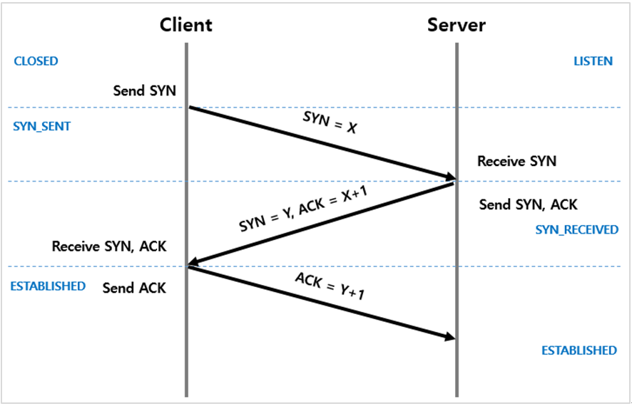
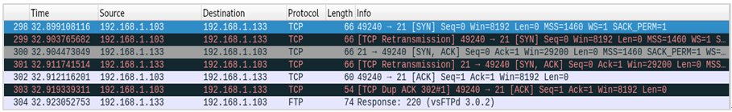
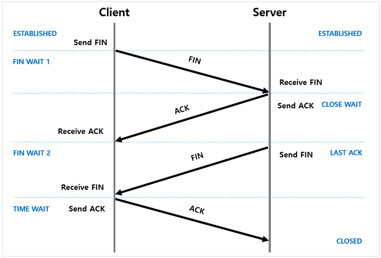
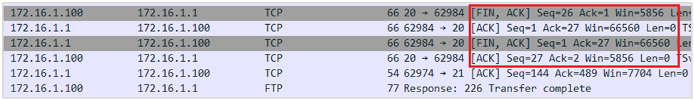

# TCP (Transmission Control Protocol)
* 연결 지향형 프로토콜
* 특징
    * 논리적 경로 생성을 통해 패킷 순서를 보장한다.
    * ACK 신호 등을 통해 데이터 전송에 대한 확인 작업을 걸침으로 패킷 손실 등을 체크한다. 그렇기 때문에 데이터 전송에 대한 신뢰성이 보장된다.
    * 데이터 흐름 제어(버퍼 오버플로우 방지) 및 혼잡 제어(과도한 패킷 수 증가 방지) 한다.
    * UDP 보다 전송속도가 느리다.
 

## TCP 관련 정보
* Port 상태
    | Status | 설명 |
    |--------|-----|
    | LISTEN | 연결 요청 대기 중 |
    | SYN_RCV | SYN 요청을 받고, 응답을 기다리는 중 |
    | ESTABLISHED | 연결 상태 |
    | CLOSED | 닫힌 상태 |

* 플래그
    | Flag | 설 명 | 비 고 |
    |------|-------|------|
    | S | SYN 요청 | 세션 연결 요청 (3-way handshaking) |
    | ACK | 요청에 대한 응답 |  |
    | F | FIN 요청 | 연결 종료 요청 (4-way handshaking) |
    | R | RST(Reset) | 비정상적인 종료를 위한 Packet |
    | P | PSH(Push) | 빠른 응답을 위하여 OSI 7 Application Layer로 즉시 전송하도록 하는 Flag. (버퍼가 채워져야 데이터를 읽기 때문에 느릴 수 있다) |
    | URG | Urgent Pointer | 긴급한 데이터에 대해 높은 우선수위를 가지게 함. (ex> 명령어 도중 CTRL + c) |
    | . | Placeholder | SYN, FIN, RST, PSH 등 Flag가 설정되지 않은 상테 |
 

---
## 3-way handshaking

TCP 프로토콜을 이용해서 통신을 하는 프로세스가 데이터를 전송하기 전에 데이터 전송을 보장하기 위해 상대방 프로세스와 사전에 세션을 수립하는 과정 

1. Client가 접속을 위해 Serer 쪽에 SYN 패킷을 보낸다. SYN 패킷을 보낸 Client는 SYN/ACK 응답을 기다리는 SYN_SENT 상태가 된다.
2. 연결 요청을 받은 Server는 응답(연결 수락)으로 SYN와 ACK 패킷을  Client에게 보내준다. SYN/ACK 패킷을 보낸 Server는 SYN_RECEIVED 상태가 된다.
3. 연결 수락을 받은 Client는 Server에게 ACk 패킷을 보내고, 연결이 된 상태가 된다.
 
 

---
## 4-way handshaking

TCP 통신 연결을 정상적으로 세션을 종료하기 위한 수단

1. Client는 연결 종료를 위한 FIN 패킷를 보낸다. 그리고 FIN WAIT 1 상태가 된다.
2. Server는 FIN 패킷을 받게 되면 응답으로 ACK 신호를 보내고, 해당 Server의 Application에서 연결이 CLOSE 할 때까지 CLOSE WAIT 상태가 된다.
3. ACK 패킷을 받은 Client는 FIN WAIT 2 상태가 되고, FIN 신호를 기다린다.
4. Server 쪽에서 Application 연결이 종료되면 FIN 패킷을 보내고 LAST ACK 상태가 된다.
5. FIN 패킷을 받은 Client는 TIME WAIT 상태가 되고 ACK 패킷을 Server에게 보낸다. ACK 패킷을 받은 Server는 CLOSED로 완전히 종료 상태가 된다.
> Client에서 세션을 종료시킨 후, 뒤늦게 도착하는 패킷이 있다면 이 패킷은 Drop 되고 데이터는 유실된다. 이러한 현상에 대비하여 Client는 Server로부터 FIN을 수신하더라도 일정시간(디폴트 240초) 동안 세션을 남겨놓고 패킷을 기다리는 과정을 거치게 되는데 이 과정을 "TIME_WAIT"라고 합니다.

 
 

---
## Timeout
* Connection Timeout : Client - Server 간의 연결이 생성되는데 까지 걸리는 시간 (3-way-handshaking) 제한
* Socket Timeout : 데이터 전송 시 여러 개의 패킷을 보내는데, 각 패킷에 대한 시간 제한
* Idle Timeout : 연결 후, 서로 패킷을 주고 받지 않고 연결을 유지할 수 있는 시간
 

### Idle Timeout Test
1. ALB - Idle : 60s / Server - Timeout : 100s / Server의 응답 시간이 80s인 경우
    * LB에서 Client측에 504 error 전달
    * Server 응답은 어떻게 되지?? 
    > 추측) LB가 Server로 FIN이나 RST을 보냄으로 통신을 종료시지 않았까 싶다. 아니라면 TIME_WAIT 기간 내라면, Server가 응답을 LB한테 전달하고, RST나 Connection Timeout으로 연결이 종료되지 않을까 싶다.
    
    > LB가 Server로 FIN이나 RST을 보냄으로 통신을 종료시지 않을까 싶다. (현재 확인 결과 ALB는 양쪽에 FIN을 보낸다!) : https://medium.com/tenable-techblog/lessons-from-aws-nlb-timeouts-5028a8f65dda
2. ALB - Idle : 60s / Server - Timeout : 30s / Server의 응답 시간이 80s인 경우
    * Server에서 LB 측에 504 error 전달
    * LB에서 Client측에 504 error 전달
    > 앞에 단의 서버의 Timeout이 긴것이 좋다!!
3. NLB - Idle : 350s / Server - Timeout : 450s / Server의 응답 시간이 400s인 경우 
    * NLB는 혼자 Timeout으로 혼자만 세션을 종료
    * Client가 NLB와 다시 통신을 할 때 기존 세션이 살아있다 생각하고 해당 세션으로 통신 시도
    * NLB는 이때서야 RST 반환
    > 추측) 이러면 HTTP 기준으로 503이 반환될 것이다.
4. NLB - Idle : 350s / Server - Timeout : 300s / Server의 응답 시간이 400s인 경우 
    * Server에서 Client 측에 504 error 전달
    * Client - LB는 Idle timeout에 의해 연결이 유지되고 있다. 이후에 LB의 Timeout이 끝날 때까지 기존 연결에 연결 시킬 수 없다.
> 그리고 연속적인 통신이 필요하다고하면, Timeout을 건드리는 것이 아니라 Connection Pool이나 Connection 재사용 속성을 생각해보는 것도 하나의 방법인거 같다.
 

#### Reference
* https://docs.likejazz.com/time-wait/#%ED%83%80%EC%9E%84%EC%8A%A4%ED%83%AC%ED%94%84
* Proxy 3-way handshaking: https://aws-hyoh.tistory.com/m/90
 
 

---
# UDP (User Datagram Protocol)
* 비연결 지향 프로토콜
* 특징  
    * 데이터그램 방식을 제공한다(독립적인 관계를 지닌 패킷)
    * 논리적 경로를 따로 생성하지 않아 패킷 순서가 보장되지 않는다.
    * 주고 받는 신호가 따로 있지 않아 데이터 전송에 대한 신뢰성이 보장되지 않는다. 그렇기 때문에 패킷 관리가 필요하다
    * 패킷 오버헤드가 적어 네트워크 부하가 감소된다.
    * UDP 보다 전송속도가 느리다.
    * TCP보다 속도가 빠르다.
 
 