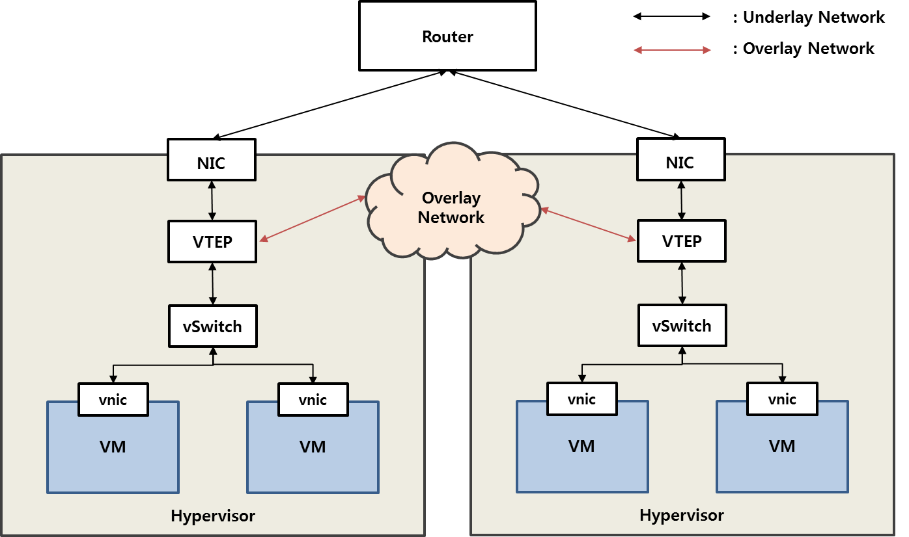

# VXLAN (Virtual Extensible LAN)
* Physical Network 위에 Virtual Network를 사용하기 위한 Overlay Network를 구현하는데 사용되는 Protocol 중 하나.
* VXLAN은 Tunneling 기반으로 하는 기법이다. Virtual Network 안에서 발생한 Packet은 Encapsulation 되어 Physical Network을 통과하고 다시 Decapsulation되어 Virtual Network로 전달 된다.
* Multicast 기반으로 통신한다.
 

## 등장 배경
* 기본적인 등장 배경은 Cloud 환경에서는 많은 Address와 유동적으로 변경 가능한 네트워크가 필요하다는 점에서 등장하였다.
* MAC Address 개수 한계
    * 네트워크 장비의 한계로 MAC Address Table 관리의 문제
    > Table 관리를 vSwitch에서 소유하고 해당 Swtich로 Forwading
* VLAN 개수 한계
    * VLAN ID bit는 12 bit로 최대 4096개의 VLAN만 생성 가능
    > VXLAN ID bit는 24 bit로 구성
* 수동적인 구성
    * Zone 별 VLAN Trunk 구성은 수동적이기 때문에 급변하는 Cloud 환경에서는 L2 구성은 불필요한 구성
    > Multicast 기반으로 구성함으로써 능동적인 구성이 가능

 
 

---
## Tunneling
Source와 Destination에서만 사용하고 중간 네트워크에서 사용하지 않는 프로토콜을 사용하여 데이터를 전송하는 과정
* 전송할 때 패킷을 캡슐화하여 전송한다(캡슐화는 패킷을 다른 패킷 내부에 래핑하는 것을 의미)
* 기존 패킷을 Payload에 두고, Tunneling 정보를 Header로 추가하여 캡슐화한다.
 
 

---
## VLAN
가상 랜. 컴퓨터 네트워크에서 여러 개의 구별되는 Broadcast Domain을 만들기 위해 단일 2 계층 네트워크를 분할할 수 있는데, 이렇게 분리되면 Packet들은 하나 이상의 네트워크 장비를 통해서만 이동할 수 있다.
> Broadcast Domain을 이해하려면 ARP Protocol을 이해하면 된다!!
* 보통 서로 다른 PC 정보를 Broadcasting을 통해 알 수 있기 때문에, 해당 Domain에 따라 Network를 분리할 수 있다(guess)
* Switch Tunneling을 사용하여 VLAN을 구분지어 통신한다.
 

* Trunk: 복수 개의 VLAN 프레임을 전송할 수 있는 링크 (Encapsulation 방식)
* Broadcast Domain : LAN 상에서 어떤 단말이 Broadcast Packet을 송출할 때, '해당 Packet을 수신할 수 있는 단말들의 집합'을 의미
* Collision Domain : Collision Domain : LAN 상에서 전송 매체를 공유하고 있는 경우, 여러 단말들이 동시에 Packet을 송출하면 충돌이 나는데 이 충돌에 영향을 받게 되는 영역을 의미. 하나의 단말이 통신을 하고 있는 경우, 다른 단말은 통신할 수 없다.
    > 허브는 CSMA/CD를 통해 충돌을 처리하고, 스위치는 충돌을 미연에 발생하지 않게 하기 위해 MAC 주소 필터링과 버퍼링 방법을 사용.
    > 리피터와 허브는 충돌을 전파하지만, Switch, Router는 forwarding을 통해 충돌 영향이 없다. Collision Domain을 Switch와 Router는 분할할 수 있다.
> ref : https://ja-gamma.tistory.com/entry/VLAN-%EA%B0%9C%EB%85%90-%EB%8F%99%EC%9E%91%EC%9B%90%EB%A6%AC-%EC%82%AC%EC%9A%A9%EC%9D%B4%EC%9C%A0

 
 

---
## VXLAN 네트워크 구조

* VTEP(VXLAN Tunnel End Point)
    * VXLAN Tunnel 간의 Encapsulation/Decapsulation 작업이 발생하는 지점
    * VTEP는 소프트웨어 장치일 수도 있고, 하드웨어 장치일 수 있다.
* VNI(Virtual Network Idenfitier / Tag)
    * 해당 VNI를 통해 어느 Vritual Network 인지 구분되고, 격리된다.
    * Encapsulation 된 Packet은 VXLAN Header에 저장된다.
* vSwitch
    * VM끼리 통신을 위한 Virtual Switch
    * ARP Table이 저장됨
* vNIC
    * VM의 논리적 IO 포트
    * veth 라고도 쓰인다.
> 그림에서는 vSwitch와 VTEP가 분리되어 그려져있지만, 실제로는 vSwitch 위에 VTEP가 포함되어 있다고 생각하면 된다.

 

### 통신과정
> 정보를 가지고 유추한 내용이므로 틀린 내용이 많을 것이다! 이후 수정 예정
1. A VM - > A VTEP
    * A VM에서 ARP Request Packet을 VLAN ID와 함께 전송한다.
2. A VTEP
    * A VM 네트워크의 VTEP는 VLAN ID와 VLAN 정보를 저장(설정)하고, VLAN ID를 VXLAN VNI와 매핑한다.
    * VXLAN VNI로 Packet을 Encapsulation한다.
    > VLAN ID는 Hypervisor 내에서 VM 끼리의 통신

    > VXLAN VNI는 Network를 통한 Hypervisor 끼리의 통신
3. A VTEP -> Network(Multicast) -> B VTEP
    * Encapsulation 된 Packet은 다른 VTEP들에게 전달된다.
    * 해당 Packet들의 정보로 Table이 생성된다.
4. B VTEP
    * Encapsulation 된 Packet을 Decapsulation 하여, 다시 ARP Packet으로 변환한다.
    * Packet 정보를 저장한다.
5. B VTEP -> B VM
    * B VM에게 ARP Request Packet을 전송한다.
6. B VM <-> A VM
    * 이후에는 Unicast를 통해 통신한다.
 

### Why mapping VNI to VLAN ID?
VXLAN(VNI)를 사용한다고 해서 VLAN을 사용하지 않는 것은 아니다. 
* VXLAN으로 하나의 네트워크 구축할 때 같은 네트워크에 포함되는 범위는 "같은 Switch 내의 동일한 VLAN + 다른 Swhitch에 있는 동일 VNI, VLAN"이다. 그렇기 때문에 보통 VLAN ID와 VNI는 1:1 매핑을 한다(ex> 1:100001, 1:110001, 2:110002)
* Ref: https://www.cisco.com/c/dam/en/us/td/i/300001-400000/350001-360000/357001-358000/357506.jpg
 

### VLAN vs VXLAN
| List           | VLAN                | VXLAN                 |
| -------------- | ------------------- | --------------------- |
| Network Layer  | Layer 2             | Layer 2               |
| ID bit         | 12bit / 최대 4096개 | 24bit / 최대 1600만개 |
| Tunneling 방식 | Trunk               | Multicast             |
|                |                     |                       |
> Layer 3 네트워크도 같이 사용하고 있으나, 실질적 기술은 Layer 2 기반이다!

 
 

### Reference
* https://ssup2.github.io/theory_analysis/Overlay_Network_VXLAN/
* https://blog.naver.com/PostView.nhn?blogId=lunaeye&logNo=221160549927
* https://youngmind.tistory.com/entry/Network-Overlay-VXLAN-%EB%B6%84%EC%84%9D-3?category=394664
* https://ikcoo.tistory.com/117
* https://blog.naver.com/PostView.nhn?blogId=lunaeye&logNo=221160549927&parentCategoryNo=&categoryNo=1&viewDate=&isShowPopularPosts=false&from=postView

