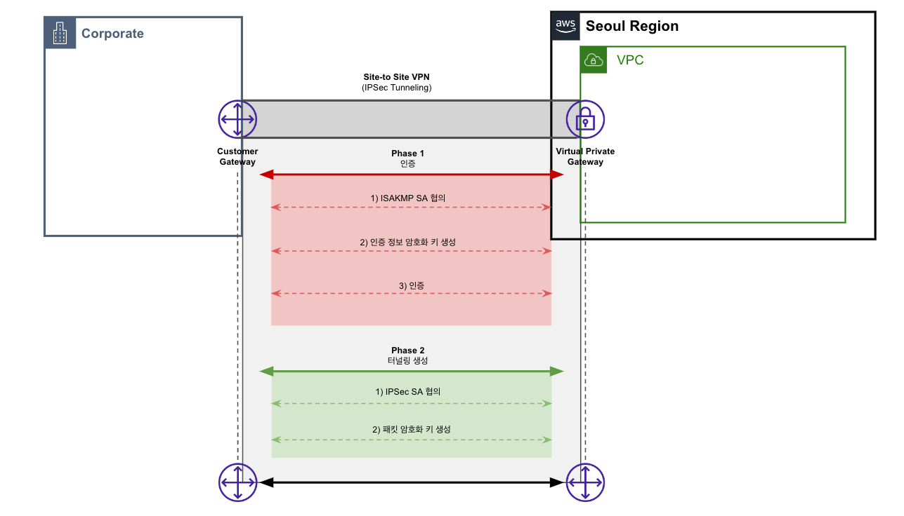

# On-premeise
Cloud와 On-premise와 통신하는 방법으로는 크게 3가지 방식이 존재한다.
1) 인터넷망 통신
2) VPN 통신
3) 전용선 통신
> 인터넷망은 우리가 아는 인터넷을 통해 통신하는 방법이기 때문에 여기서는 다루지 않는다.

 
 

---
# VPN 통신
모두가 접근 가능한 인터넷망을 통하여 통신하며, VPN 암호화 프로토콜을 통해 패킷을 캡슐화하여 통신하는 방법이다.
 

## VPN Basic
* VPN Protocol
    - OpenVPN : 대중적이지만, 설정이 많음
    - IKEv2 : Internet Key Exchange, 암호화 키 교환 프로토콜. IPSec을 통해 터널링 구성시 암호 키를 교환하는데 사용되는 프로토콜
    - IPSec : Internet Protocol Security. 터널링 및 데이터 전송 및 암호화를 관리하는 프로토콜
        > IPSec + IKEv2 공동하에 IPSec/IKEv2 프로토콜을 VPN에서 사용하도록 만듬.
* ASN
    - 일관된 라우팅 정책을 가지고 있는 IP 접두사 그룹(AS)을 나타내는 번호 (172.16.30.0/24 == 100번, 172.16.20.0/24 == 90번)
 

## VPN 터널링 과정
터널링을 위한 과정으로는 크게 Phase 1, Phase 2로 나뉜다. Phase 1에서 안전한 키 교환을 위한 VPN 인증 및 키 생성, Phase 2에서 터널링 생성을 진행 (ref: https://aws-hyoh.tistory.com/165)

* Phase 1
    1) ISAKMP SA 제안 및 협의 : 인증을 위한 정보를 대칭키 암호화하기 위햐여 어떤 것들을 사용할지 협의를 진행. 즉 정보를 교환하며, 협의 내용은 다음과 같다. (ISAKMP == Internet Security Association and Key Management Protocol / SA == Security Association)
        - Diffie-Hellman Key Algorithm : 인증 정보를 암호화하는데 사용되는 대칭키 교환 알고리즘
        - Authentication : 상대방 VPN을 인증하기 위한 방법 (Pre-shared Key, RSA Encryption, RSA Signature)
        - Encryption : 키 교환 알고리즘과 함께 인증 정보를 암호화할 암호화 알고리즘 (AES, DES, 3DES)
        - Authentication Algorithm(Hash Key) : 인증 정보 변질을 위해 첨부되는 Hash code (MD5, SHA)
        - Life Time : Phase 1 Teunnel 유지 시간
    2) 인증 정보 교환을 위한 키 생성 : 키 교환 알고리즘을 통해 키 재료(Key Materials)를 교환하여 대칭 키 생성
    3) 상대방 VPN 인증 및 Phase 2에서 사용할 암호화 키 생성 : 생성한 키를 이용하여 인증 정보(Authentication)를 암호화하고, 정보 전달 및 상대방 인증한다.
* Phase 2
    1) IPSec SA 제안 및 협의
        - IPSec Protocol : 패킷 인증/암호화를 위한 프로토콜 선택 (AH / ESP)
        - Encapsulation Mode : IPSec Turnnel Mode (Transport / Tunnel)
        - Encryption : Packet을 암호화할 알고리즘 (AES, DES, 3DES)
        - Authentication Algorithm(Hash Key)  : Packet을 인증할 Hash 알고리즘 (MD5, SHA)
        - Life Time : Phase 2 Tunnel 유지 시간 (Phase 1 대칭키 재생성 주기를 의미, Phase 1보다 낮게 책정!!)
        - Perfect Forward Security(PFS, Optional) : 키를 주기적으로 교환하게하는 강제 옵션
    2) 패킷을 암호화할 암호화 키 생성 및 인증 : 키 생성 시 Phase 1에서 생성한 키와 추가적인 키 재료를 가지고 암호화 키를 생성.

* 암호화된 대칭키를 이용하여 Tunnel 통신 진행
    - 공인 IP는 변경 가능성이 있기 때문에, Tunnel 통신용 네트워크 대역을 지정하여 통신한다(Tunnel IP)
    - 트래픽 예시는 다음과 같다(A: 172.16.30.0/24, B: 172.16.40.0/24, Tunnel: 169.254.24.196/30)
    1) A PC ---> A Gateway / A VPN (Next Hob : 172.16.30.1)
    2) A VPN ---> B VPN (Next Hob : 169.254.24.197)
    3) B VPN / B Gateway ---> B PC
 
 

### VPN 구성
VPN 구성을 위해서는 다음과 같은 정보가 필요 (AWS Site-to-Site VPN 연결 구성을 기준으로 작성)
1) 본인 네트워크 정보 확인 (AWS VGW 생성)
    - VPN Public IP (자동 생성)
    - ASN
    - Network CIDR
2) 상대 네트워크 정보 확인 (AWS CGW 생성)
    - VPN Public IP
    - ASN
    - Network CIDR
3) VPN 통신을 위한 정보 설정 (AWS Site-to-Site 설정)
    - Routing 프로토콜 지정 (Static / Dynamic)
    - DH Algorithm
    - Authentication (Pre-Shared Key or SSL 인증서)
    - Encryption Algorithm
    - Hash Key Algorithm
    - Tunnel IP
    - Maintenance
4) 라우팅 및 통신 확인
 
 

---
# 전용선 통신
실제 물리적인 선을 연결시켜 

 