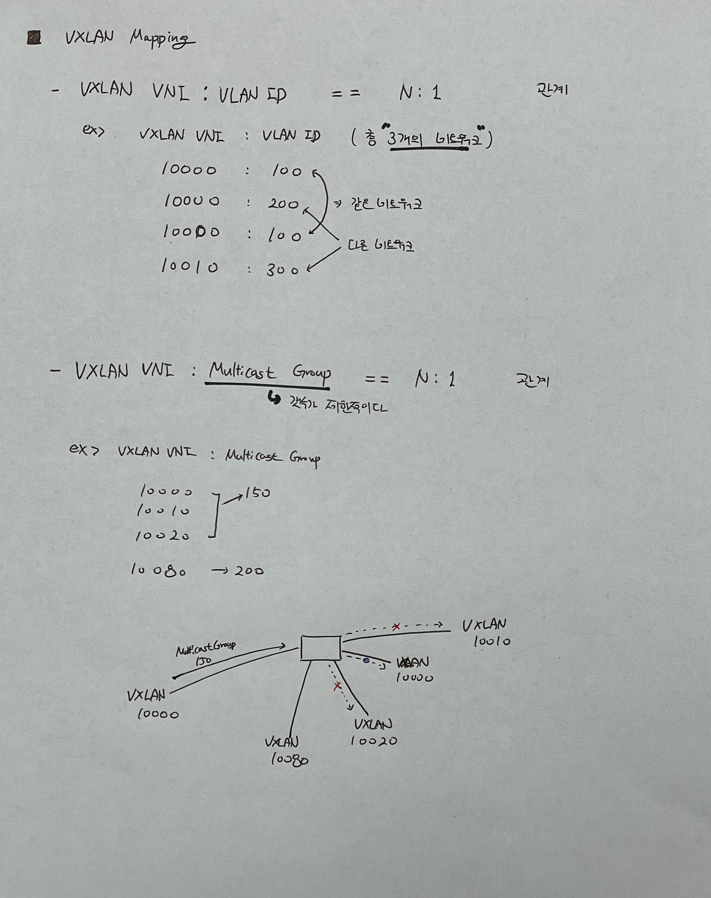

# VXLAN (Virtual Extensible LAN)
Physical Network 위에 Virtual Network를 사용하기 위한 Overlay Network를 구현하는데 사용되는 Protocol 중 하나.

VXLAN은 Tunneling 기반으로 하는 기법이다. Virtual Network 안에서 발생한 Packet은 Encapsulation 되어 Physical Network을 통과하고 다시 Decapsulation되어 Virtual Network로 전달 된다.

* Layer 3에서 동작
* Layer 2에서 동작하는 VLAN의 확장
* Multicast 기반으로 통신

 

## 등장 배경
* 기본적인 등장 배경은 Cloud 환경에서는 많은 Address와 유동적으로 변경 가능한 네트워크가 필요하다는 점에서 등장하였다.
* MAC Address 개수 한계
    * 네트워크 장비의 한계로 MAC Address Table 관리의 문제
    > Table 관리를 vSwitch에서 소유하고 해당 Swtich로 Forwading
* VLAN 개수 한계
    * VLAN ID bit는 12 bit로 최대 4096개의 VLAN만 생성 가능
    > VXLAN ID bit는 24 bit로 구성
* 수동적인 구성
    * Zone 별 VLAN Trunk 구성은 수동적이기 때문에 급변하는 Cloud 환경에서는 L2 구성은 불필요한 구성
    > Multicast 기반으로 구성함으로써 능동적인 구성이 가능

 
 

---
## Tunneling
다른 프로토콜로 캘슙화하여 데이터를 전송하는 기술
* 캡슐화는 패킷을 다른 패킷 내부에 래핑하는 것을 의미
* 기존 패킷을 Payload에 두고, Tunneling 정보를 Header로 추가하여 캡슐화한다.
 
 

---
## VLAN
가상 랜. 컴퓨터 네트워크에서 여러 개의 구별되는 Broadcast Domain을 만들기 위해 단일 2 계층 네트워크를 분할할 수 있는데, 이렇게 분리되면 Packet들은 하나 이상의 네트워크 장비를 통해서만 이동할 수 있다.
> Broadcast Domain을 이해하려면 ARP Protocol을 이해하면 된다!!
* 보통 서로 다른 PC 정보를 Broadcasting을 통해 알 수 있기 때문에, 해당 Domain에 따라 Network를 분리할 수 있다(guess)
* Switch Tunneling을 사용하여 VLAN을 구분지어 통신한다.
 

* Trunk: 복수 개의 VLAN 프레임을 전송할 수 있는 링크 (Encapsulation 방식)
* Broadcast Domain
    - LAN 상에서 어떤 단말이 Broadcast Packet을 송출할 때, '해당 Packet을 수신할 수 있는 단말들의 집합'을 의미
    - VLAN, CIDR 등에 결정됨
* Collision Domain
    - LAN 상에서 전송 매체를 공유하고 있는 경우, 여러 단말들이 동시에 Packet을 송출하면 충돌이 나는데 이 충돌에 영향을 받게 되는 영역을 의미. 하나의 단말이 통신을 하고 있는 경우, 다른 단말은 통신할 수 없다 (장비 성능에 영향을 많이 받음)
    > 허브는 CSMA/CD를 통해 충돌을 처리하고, 스위치는 충돌을 미연에 발생하지 않게 하기 위해 MAC 주소 필터링과 버퍼링 방법을 사용.

    > 리피터와 허브는 충돌을 전파하지만, Switch, Router는 forwarding을 통해 충돌 영향이 없다. Collision Domain을 Switch와 Router는 분할할 수 있다.

    > ref : https://ja-gamma.tistory.com/entry/VLAN-%EA%B0%9C%EB%85%90-%EB%8F%99%EC%9E%91%EC%9B%90%EB%A6%AC-%EC%82%AC%EC%9A%A9%EC%9D%B4%EC%9C%A0

 
 

---
## VXLAN 네트워크 구조

* VTEP(VXLAN Tunnel Endpoint)
    - VXLAN Tunnel 간의 Encapsulation/Decapsulation 작업이 발생하는 지점
    - VTEP는 소프트웨어 장치일 수도 있고, 하드웨어 장치일 수 있다.
* VNI(Virtual Network Idenfitier / Tag)
    - VXLAN ID
    - 해당 VNI를 통해 어느 Vritual Network 인지 구분되고, 격리된다.
        > 즉, VXLAN VNI가 Broadcast Domain을 나누는 기준이 된다.
    - Encapsulation 된 Packet은 VXLAN Header에 저장된다.
* vSwitch
    * VM끼리 통신을 위한 Virtual Switch
    * ARP Table이 저장됨
* vNIC
    * VM의 논리적 IO 포트
    * veth 라고도 쓰인다.
> 그림에서는 vSwitch와 VTEP가 분리되어 그려져있지만, 실제로는 vSwitch 위에 VTEP가 포함되어 있다고 생각하면 된다.

 

### 통신과정
> 정보를 가지고 유추한 내용이므로 틀린 내용이 많을 것이다! 이후 수정 예정
1. A VM - > A VTEP
    * A VM에서 ARP Request Packet을 VLAN ID와 함께 전송한다.
2. A VTEP
    * A VM 네트워크의 VTEP는 VLAN ID와 VLAN 정보를 저장(설정)하고, VLAN ID를 VXLAN VNI와 매핑한다.
    * VXLAN VNI로 Packet을 Encapsulation한다.
    > VLAN ID는 (Hypervisor 내인지? 전체인지 모르겠음...) VM 끼리의 통신 (Network 관리)

    > VXLAN VNI는 Network를 통한 Hypervisor 끼리의 통신 (어느 Hypervisor를 선택해야 되는지 Routing 관리)
3. A VTEP -> Network(Multicast) -> B VTEP
    * Encapsulation 된 Packet은 다른 VTEP들에게 전달된다.
    * 이때 같은 Multicast Group에 속한 VTEP들이 트래픽을 수신하고, 그 중에서 같은 VNI에 속한 VTEP만이 해당 트래픽을 처리한다.
    * 해당 Packet들의 정보로 Table이 생성된다.
4. B VTEP
    * Encapsulation 된 Packet을 Decapsulation 하여, 다시 ARP Packet으로 변환한다.
    * Packet 정보를 저장한다.
5. B VTEP -> B VM
    * B VM에게 ARP Request Packet을 전송한다.
6. B VM <-> A VM
    * 이후에는 Unicast를 통해 통신한다.
 

---
## Networking Mapping

VXLAN을 관리하기 위해서는 Networking Mapping 방식에 대해서 자세하게 볼 필요가 있다.

1. Why mapping VXLAN VNI to VLAN ID
    - 기본적으로 Broadcast Domain은 VNI로 구분되어진다.
        > 즉, VLAN ID와 상관없이 VNI로 구분되어진다!!
    - 같은 VLAN ID에 여러 개의 VNI가 매핑될 수 있다. 이는 서로 다른 Broadcast Domain을 가진다.
    - 왜 VLAN ID가 필요할까?
        - VXLAN은 L3로 L2의 VLAN 확장이다. 그리고 Layer2는 VLAN을 통해서 통신이 이루어진다.
            > 여기서 헷갈리기 쉬운것은 L3이기 때문에 기본적으로 L3 Switch 등의 L3 장비가 해당 트래픽을 처리한다는 것이다. 그렇기 때문에 InterVLAN 같은 동작은 VXLAN 통신 안에 자동으로 들어가 있다!!! 

            > 헷갈린 지점 : VNI에 의해 Broadcast Domain이 정해진다고 한다. 10000:100과 10000:200은 같은 네트워크 대역이라는 것이다. 여기서 VLAN은 실질적으로 태깅역할을 한다!!
        - 레거시 네트워크 호환성. 기존에 사용하던 VLAN과 통합하기 위해 사용
        - 서로 다른 L2 세그먼트 구분. 데이터센터의 한 VTEP에서는 VLAN 100이 VNI 10000에 매핑되고, 다른 VTEP에서는 VLAN 200이 VNI 10000에 매핑될 수 있음
        - 실질적으로 단순 L2 통신은 Switch를 통해서만 통신하기 때문에 VLAN ID가 필요하다!!
2. Why mapping VXLAN VNI to Multicasting Group
    - VTEP 끼리 통신할 때 Multicasting 방식으로 통신한다.
    - 하지만 Multicast Group의 갯수는 한정적이다(약 1000개). 그리고 같은 Group에 속해 있을지라도 내부적으로 VLAN이 여러개로 구성되어 있을 수 있다. 그렇기 때문에 VXLAN VNI:Multicasting Group은 N:1 관계를 가진다.

* Ref: https://www.cisco.com/c/dam/en/us/td/i/300001-400000/350001-360000/357001-358000/357506.jpg
> VXLAN VNI는 Ethernet(eth) 어떤 서버로 보내야 될지 결정하는 ID이고 VLAN은 네트워크에 해당하는 영역이다.
 

---
### VLAN vs VXLAN
| List           | VLAN                | VXLAN                 |
| -------------- | ------------------- | --------------------- |
| Network Layer  | Layer 2             | Layer 3               |
| ID bit         | 12bit / 최대 4096개 | 24bit / 최대 1600만개 |
| Tunneling 방식 | Trunk               | Multicast             |
|                |                     |                       |
> Layer 3 네트워크도 같이 사용하고 있으나, 실질적 기술은 Layer 2 기반이다!

 
 

### Reference
* https://ssup2.github.io/theory_analysis/Overlay_Network_VXLAN/
* https://blog.naver.com/PostView.nhn?blogId=lunaeye&logNo=221160549927
* https://youngmind.tistory.com/entry/Network-Overlay-VXLAN-%EB%B6%84%EC%84%9D-3?category=394664
* https://ikcoo.tistory.com/117
* https://blog.naver.com/PostView.nhn?blogId=lunaeye&logNo=221160549927&parentCategoryNo=&categoryNo=1&viewDate=&isShowPopularPosts=false&from=postView

