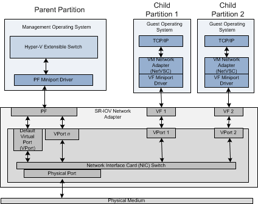

# Network Performance and Optimization
## Performance

* Bandwidth : 초당 전송 가능한 비트
* Latency : 첫 패킷이 두 지점간의 통신하는데 걸리는 시간
* Jitter : Variation in inter-packet delays. 패킷 간의 지연 시간
* Throughput(bps) : 초당 전송한 비트. 전송한 패킷량, Latency, Packet loss 등이 있기 때문에 Bandwidth와 동일하게 나오지 않는다!
* PPS : Packet Per Second, 네트워크 장비의 초당 패킷 처리량. 컴퓨팅 리소스 파워, Throughput도 영향을 준다(여기서 Packet은 Frame 단위를 의미하여 최소 84 byte 크기를 처리할 수 있다)
    - PPS가 있는 이유는 네트워크 장비는 실질적으로 비트가 아닌 패킷 단위로 처리하며, 패킷당 처리할 수 있는 비트 기준으로만으로 Throughput(처리량)을 판단하면 매 순간 보내는 패킷의 실제 비트 수에 따라 처리 성능이 다르게 보일 수 있기 때문이다.
    - PPS 계산법 (84 bit 기준으로 계산 시)
        ```
        1 Packet == 최소 84 byte == 최소 672 bit 
        1 packet/sec == 672 bit/sec
        1 pps == 672 bps
        1/672 pps == 1 bps
        1.488 pps == 1 Kbps
        1488 pps == 1 Mbps
        ``` 
        1) 처리할 수 있는 Packet 크기를 측정 (최대 패킷: MTU)
        2) Second 나누기
        3) 1 bps 에 대한 pps 값을 구한다!
        4) PPS = 1 / Packet_Size * 처리 능력(속도 등)
* MTU : Maximum Transmission Unit. 보낼 수 있는 가장 큰 패킷
    - 일반적으로 인터넷은 MTU : 1500 bytes 이다.
    - Jumbo Frames : 1500 bytes 보다 큰 프레임
        1) 한번 보낼때 크게 보낼 수 있으므로 적은 패킷량으로 통신 가능
        2) Throughput 증가
        3) AWS 서비스를 사용하는 것들은 Jumbo Frame 지원 (VPN과 같이 인터넷으로 가는 서비스는 불가능)
    - Check 방법 : ```$ sudo ip link chow eth0```
    > MTU 이상의 크기를 가진 패킷을 전송하게 되면, 패킷을 MTU 이하의 조각으로 분할하는 것을 단편화패킷을 나눠 보내도록 되돌려 보낸다(단편화). 이를 재조합하기 위해서는 CPU/Memory가 사용되기 때문에 Overhead가 발생

</br>

### 패킷 전송 과정
1) 네트워크 장비는 처리할 수 있는 최대 패킷 크기가 정해져 있다. => (MTU)
    > 대상 장비의 MTU보다 패킷이 크면 패킷 단편화(Packet Fragmentation) 발생.

    > 단편화 발생 시, 패킷을 반환하고 해당 MTU 크기만큼 다시 분할하는 작업을 거침으로 오버헤드가 발생한다.
2) 그리고 각 장비는 통신을 위해 Encapsulation, Decapsulation 등 패킷을 처리한다. => (PPS)
3) 이때 패킷의 크기는 통신마다 다르기 때문에 Bit 수가 다를 수 있다. => (Throughput)
    > 기본적으로 패킷의 비트 수가 일정하면 BPS와 PPS의 그래프는 거의 비슷한 곡선을 가지게 된다.

    > BPS > PPS 인 경우, 데이터가 큰 파일 다운로드 또는 업로드 등이 행해졌다는 의미로 볼 수 있다. 패킷 최대 사이즈로(MTU) 보내게 되면 패킷 수에 비해 비트 사이즈가 커지기 때문에 BPS와 PPS의 그래프가 서로 달라진다. 

    > BPS < PPS 인 경우, 데이터가 작은 GET 요청이나 pingcheck 패킷 등이  전송되었다는 의미로 볼 수 있다. 많은 요청에 대한 응답으로 많은 패킷을 전송하지만 실질적인 데이터는 작기 때문에 BPS와 PPS의 그래프가 서로 달라진다.

</br>

---
## Optimization
- Over 1M PPS(1초당 1백만개 이상의 패킷을 전송)를 의미. 
- High Network Bandwidth and Throughput, Low Laytency
- High I/O performance and Low CPU Utilization

1. Network Device(HW) level
    1) (기능) Using Jumbo Frame at network device.
    2) (기능) Network I/O Credit Type 선택
    3) (전용.선) EBS Optimized Instance : EBS is not a physical drive but Network drive. EBS와의 통신으로 전용 네트워크를 사용함을써 다른 네트워크와 경쟁하지 않음
    4) (거리) 배치 그룹 : EC2 인스턴스끼리 서로 가까운 곳에 둠으로써 네트워크 홉 수 등을 줄임
2. Virtualization level
    * Enhanded Networking
        1) SR-IOV with PCI passthrough : 향상된 Physical NIC(Server)Virtualization(Hypervisor) 방법
            
            - SR-IOV : Single Root I/O virtualization. 개별 서버의 I/O 자원(물리적 네트워크 인터페이스 카드)을 여러 가상 네트워크 인터페이스로 나누어 각 가상 머신에게 할당해 주는 기술.
            - PCI Passthrough : Peripheral Component Interconnect. 물리저 하드웨어 장치를 직접 VM에 연결하는 기술. 여기서는 네트워크 인터페이스를 연결하는 인터페이스를 의미한다고 생각하면 된다.
            - SR-IOV 어댑터를 통해 물리적 PCIe(PF: Physical Function)를 여러 개의 가상화 PCIe(VF: Virtual Function)로 분할 할 수 있다.
                > Virtualization Layer(Hypervisor)을 거쳐 통신을 처리하는 것이 아닌 PCI Passthrough을 통해 가상화 네트워크 인터페이스 분배(SR-IOV)할 수 있는 물리적 네트워크 장비와 직접 연결되어 통신을 처리한다. 이를 통해 기존 Hypervisor를 통한 패킷 프로세싱 Overhead를 줄여 Latency를 줄인다.
            - VM은 기본적으로 통신을 하기 위해 가상화 레이어를 거쳐 물리적 통신을 하게 되는데 이 과정을 간소화시켜준다.
            - 사용 방법은 다음과 같다(드라이버 확인 방법 : ```ethtool -i eth0```)
                - Intel ixgbevf : 10 Gbps
                - Elastic Network Adatpter(ENA) : 100 Gbps / P4d는 400 Gbps
        2) AWS EFA (Elastic Fabric Adapter) : 고성능 처리에 사용. HPC 및 ML
            - OS Bypass를 통해 SW가 HW에 직접적으로 연결
        > AWS EFA 기능은 SR-IOV와 달리 하나의 물리적 인터페이스가 하나의 서버와 연결되며, 가상화 멀티 테넌시 기능을 위한 것은 아니다.
3. Operating system level
    * Enhanced Networking
        1) DPDK (Intel Data Plane Development Kit) library 사용 : Kernel Library로, 원래는 Kernel이 중간에서 네트워크 관련 코드/요청에 대한 Translation이 이루어지지만, 해당 라이브러리를 통해 Translation 없이 다이렉트로 네트워크 장비에 요청함으로써 Overhead를 줄여 OS 내부 패킷 처리 향상시킨다.
            
            - Kernel bypass
            - Packet Processing 제어
            - 작은 CPU Overhead
4. Software level (Others)
   1) 보안 프로토콜(HTTPS, SSH 등) 미사용 : 보안 프로토콜을 사용하면 패킷을 한번 더 감싸기 때문에 Latency가 발생
</br>


### 정리
- Physical level (네트워크 장비, 연결선, 거리)
    - 네트워크 장비의 자체 성능 : Jumbo Frame, Throughput, Bandwidth, Latency
    - 연결선 : 연결선 종류, 전용선
    - 물리적인 거리
- Virtual level
    - SR-IOV with PCI : 패킷 처리 속도 향상 ("Physical <-> Virtual"에 대한 Overhead)
- OS level
    - DPDK : 패킷 처리 속도 향상 ("OS <-> Physical/Virtual"에 대한 Overhead)
- Software level
</br>


### Delay가 발생하는 이유
* Hardware
    - Network Device 성능 이슈
    - 라우팅 문제
* Software
    - 패킷 처리 과정에서 추가되는 처리 요소(Overhead):  HTTPS, SSH 등 암호화/복호화 등
</br>

### Bandwidth limits
1. AWS Network Service Internal (with region)
    - VPC : No limits
    - Internet Gateway : No limits
    - VPC Peering : No limits
2. AWS Network Service External
    - VPN (per Tunnel) : 1.25 Gbps
    - DX : 1 Gbps / 10 Gbps / 100 Gbps (포트를 여러개 둠으로써 1 ~ 300 Gbps 선택 가능)
3. Instance
    - NAT Gateway : 3 ~ 45 Gbps 
    - EC2 : 기본적으로 인스턴스 타입마다 제공되는 Bandwidth가 다름. 다른 리전이거나 Internet Gateway를 통과하거나 DX를 통과하는 경우, 32 vCPU 이상 사용하는 EC2 기준으로 제공된 인스턴스 타입 Bandwidth의 50% 까지만 사용 가능. 32 vCPU 미만인 경우 5 Gbps.
        1) One flow limit with Intel 82599 VF interface : 5 Gbps
        2) One flow limit With ENA not in placement : 5 Gbps 
        3) One flow limit with ENA in placement : 10 Gbps
</br>
</br>