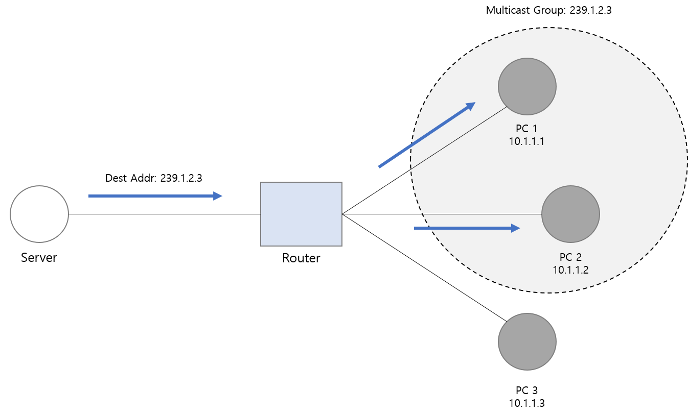

# Casting
* Unicast
* Multicast
* Broadcast
* Anycast

## Unicast

* Basic
    * 대상 당 하나의 Unicast Packet을 생성한다. 그렇기 때문에 여러 대상에게 보내야하는 경우, 여러 개의 Packet 생성이 필요하다.
    * __TCP__ 를 사용한다.
    * Network Device에서 MAC Address를 비교하고 처리한다.
* Process
    1) Packet을 전송하기 위해 Frame에 자신의 MAC Address와 Target의 MAC Address를 감싸서 전송한다.
    2) Target의 Local Network의 Network Device(Lan Card, Router, Switch)들은 해당 Packet을 받아 MAC Address를 비교하여(ARP Table) 정보가 있으면 해당 Device로 전달한다. 없으면 차단한다.
    3) Unicast를 받은 Lan Card는 CPU에 인터럽트를 발생시켜 Packet을 처리한다.
    4) MAC Address를 모르는 Unicast Packet이 들어오는 경우, 해당 Packet은 Switch에 연결되어 있는 모든 포트로 Broadcast 된다(__Unicast flood__)
* Transmission (전파 대상)
    * ```One-to-One```
* Bandwidth (대역폭)
    * 여러 대상에게 보내려면 각 각에 Unicast를 생성해서 보내야 되므로, 대역폭을 많이 차지할 수 있다.
* Traffic (트래픽)
    * Target이 지정되어 있어 트래픽이 통제된다.
    * Bandwidth가 보장된다면 빠르다.
* https://ko.wikipedia.org/wiki/%EC%9C%A0%EB%8B%88%EC%BA%90%EC%8A%A4%ED%8A%B8?msclkid=efbe0e3ab9fb11ecb78c27c2dd663e7b
</br>

## Multicast

* Basic
    * Multicast Group 당 하나의 Multicast Packet을 생성한다. 이를 위해 보낼 대상에 대한 Group 관리가 필요하다.
    * __UDP__ 를 사용하여 전송하므로 신뢰성을 보장받지 못한다.
    * Router에서 Multicast를 지원해야 한다.
* Process
* Transmission (전파 대상)
    * ```One-to-Many (Group)```
* Bandwidth (대역폭)
    * Router를 통해서 하나의 Packet으로 여러 대상에게 보낼 수 있으므로 효율적으로 사용할 수 있다.
* Traffic (트래픽)
    * Group을 지정함으로써 트래픽이 통제된다.
    * 트래픽이 통제가 되기 때문에 빠르다.
</br>


## Broadcast

* Basic
    * 하나의 Boardcast Packet을 생성하여 대상에게 전송한다.
    * __UDP__ 를 사용하여 전송하므로 신뢰성을 보장받지 못한다.
    * Device의 CPU가 모든 Bradcast를 처리한다. 그렇기 때문에 CPU에 영향을 주어 성능 저하가 생길 수 있다.
    * MAC Address를 알지 못하는 경우, 라우터끼리 정보 교환 등에 사용된다.
* Process
    1) Target의 Local Network의 Network Device(Router, Switch)들은 해당 Packet을 받아 모든 시스템에 Packet을 보낸다.
    2) 모든 Device는 Target의 MAC Address가 자신과 다르더라도 CPU에 인터럽트를 발생시켜 Packet을 처리한다.
* Transmission (전파 대상)
    * ```One-to-Many (All)```
* Bandwidth (대역폭)
    * Router를 통해서 하나의 Packet으로 여러 대상에게 보낼 수 있으므로 효율적으로 사용된다.
* Traffic (트래픽)
    * Local Network에 있는 모든 Device에 전송되므로 불필요한 Traffic이 생성될 수 있다.
</br>


## Anycast

* Basic
    * __IPv6__ 에서 사용된다. 그러므로 Network Device가 IPv6를 지원해야 한다.
    * 동일한 IP를 가진 Device Group에서 가장 가까운 Device가 트래픽을 수신한다.
    * 트래픽 분산 / 네트워크 이중화 / 물리적인 거리 최소화 등을 위해 사용
* Process
* Transmission (전파 대상)
    * ```One-to-Closet Of Many```
* Bandwidth (대역폭)
    * Unicast와 동일.
* Traffic (트래픽)
    * Unicast와 동일.
</br>
</br>


### Reference
* https://techdifferences.com/difference-between-broadcast-and-multicast.html#:~:text=Broadcasting%20allows%20the%20transmission%20of%20the%20packet%20to,The%20relationship%20between%20source%20and%20destination%20is%20one-to-many.?msclkid=3d091947b96c11ecb33573fecd99d4e5
* https://m.blog.naver.com/wnrjsxo/221250742423?msclkid=1c2d5dc4b97111ec8f8ace189f6166ff