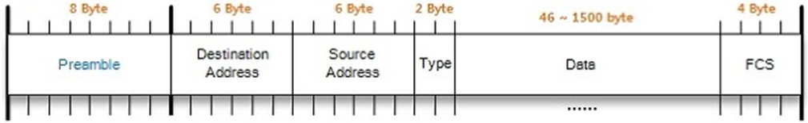
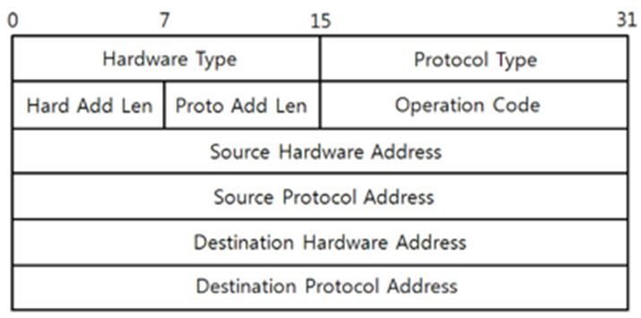
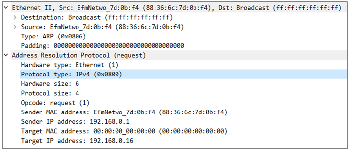

# ARP Protocol
* Address Resolution Protocol (Layer 3 Protocol)
* 주소 결정 프로토콜. 네트워크 상에서 IP 주소를 물리적 네트워크 주소로 Bind 시키기 위해 사용되는 프로토콜이다.
    * 즉, Layer 3 Address(IP) -> Layer 2 Address(MAC) 변환하는 기능 제공
 
 

## Why network uses ARP protocol
왜 ARP protocol이 사용되는가? 이를 위해서는 IP, MAC Address를 정확히 알 필요가 있다. 정의는 다음과 같다.
* IP Address : 라우팅을 하기 위해 사용. 즉, Target에 대한 네트워크를 추적하고, 최단 경로를 선택하기 위해서 사용.
* MAC Address : 이더넷을 이용하기 위해 사용. 같은 네트워크에서의 통신을 위해 사용.
> 같은 네트워크를 사용해도 IP를 사용하여 설정하기 때문에, 우리는 IP를 Computer의 주소로 생각하지만 IP는 NIC(Network Interface Card)에 연결되어 있는 회선 주소이다. 실질적으로 같은 네트워크에서 통신을 할때는 MAC Address를 기준으로 통신하게 된다. 그렇기 때문에 ARP protocol을 통해 IP Address는 대응되는 MAC Address로 변환 작업이 필요하다(또는 확인 작업이 필요하다).

> 이러한 목적에 의해 보통 MAC Address를 모르는 Target의 경우, ARP packet을 broadcasting 한다. 그리고 해당 정보는 APR Cache Memory에 Table 형태로 저장된다. MAC Address는 알지만 IP Address를 모르는 경우 __RARP Procotol__ 을 사용한다(RARP는 현재 안쓴다)
 

### GARP (Gratuitous ARP)
자신의 IP를 타켓으로 ARP 요청하는 것을 의미한다. 이유는 아래와 같다.
> 제한된 기능으로 인해 DHCP 등으로 대체되어 현재는 안 쓰인다!!
1. IP 주소 충돌 감지
2. ARP Table 갱신 : 동일 서브넷에 존재하는 라우터의 ARP Talbe을 갱신(Refresh)하기 위해 사용.
3. VRRR/HSRP 프로토콜에 사용
 
 

---
## ARP 구조
### Frame Header

* Preamble: 송신 측과 수신 측의 Bit 동기화를 위해 사용
* Destination Address: 목적지 주소(MAC)
* Source Address: 출발지 주소(MAC)
* Type: 상위 계층의 Protocol 종류(ex> 0x80=IP, 0x806=ARP 등)
* Data: 상위 계층으로부터 전달받은 or 상위 계층으로 전달할 데이터
* FCS: CRC로 Bit 오류검사
 

### Pakcet Structure

* Hardware Type: MAC의 유형을 나타내며, 이더넷 통신 시 항상 1로 설정
* Protocol Type: Protocol Address의 유형, IPv4는 0x0800 설정
* Address Length: 주소 길이
* Operation Code: ARP의 동작, ARP Request, ARP Reply, RARP Request, RARP Reply
* Hardware Address: MAC Address
* Protocol Address: IP Address
 

* 내부 네트워크로 Broadcasting을 하기 때문에, ff:ff:ff:ff:ff:ff으로 입력되어 있다.
* Target MAC Address를 모르기 때문에, 00:00:00:00:00:00으로 입력되어 있다.
 
 

### Reference
* https://www.stevenjlee.net/2020/06/07/%EC%9D%B4%ED%95%B4%ED%95%98%EA%B8%B0-arp-address-resolution-protocol-%ED%94%84%EB%A1%9C%ED%86%A0%EC%BD%9C/