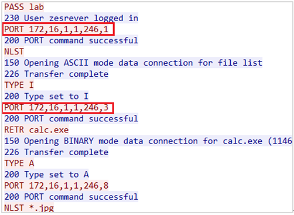

# FTP
 

### 추가 - FTP Active / Passive Mode

* Wireshark에서 Follow -> TCP Stream 클릭 위의 그림 같이 정보를 확인할 수 있다.
* 위의 그림에서 빨강은 Client, 파랑은 Server이다.
* PORT 172,16,1,1,246,1 => IP: 172.16.1.1, Port: 246*256 + 1 = 62976번을 사용하겠다는 의미이다.
 
 

