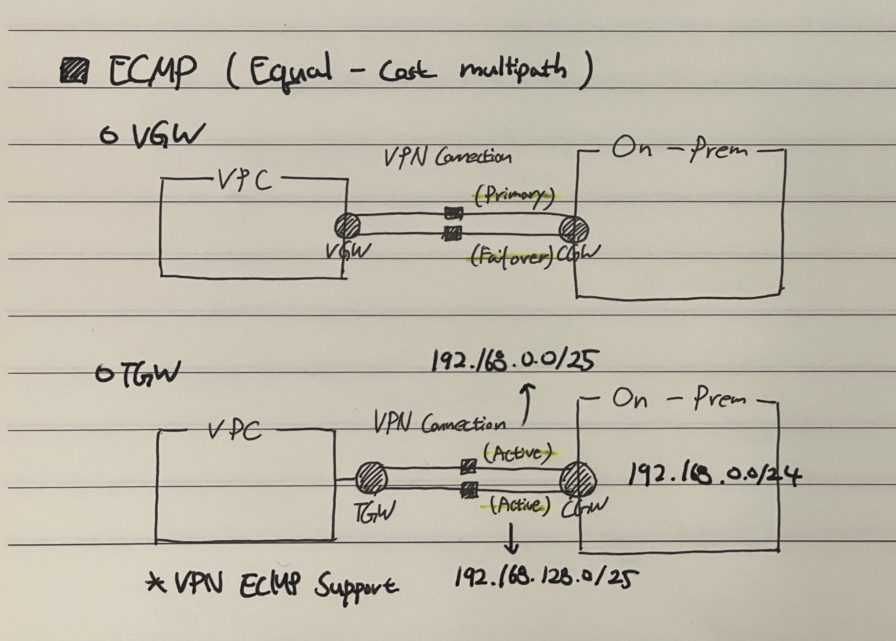

# ECMP Routing

* Equal-cost multi-path routing
* Destination에 대해 Distance, Metric, Priority 값이 동일한 경우(동일한 비용이 드는 경우), 여러 경로를 통해 전송되도록 허용하는 라우팅 전략
    - Active된 경로로는 트래픽을 Load balancing한다.
    - 전체 경로를 사용할 수 있으므로 Aggregate Bandwidth가 증가한다.
* 설정 시, 두 군데에서 모두 같은 CIDR을 BGP로 광고하면 Longest Match가 발생하므로 이미지와 같이 분리해서 설정해줘야 한다!

> 경로 복잡도 증가, 다른 라우팅 프로토콜과의 연동 등의 이슈로 좋은 성능을 제공하지 못하는 경우가 있다.

>  Active - Active로 동작시킬 경우 사용!! (단순 경로)

### Reference
* https://ko.wikipedia.org/wiki/ECMP
* https://www.juniper.net/documentation/kr/ko/software/junos/flow-packet-processing/topics/topic-map/security-ecmp-flow-based-forwarding.html