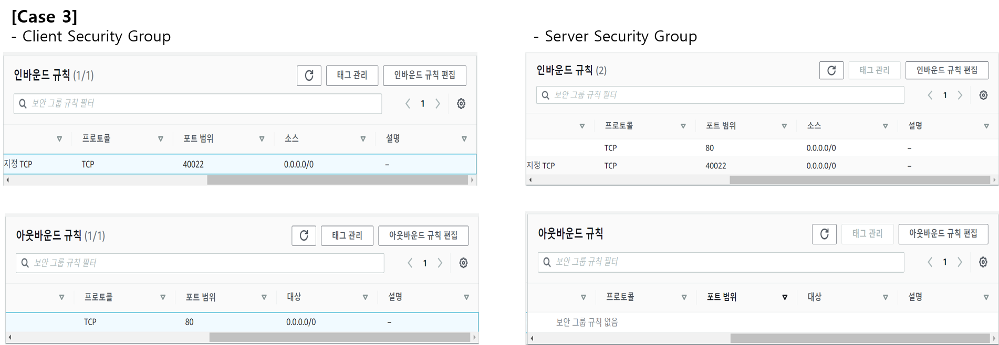

# Security Group (SG)
* https://brunch.co.kr/@ka3211/5
* https://m.blog.naver.com/adol83/222043782569

## Stateless
* 상태를 저장하지 않는 방화벽.
* Header에 있는 Source IP/Port, Destination IP/Port를 확인하여 필터링한다.
 
 

## Stateful
* Stateful inspection.
* 상태 추적 또는 세션 추적 방화벽이라고 한다.
* 3 way handshake 과정에서 통신 요청 정보(syn)와 통신 응답 정보(syn-ack) 정보를 세션 테이블에 저장하여 세션을 기준으로 필터링한다.
 
 

## SG Test
* Test Environment
* Client IP : 10.0.0.136
* Server IP : 10.0.0.186
    * Installed Yum Package : httpd
 

### Case 1
* Security Group
    

* Result
    

* Client의 Outbound가 없기 때문에 통신 불가.
 

### Case 2
* Security Group
    
* Result
    
* Request를 위한 Outbound가 허용되어 있어야 통신 가능.
* Requset를 위한 Outbound가 허용되어 있으면, Response에 대한 Inbound는 자동 허용
 

### Case 3
* Security Group
    
* Result
    
* Request에 대한 Inbound가 허용되어 있어야 통신 가능.
* Requset에 대한 Inbound가 허용되어 있으면, Response에 대한 Outbound는 자동 허용
 