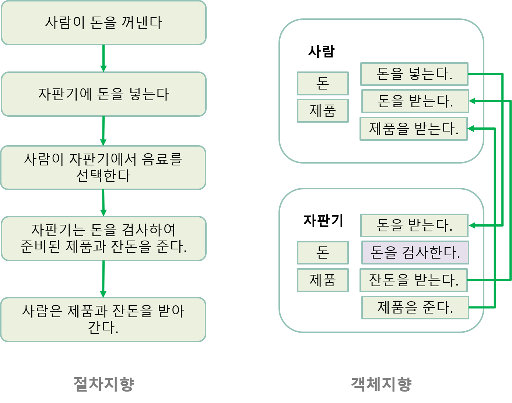

# Programming Paradigm
## 절차지향 & 객체지향 프로그래밍
* 프로그래밍 방법론(패러다임)
* Example : 사람이 음료 자판기에서 음료를 뽑는다.
    
* ref
    * https://www.slideshare.net/QooJuice/vs-60147566
    * http://www.incodom.kr/%EC%A0%88%EC%B0%A8_%EC%A7%80%ED%96%A5

## 절차지향 (Procedural Oriented)
* __절차를 중심으로 코드를 작성한다.__
* 데이터(구조체)와 함수(기능)가 분리되어 있다.
* 함수들이 데이터에 "종속성"을 나타내지 못하기 때문에 다른 영역에서 해당 함수를 호출하는 실수를 범할 수 있다.
 
 

## 객체지향 (Object Oriented)
* __객체를 중심으로 함수를 작성한다.__
* 데이터(클래스)와 함수가 분리되어 있지 않다.
* 함수가 클래스에 "종속성"을 띤다.
 
 

### 결론 (Conclusion)
* 정리를 하며 든 나의 생각은 규모가 커지고, 유지/보수가 커짐에 따라 절차지향 -> 객체지향으로 바뀌었다고 생각한다.
> 그러면 무조건 객체지향이 좋나? => 아니다. 소규모 작업인 경우는 절차지향이 더 좋을 수 있다고 생각한다.

> 하지만 설계와 개발 시간이 충분하고, 유지/보수 등을 생각하면 객체지향이 좋다고 생각한다.
 
 

#### 개발 공부 순서
* 1 - 변수 스코프 정리
* 2 - 데이터 타입 / 타입 캐스팅
* 3 - 연산자
* 4 - 조건문 / 제어문 / 반복문
* 5 - 함수
* 6 - 클래스 / 상속 overriding overloading
* 7 - 인터페이스 / 추상 클래스 
* 7 - 모듈
* 8 - 입출력
* 9 - 예외처리
* 10 - 라이브러리