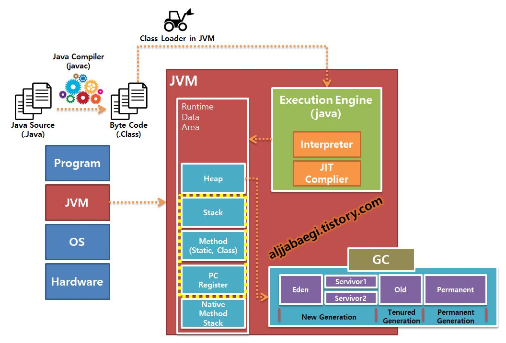
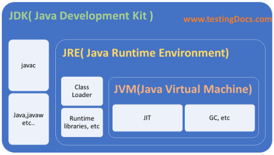

# Compile 과정
## Compile 과정 (컴파일러 & 인터프리터)
* 각 방식의 Build Process는 다음과 같다.

## 컴파일러 (Compiler)

* 기본 과정
    1) 헤더 파일(.h) 작성, 함수 및 클래스 선언
    2) 소스 파일(.c) 작성, 헤더 파일에서 선언한 함수의 기능 코드 작성
    3) 컴파일러를 통해 Object 파일 생성 (기계어로 번역된 파일ㅇ)
    4) 링커를 통해 Object 파일들을 링크하여, 실행 파일을 생성
    5) 해당 장치에서 실행 파일을 실행
* __전처리기(Preprocessor)__ : 각 소스 파일에서 지시자를 찾는다. 지시자는 # 으로 시작해서 줄 바꿈으로 끝나는 코드이다. 전처리기는 컴파일러가 실행되기 직전에 단순히 텍스트를 조작하는 치환 역할을 하기도 하고, 디버깅에도 도움을 주며 헤더 파일의 중복 포함도 방지해주는 기능을 가진다.
* __컴파일(Compile)__ : 소스 파일을 바이너리 파일(기계어)로 번역하는 작업. Object 파일을 생성.
* __링크(Link)__ : 분리된 파일들을 연결시켜 실행 파일을 생성(코드를 하나의 파일에서만 작업하지 않으므로 연결할 필요가 있다.)
* __빌드(Build)__ : 컴파일과 링크 과정을 합쳐서 빌드라고 함
* __라이브러리__ : 컴파일된 함수(기능)를 구현하는 코드가 저장되어 있는 파일들 모음
* __헤더 파일__ : 함수(기능)를 호출하기 위한 방법(인터페이스) 정보가 저장되어 있는 파일
 
 

## 인터프리터 (Interpreter)

* 기본 과정
    1) 소스 파일(.java/.py)을 컴파일러를 통해 바이트 코드 파일(.class/.pyc) 생성
    2) 바이트 코드 파일를 인터프리터가 해석하고 실행
* __바이트 코드 파일__ : 특정 VM이 읽을 수 있는(해석) 코드 파일 
* __인터프리터__ : 특정 VM에서 바이트 코드 파일을 해석하고 실행시키는 장치
 
 

## JAVA 컴파일 과정

* 기본 과정
    * __JDK__
        1) __Java Source File(*.java)__ 작성
        2) __Compiler(javac.exe)__ 을 통해 __Byte Code File(*.class)__ 로 변환
        3) __JVM(java.exe)__ 구동
    * __JRE__
        1) Runtime에 __Class Loader__ 를 통해 __Byte Code File__ 을 JVM 내로 로드
        2) ByteCode Verifier을 통해 검증 단계를 거친다.
            * Data Types 체크
            * Stack Overflow 체크
            * Code가 JVM이 명시한 내용과 일치한지
            * Memory에 허가되지 않은 접근이 존재한지
        3) Execution Engine에 의해서 Byte Code File을 __Binary Code__ 로 변환 및 실행

### Class Loader
* 생성된 Byte Code File(*.class)들을 엮어서 JVM으로 로드하고, Runtime Data Area에 적재한다(자바 애플리케이션이 실행 중일 때 해당 작업을 수행)
 

### Execution Engine (= Interpreter & JIT Compiler(Just In TIme))
* 기본적으로 Interpreter가 동작하여 명령어 단위로 Byte Code를 해석하게 된다.
* Interpreter가 코드를 해석하며, 루프, 반복적인 함수 호출 등을 만나 몇 번 이상 중복적인 해석이 이루어진다고 판단되며 JIT Compiler를 통해 Byte Code를 Binary Code로 직접 컴파일하게 된다(__Hot Spot Detection__)
> JVM의 경우 메소드 영역에 있는 코드 캐시(Code Cache) 공간에 컴파일된 기계어 코드를 캐싱한다.
 

### Garbage Collector (GC)
* Heap 메모리 영역에 적재되어 있는 객체들 중에 참조되지 않는 개체들을 탐색하여 제거하는 역할을 한다.
* GC가 언제 동작하는지 알 수 없다 (동작 구조를 볼 수 없음)
> 단점으로 특징 중 하나는 GC가 수행되는 동안 GC를 수행하지 않는 다른 모든 Thread들은 일시적으로 정지된다.
 

### Runtime Data Area
1. Stack Area
    * Class 내의 Method에서 사용되는 정보들이 저장되는 공간, 매개변수, 지역변수, 리턴 값 등이 LIFO 방식으로 저장된다.
    * 각 Thread 마다 하나씩 존재하며 Thread가 시작될 때 할당되며, 추가적으로 Thread를 생성하지 않았다면 main Thread만 존재한다.
2. Method Area (== C/C++ : Data Area + Code Area)
    * 전역 변수와 static 변수가 저장된다.
    * 코드에서 사용되는 클래스(*.class)들을 클래스 별로 런타임 상수풀(runtime constant pool), 필드(field) 데이터, 메소드(method) 데이터, 메소드 코드, 생성자(constructor) 코드 등을 분류해서 저장된다.
    > 정말 좋은 글 : https://velog.io/@syleemk/Java-%EB%A9%94%EB%AA%A8%EB%A6%AC-%EA%B5%AC%EC%A1%B0, 메소드 영역이라고 하는 추측은 클래스 파일로 컴파일하게 되면 메소드 별로 바이트 코드를 생성하기 때문에.

    > C/C++ 기준으로 Data Area에는 전역, static 변수 / Code Area에는 실행되는 코드가 저장.
3. Heap Area
    * new 명령어를 통해 생성한 인스턴스와 배열 등의 참조형 변수 정보가 저장되며, Method Area에 저장된 Area에 저장된 클래스들만으로 생성이 가능하다.
4. PC Register Area (JVM Area)
    * Program Counter. 즉, 현재 Thread가 실행되는 부분의 주소와 명령을 저장하고 있는 영역이다.
    * 해당 Area를 통해 Threaad가 돌아가면서 수행할 수 있게 된다.
    * Thread가 생성될 때마다 생성된다.
    > JVM이 CPU에 직접 Instruction을 실행하지 않고, Stack에서 직접 뽑아내 별도의 메모리 공간에 저장하는 방식을 취하고 있다. (https://doohong.github.io/2018/03/02/Java-runtime-data-area/)
5. Native Method Stack Area (JVM Area)
    * 자바 외 언어로 작성된 Native Code를 위한 영역. C/C++의 Method를 호출할 때 사용된다.
> Heap Area, Method Area는 모든 Thread가 공유 / 나머지 Area는 Thread 당 1개씩 존재

 
 

## JDK (Java Development Kit)

* __JDK(Java Development Kit)__ : 자바 개발 키트. JRE ++ 개발에 필요한 도구(Compiler, java.exe 등)
* __JRE(Java Runtime Environment)__ : 자바 실행 환경. JVM + 표준 클래스 라이브러리
* __JVM(Java Virtual Machine)__ : 자바 가상 기계. 실제 운영체제를 대신해서 자바 프로그램을 실행하는 가상의 운영체제 역할을 한다(JIT + Complier + GC 등)
> JDK와 JRE는 운영체제 별로 제공된다.
 
 

### Reference
* https://www.holaxprogramming.com/2013/07/08/java-jvm-bytecode/ 
* https://m.blog.naver.com/2feelus/220738480797
* http://blog.naver.com/PostView.nhn?blogId=kbh3983&logNo=220985785358
* https://aboullaite.me/understanding-jit-compiler-just-in-time-compiler/
* https://aljjabaegi.tistory.com/387
* https://jeong-pro.tistory.com/148
