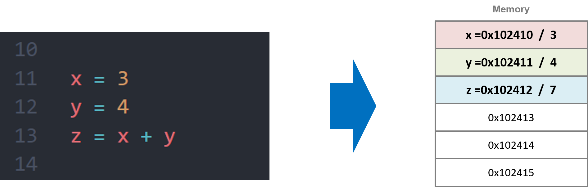
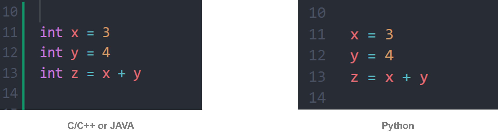

# Variable

* 값을 저장하는 메모리 공간을 변수라고 한다.
* 생각해야 될 내용
    * 변수 (Variable)
    * 상수 (Constant)
    * 바인딩 (Binding)
    * 스코프 (Scope)
    * 타입 (DataType) / 03에서 확인 가능
</br>


## 변수 (Variable)

* 변할 수 있는 데이터
</br>

### 변수 선언 및 초기화
``` 
[data_type] <l_value> = <r_value>

=> data_type : int, doutble, char etc
```
* 변수를 선언할 때는 자료형과 변수명을 입력한다. 원하는 경우 초기값을 적용할 수 있다.
* 초기화되지 않은 변수는 쓰레기 값이 들어간다.
* L value(l-value) : 메모리 위치를 가지는 표현식 (메모리 위치를 가지고 있어야 한다)
* R value(r-value) : 해당 Language에서 허용하는 모든 것 (리터럴 상수, 메모리 위치 및 Temporary 등 포함 / 왠만한거 다 되는 듯하다)
> 인터프린터 언어는(Python, Javascript etc) 자료형을 선언하지 않아도 된다. 인터프리터가 자동으로 R value를 가지고 자료형을 판단한다.

</br>
</br>


## 상수 (Constant)
* 변하지 않는 데이터
* 상수는 크게 2 가지가 있다.
    1) 리터럴 상수
    2) 심볼릭 상수
</br>

### 리터럴 상수 (Literal)
* 이름 없는 상수를 가리켜 "리터럴 상수" 또는 "리터럴" 이라고 한다.
* Example
    ```
    num = 30 + 40
    => 먼저 30, 40이 메모리 공간에 상수 형태로 저장
    => 두 상수(30, 40) 기반으로 덧셈하여 70을 num에 저장
    ```
</br>

### 심볼릭 상수 (Symbolic)
* 실질적으로 변수이지만 키워드를 이용하여 상수처럼 취급.
* 대문자, _를 사용하여 Naming 한다.
* const, final 명령어를 사용
* Example
    ```
    # C/C++
    const int CONST_NUM = 0;

    # JAVA
    public static final int CONST_FI = 3.14;
    ```
> Python은 const, final 명령어가 없다. 여러 방법이 존재 : https://velog.io/@pm1100tm/Python-%ED%8C%8C%EC%9D%B4%EC%8D%AC%EC%97%90%EC%84%9C-%EC%96%B4%EB%96%BB%EA%B2%8C-%EC%83%81%EC%88%98%EB%A5%BC-%EC%A0%95%EC%9D%98%ED%95%98%EA%B3%A0-%EC%82%AC%EC%9A%A9%ED%95%A0%EA%B9%8C

</br>
</br>


## Binding
* https://bubble-dev.tistory.com/entry/%ED%94%84%EB%A1%9C%EA%B7%B8%EB%9E%98%EB%B0%8D-%EC%96%B8%EC%96%B4-Names-Binding-Scopes
</br>

### Binding Time
* 속성이 결정되는 시기
1. 언어 설계 타임 (Language Design Time)
    * 해당 언어를 설계할 때 정의 (설계서)
    * ex> int 타입은 정수를 의미
2. 언어 구현 타임 (Language Implementation Time)
    * 설계한 내용을 구현할 때 정의
    * ex> int는 4 Byte 사용
3. 컴파일 타임 (Compile Time)
    * 컴파일러로 변환작업 거칠 때 정의
    * 변수 타입 결정
4. 링크 타임 (Link Time)
    * 링커가 실행될 때 정의
    * 다른 파일의 변수들에 대한 속성 결정
5. 로드 타임 (Load Time)
    * 프로그램이 메모리에 올라갈 때 정의
    * 전역 변수 할당 및 초기화가 이루어짐
6. 런 타임 (Run Time)
    * 프로그램이 실행 중에 정의
    * 동적 바인딩이 해당
</br>

### Binding 종류
1. 정적 바인딩 (Static Binding)
    * 컴파일 타임 포함 모든 바인딩. 실행 후에도 변하지 않는 속성들
2. 동적 바인딩 (Dynamic Binding)
    * 런타임 바인딩. 실행 후 바뀌는 속성들
    * 메모리 주소 등
</br>

### Type Binding
1. 정적 타입 바인딩 (Static Type Binding)
    * 정적 바인딩 시에 타입이 지정
    * C/C++
2. 동적 타입 바인딩 (Dynamic Type Binding)
    * 동적 바인딩 시에 타입이 지정
    * Python, Javascript 등이 해당
</br>

### Storage Binding
* 메모리에 공간이 할당되는 지점
1. 정적 방식 (Static)
    * 프로그램 로드 타임 때 공간이 바로 할당된다.
    * 전역 변수 및 static 변수가 해당.
2. 스택 동적 방식 (Stack dynamic)
    * 런타임 도중 공간 할당.
    * 함수, 지역 변수가 해당.
3. 힙 동적 방식 (Heap dynamic)
    * 런타임 도중 공간 할당.
    * malloc, new 등이 해당.
</br>
</br>

## Scope
* 변수의 정의되는 위치 또는 명령어에 따라 해당 변수를 사용할 수 있는 범위가 지정된다.
* Storage Binding과 연관이 되어, 어느 시점에 메모리에 올라가
</br>

### 지역 변수 (Local Variable)
* 함수 내에서 선언되는 변수를 의미한다.
* Stack Area에 메모리 할당된다.
* 선언된 함수 내에서만 접근이 가능하며, 함수 종료시 소멸된다.
```python
print("---------- 지역 변수 ----------")

def localVarFunc(param1, param2):
    a = param2 - param1
    b = param2 + param1
    print(a + b)

localVarFunc(4, 5)      #  10
```
</br>

### 전역 변수 (Global Variable)
* 어디서든 접근이 가능한 변수로 함수 외부에 선언된 변수
* 지역 변수와 이름이 같을 시, 지역 변수에 가려진다.
    => 함수 내의 지역변수를 전역 변수로 사용하려면 global 명령어를 사용해야 한다(잘 사용 안한다!!!)
```python
print("---------- 전역 변수 ----------")

globalVar = 10              # Global
globalVar2 = 20             # Global

def testFunc2():
    globalVar1 = 100        # Local
    global globalVar2       # Global
    globalVar2 = 30         # Global
    print(globalVar)
    print(globalVar2)
    # print(locals())

testFunc2()
print(globalVar)
print(globalVar2)
``` 
</br>

### 정적 변수 (Static Varibale)
* 클래스 변수(Class Variable)라고도 한다.

</br>

### 멤버 변수 


</br>
</br>


###############################


</br>
</br>
