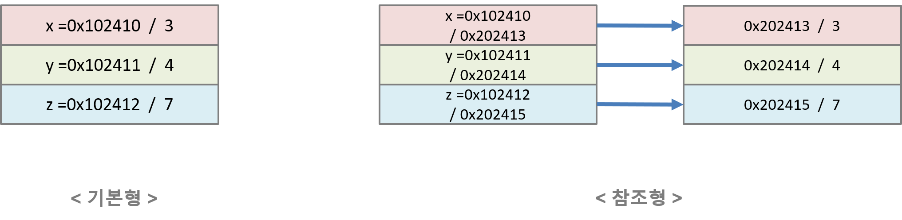

# Data Type

* Data Type은 크게 기본형(Primitive Type), 참조형(Reference Type)으로 구분된다.

## 기본형 (Primitive Type)
* 값을 변수에 직접 저장하는 자료형
</br>

## 참조형 (Reference Type)
* 값을 직접 저장하지 않고, 값의 위치(주소)를 저장하는 자료형
    ```
    # Example
    Test a = new Test();
    ```
> Python의 모든 Data Type은 참조형으로 되어 있다.
</br>

----
## Data Type (C/C++, JAVA)
| Data Type | Byte Size           | Range                               |
|-----------|-----------------------|---------------------------------------|
| boolean | 1 Byte | false(거짓), true(참) |
| char | 2 Byte	|  |
| byte | 1 Byte | -2^7 ~ 2^7 - 1 ( -128 ~ 127 ) |
| short	| 2 Byte | -2^15 ~ 2^15 - 1 ( -32768 ~ 32767 ) |
| int | 4 Byte | -2^31 ~ 2^31 - 1 ( -약 21억 ~ 약 21억 ) |
| long | 8 Byte | -2^63 ~ 2^63 - 1 |
| float | 4 Byte | -m * 10^e ~ m * 10^e  // m = 23, e = 8 ( Max : 3.4028235 * 10^38 ) ( Min : 1.4 * 10^-45, 절대값 기준 ) |
| double | 8 Byte | -m * 10^e ~ m * 10^e  // m = 52, e = 11 ( Max : 1.8 * 10^308 ) ( Min : 4.9 * 10^-324 ) |
* 일반적으로 리터럴 상수는 Integer, 실수는 Double을 사용한다(언어마다 다르다!)
> 1/2 Byte Data Type은 연산 시에 4 Byte인 int로 자동 Casting 후에 연산을 진행하는데 이유는 컴퓨터가 연산을 처리할 때 32bit(4 Byte) 또는 64bit(8 Byte) 연산 체제를 가지고 있기 때문이다.

> 실수 연산은 오차가 존재하기 때문에 이에 대한 처리가 필요하다!
</br>

## Data Type (Python)
| Data Type | Description           | Example                               |
|-----------|-----------------------|---------------------------------------|
| int       | 정수형 데이터            | a = 100   # 0xFF(16진수), Oo56(8진수)  |
| float     | 소수점을 포함한 실수형     | a = 10.25                             |
| complex   | 복소수                 | a = 3 + 1j                            |
| str       | 문자열                 | a = "abc"                             |
| bool      | 참, 거짓               | a = True   # False                    |
| None      | Null                  | a = None                              |

</br>

### Numbers
* Python이 지원하는 정수(Integer), 실수(Real Number), 복소수(Complex Number) 3가지가 있다.
1) 정수 (Integer)
    - 메모리가 허용하는 선에서 무한대의 정수를 사용    
    => Data Type : ```int```
2) 실수 (Real Number)
    - 8 바이트 크기의 부동 소수형 제공
    - 소수점 15자리까지 표현된다.
    - 정밀한 계산을 하기는 힘들다.
    => Data Type : ```float```
3) 복소수 (Complex Number)
    - "a + bj" 와 같이 표현
    => Data Type : ```complex```

```python
print("PYTHON")
print("---------- Numbers ----------")

a = 2
print(type(a))          # <class 'int'>

b = 3.15
print(type(b))          # <class 'float'>

v = 2 + 3j 
v.real    # 2
v.imag    # 3
print(type(v))          # <class 'complex'>
print(type(v.real))     # <class 'float'>
print(type(v.imag))     # <class 'float'>

```
</br>


### String
* 작은 따음표 또는 큰 따음표를 이용하여 문자열 표현
* 문자열의 특성은 다음과 같다.
    1) 기본적으로 문자열은 불변하다(immutable). 그러므로 대입 연산이 불가능하다.
    2) 인덱싱과 슬라이싱 가능
    3) 이스케이프(\)를 사용하여 특수문자 표현 가능
        - 이스케이프(\)를 특수문자  취급하기 싫으면 첫 따옴표 앞에 r을 붙이면 된다(raw string). 대신 이 경우 모든 이스케이프(\)를 일반 문자 취급하게 된다.
    4) """""" 또는 ''''''를 사용하여 여러줄 표현 가능
        - 줄 넘김 문자는 자동으로 문자열에 포함된다. 하지만 줄 끝에 \를 붙여 방지할 수 있다.
    5) 문자열로 연산이 가능
    6) 문자열 Formatting이 가능
> char 형은 문자형으로 가변이다(mutable). 그러므로 대입 연산이 가능하다!
</br>

```python
print("PYTHON")
print("---------- String ----------")


## 1) 문자열은 불변하다
str = "abcdefg"
#str[2] = "j"       Error Code


## 2) 인덱싱과 슬라이싱 가능
str = "abc"
print(str[0])           # a
print(str[2])           # c
print(str[0:2])         # ab


## 3) 이스케이프(\)를 사용하여 특수문자 표현 가능
str = "123\n456"
print(str)              # 123
                        # 456
str = "\"Python\""
print(str)              # "Python"

str = r'\"Python\"'
print(str)              # \"Python\"


## 4) """""" 또는 ''''''를 사용하여 여러줄 표현 가능
str = """
abc
def
"""
print(str)      # abc
                # def

str = """\
abc\
def
"""
print(str)      # abcdef

# 5) 문자열로 연산이 가능
print(3 * 'un' + 'ium')     # unununium


# 6) 문자열 Formatting
s = "Name: %s, Age: %d" % ("ABC", 30)
print(s)
```
</br>


### Byte
* 앞에 b'' 가 붙는다.
* 바이트를 표현하며, Immutable Type이다.
* bytearray 클래스의 경우, Mutable Type이다.
```python
print("PYTHON")
print("---------- String ----------")

s = "Python"
encodedS = s.encode("UTF-8")
print(encodedS)     # b'Python'
decodedS = encodedS.decode("UTF-8")
print(decodedS)     # "Python"

a = b'123'
print(a)            # b'123'
```

</br>


### Boolean
* Boolean은 True, False 둘 중 하나의 값을 가질 수 있다.
* True == 1, False == 0 으로 대응시킬 수 있다.

```python
print("PYTHON")
print("---------- Boolean ----------")

isTrue = True
isFalse = False

print(type(isTrue))         # <class 'bool'>
print(type(isFalse))        # <class 'bool'>

x, y = True + 1, False + 0 
print(x, y)                 # 2 0
```

</br>
</br>

---
## Pointer


### 2,3차원 배열
```py
# N*M 크기의 2차원 배열
n = 5
m = 2
arr = [[0]*m for _ in range(n)]

# [[0,0],[0,0],[0,0],[0,0],[0,0]]

# N*M 크기의 2차원 배열
n = 5
m = 2
arr = [[0]*m]*n
arr[0][0] = 5

# [[5,0],[5,0],[5,0],[5,0],[5,0]]
```
https://computer-science-student.tistory.com/313


----

# Type Casting
* Data Type을 변환한다.
* 연산은 Data Type 특성(Binding)을 가지고 진행이 된다. 크게 Upcasting과 Downcasting으로 분류된다.
    > 헷갈리기 쉬운데, 메모리를 기준으로 보는 것이 아닌 Data Type을 기준으로 생각해야 한다! Class 다형성은 이후에 정리할 예정.
* Data Type을 변환하는 방법으로는 크게 자동 형 변환과 강제 형 변환이 있다.
    > Python은 신경쓰지 않아도 된다. 전부 자동...
</br>


## 자동 형 변환 (== 묵시적 형 변환)
* 형 변환 시 명시적으로 표시를하지 않아도 자동으로 변환된다.
* 자동 형 변환이 되는 경우는 다음과 같다.
1. 대입 연산의 전달과정에서 발생하는
    ```c++
    double num1 = 245;       # 245.0
    int num2 = 3.1415;       # 3
    ```
2. 정수 승격에 의한
    * short나 char의 경우 연산할 때, int 형으로 자동 승격된다.
3. 피연산자의 자료형 불일치로 발생하는
    ```c++
    double num1 = 5.15 + 19;     # 19 --> 19.0으로 변경된 후 계산된다.
    ```
    * 순서 : int -> long -> longlong -> float -> double -> longdouble
    * 데이터 손실을 최소화하는 방향으로 진행하며, char, short는 정수의 승격에 의해 자동으로 변환
</br>
</br>

## 강제 형 변환 (== 명시적 형 변환)
* 형 변환 시 명시적으로 표시를 해야 변환된다.
    ```c++
    int num1 = 3;
    int num2 = 4;

    double divResult;
    divResult = (double)num1 / num2;
    ```
</br>
</br>


## Upcasting
* 범위가 작은 쪽 ---> 큰 쪽으로 타입 변환
1. 메모리 크기가 작은 쪽 ---> 큰 쪽
2. 정밀도가 작은 쪽 ---> 높은 쪽
3. Parent Class ---> Child Class (아마 가능은 하나? 사용하지 않음)
</br>
</br>

## Downcasting
* 범위가 큰 쪽 ---> 작은 쪽으로 타입 변환
    > 범위가 작아짐에 따라 제약 사항이 따라온다!
1. 메모리 크기가 큰 쪽 ---> 작은 쪽
2. 정밀도가 높은 쪽 ---> 작은 쪽
3. Child Class ---> Parent Class
```c++
long x = 10;            # long type은 8 byte로 연산하는 특성을 가지고 있다. => x는 8 byte 메모리를 할당받는다(초기화 및 대입연산)
int y = x;              # int type은 4 byte 로 연산하는 특성을 가지고 있다. => y는 4 byte 메모리를 할당받는다(초기화 및 대입연산산)
                        # y는 4 byte만 저장 가능하므로 x의 8 byte 중 4 byte만 저장된다. 즉, 앞 4 byte는 잘려나간다.

# Class
Child a = new Child();       # a는 Parent Class를 상속. Child 뿐만 아니라 Parent의 멤버변수, 멤버함수도 접근 가능하다.
Parent b = a;                # b는 Parent Class. 클래스는 주소 값을 저장하기 때문에 대입 연산으로 인해 메모리 크기가 줄어들거나 하지 않는다.
                            # 하지만 b는 Parent Type이기 때문에 메모리에 저장되어 있는 Type은 Parent이기 때문에 Child 클래스 쪽을 접근이 불가능하다. 그래서 변수의 값은 Child를 가리키지만 Child의 멤버면수, 멤버함수에 접근이 불가능하다.
```
</br>

* ord(char) : 아스키 코드 -> 숫자
* chr(number) : 숫자 -> 아스키 코드