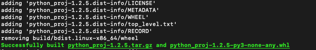
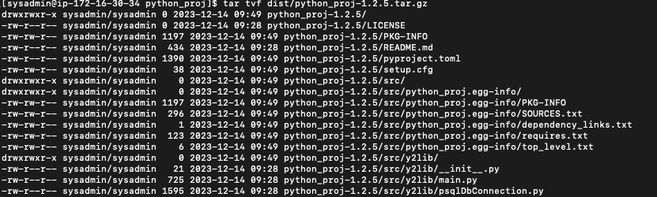
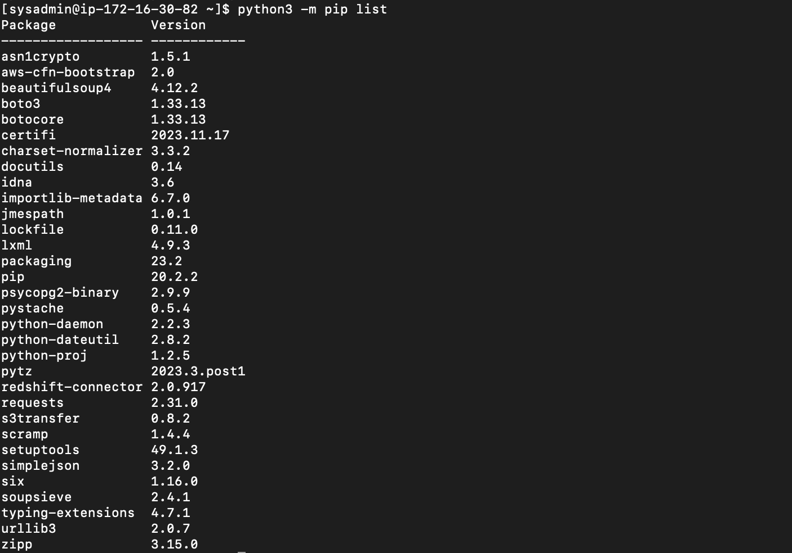

# Project
프로젝트의 규모가 커지고 유지보수할 것들이 늘어날 수록, 관리되어져야 하는 포인트들이 점차 많아진다. 그렇기 때문에 포인트를 줄여야 하는데 이를 위해 여러가지 도구들을 사용하게 된다.

프로젝트 구성 및 배포 과정은 다음과 같다.
1. 개발 환경 구성  
2. 프로젝트 구성 :  https://devocean.sk.com/blog/techBoardDetail.do?ID=163566
3. 코드작성
4. 배포 : https://bskyvision.com/entry/python-%EB%82%B4%EB%B6%80%EB%A7%9D%ED%8F%90%EC%87%84%EB%A7%9D%EC%97%90-whl-%ED%8C%8C%EC%9D%BC%EC%9D%84-%ED%86%B5%ED%95%B4%EC%84%9C-%ED%8C%A8%ED%82%A4%EC%A7%80-%EC%84%A4%EC%B9%98%ED%95%98%EB%8A%94-%EB%B0%A9%EB%B2%95
5. 컨테이너 : https://www.ghanei.net/python-app-multistage-docker-build/
6. https://pythonspeed.com/articles/multi-stage-docker-python/


Reference
- https://ryanking13.github.io/2021/07/11/python-packaging.html
- https://devocean.sk.com/blog/techBoardDetail.do?ID=163566

</br>
</br>


## 프로젝트 구성
### Project Structure
```sh
## Directory Structure
$ tree .

python_proj
├── LICENSE
├── README.md
├── pyproject.toml (or setup.py)
├── src
│   └── y2proj
│       ├── __init__.py
│       └── utils.py
└── test
```
- LICENSE : Project License 정보
- README.md : README 파일
- pyproject.toml (or setup.py): 패키지 빌드 및 의존성 명세서
- src : Source Code
- test : Test Code

</br>
</br>

---
### pyproject.toml
setup.py 스크립트를 사용하는 것은 Legacy한 방식으로 최근 추세는 toal 파일을 사용하려 한다.

```toal
#################################################################################
# 빌드 백엔드
#################################################################################
[build-system]
requires = ["setuptools>=40.8.0", "wheel"]          # 빌드를 위한 패키지 정의
build-backend = "setuptools.build_meta"             # 빌드를 수행할 Python 객체 이름


#################################################################################
# 프로젝트 메타데이터 정의
#################################################################################
[project]
name = "test-y2-pkg"                                # 패키지 이름
version = "1.2.5"                                   # 패키지 버전

description = "Package description"                 # 패키지 설명
readme = "README.md"                                # 설명 파일 (README 파일)
# readme = {file = "README.txt", content-type = "text/markdown"}

authors = [                                         # 패키지 작성자 (사람, 기업)
    {name = "Pradyun Gedam", email = "pradyun@example.com"},
    {name = "Tzu-Ping Chung", email = "tzu-ping@example.com"},
]
maintainers = [                                     ## 패키지 관리자
    {name = "Brett Cannon", email = "brett@example.com"}
]

requires-python = ">=3.7"                           # 파이썬 최소 요구 버전

license = {file = "LICENSE"}                        # LICENSE 파일
# keywords = ["one", "two"]                              # Pypi 에서 검색시 (인스타 태그 느낌)

classifiers = [                                     # Pypi 분류 (https://pypi.org/classifiers/)
    "Development Status :: 3 - Alpha",
    "Framework :: Django",
    "Programming Language :: Python :: 3",
    "Operating System :: POSIX :: Linux"
]

dynamic = ["version"]                               # 동적 메타데이터 목록 / 벡엔드에서 코드, Git tag 등의 값을 읽도록 할 수 있다. 백엔드에서 적용을 해야한다


#################################################################################
# 프로젝트 의존성 정의
#################################################################################
dependencies = [                                    # 의존성 정의 (pip 사용하는 의존성)
    "requests",
    'importlib-metadata; python_version<"3.8"',
    "httpx",
    "gidgethub[httpx]>4.0.0",                           
    "enum34; python_version<'3.4'",                     ## 특정 환경 만족할 때 적용 (ex> Python version < 3.4)
    "pywin32 >= 1.0; platform_system=='Windows'",       ## 특정 환경 만족할 때 적용 (ex> Windows)
    "django>2.1; os_name != 'nt'",
    "django>2.0; os_name == 'nt'"
]


[project.optional-dependencies]                     ## 패키지의 특정 기능에만 의존성이 필요한 경우 (사용법 : pip install your-project-name[gui] or 명령어 통해서 따로 추가)
pdf = ["ReportLab>=1.2", "RXP"]
rest = ["docutils>=0.3", "pack ==1.1, ==1.3"]
gui = ["PyQt5"]
cli = [
  "rich",
  "click",
]

#################################################################################
# 실행 가능 스크립트???
#################################################################################
[project.scripts]
my-script = "my_package.module:function"

[project.gui-scripts]
spam-gui = "spam:main_gui"


#################################################################################
# 프로젝트 관련 사이트 주소 (URL)
#################################################################################
[project.urls]
Homepage = "https://example.com"
Documentation = "https://readthedocs.org"
Repository = "https://github.com/me/spam.git"
Issues = "https://github.com/me/spam/issues"
Changelog = "https://github.com/me/spam/blob/master/CHANGELOG.md"


#################################################################################
# Plugin 추가
#################################################################################
[project.entry-points."spam.magical"]
tomatoes = "spam:main_tomatoes"


#################################################################################
# Setuptool 사용방법 (https://setuptools.pypa.io/en/latest/userguide/pyproject_config.html#dynamic-metadata)
#################################################################################
[tool.setuptools.dynamic]
version = {attr = "my_package.VERSION"}
readme = {file = ["README.rst", "USAGE.rst"]}

```
* [build-system] : 빌드 패키지 관련 정의
* [project] : 프로젝트 메타데이터 정의
* [project.optional-dependencies] : 특정 기능에서만 의존성이 필요한 경우
* [project.urls] : 프로젝트 관련 사이트 주소 (URL)
* [project.scripts] : 
* [project.gui-scripts] : 
* [project.entry-points."spam.magical"] : Plugin 추가


</br>
</br>

---
### Setup
기존 setup.cfg(정적 메타데이터를 가지고 있는 설정 파일)를 사용하였다. 하지만 setup.py를 통하여 우리는 동적으로 메타데이터를 빌드를 할 수 있게 된다. 작성 방법은 다음과 같다.

```py
import setuptools

with open("README.md", "r", encoding="utf-8") as fh:
    long_description = fh.read()

setuptools.setup(
    name = "package-name",
    version="0.1.1",
    author="Schooldevops",
    author_email="schooldevops@gmail.com",
    description="schooldevops sample lib",
    long_description=long_description,
    long_description_content_type="text/markdown",
    url="https://github.com/schooldevops/python-tutorials",
    project_urls={
        "Bug Tracker": "https://github.com/schooldevops/python-tutorials/issues",
    },
    classifiers=[
        "Programming Language :: Python :: 3",
        "License :: OSI Approved :: MIT License",
        "Operating System :: OS Independent",
    ],
    package_dir={"": "src"},
    packages=setuptools.find_packages(where="src"),
    python_requires=">=3.6",
)
```
* name: 배포할 패키지 이름
* version: 배포할 패키지 버전
* author: 작성자 (사람, 조직)
* author_email: 작성자 메일
* description: 설명
* long_description: 긴 설명 (보통 README.md 내용을 추가)
* long_description_content_type: 설명 파일 확장자 (text/markdown)
* url: 설명 가능한 페이지 URL 추가
* project_urls: PyPI에서 보여줄 추가적인 링크를 나타낸다. Github 등 Repository 깃헙과 같은 소스 리포지토리가 보통 들어간다.
* classifiers: 패키지를 위한 몇가지 추가적인 메타 데이터를 나열한다. 파이썬 패키지, 라이선스, 운영체제 등을 기술하였다.
* package_dir: 패키지 이름들과 디렉토리를 기술한다. 비어있는 값은 루트 패키지의 값으로 여기서는 src를 작성했다 src 하위에 패키지가 포함되어 있음을 확인하자.
* package: 모든 파이썬 import packages의 목록이다. 여기에는 배포되는 패키지를 포함한다.
* python_requires: 파이썬 버젼을 기술한다.


</br>
</br>


## 빌드 및 배포
## 빌드
### 빌드 모듈 패키지 및 사용 패키지 설치
먼저 빌드에 필요한 모듈을 설치한다.

```
$ python3 -m pip install --upgrade build

$ python3 -m pip install --upgrade <사용_패키지1>
$ python3 -m pip install --upgrade <사용_패키지2>
```
</br>

### 빌드 수행
빌드를 수행하면 wheel 파일이 생성하게 된다. 

```
$ python3 -m build
```
</br>

수행하
고 나면 다음과 같은 파일이 생성된다.


- python_proj-1.2.5.tar.gz : Source archive (소스 코드 파일)
- python_proj-1.2.5-py3-none-any.whl : bdist_wheel (빌드 배포 파일)

</br>

아카이브 파일 내부는 다음과 같이 구성되어 있다.




### 빌드 업로드
빌드 업로드도 먼저 필요한 모듈을 설치해야 한다. twine은 PyPI에 패키지를 업로드할 수 있게 해준다.

```
$ python3 -m pip install --upgrade twine

$ python3 -m twine upload dist/*
```
</br>

### 빌드 패키지 설치
1. 폐쇄망이 아닌경우
    ```
    $ python3 -m pip install --upgrade <package_name>
    ```

2. 폐쇄망인 경우 (Airgabbed)
    ```
    $ python3 -m pip install --upgrade <whl_name>
    ```

</br>

### 배포
빌드한 패키지를 설치하면, 아래와 같이 리스트에 추가된 것을 확인할 수 있다.



