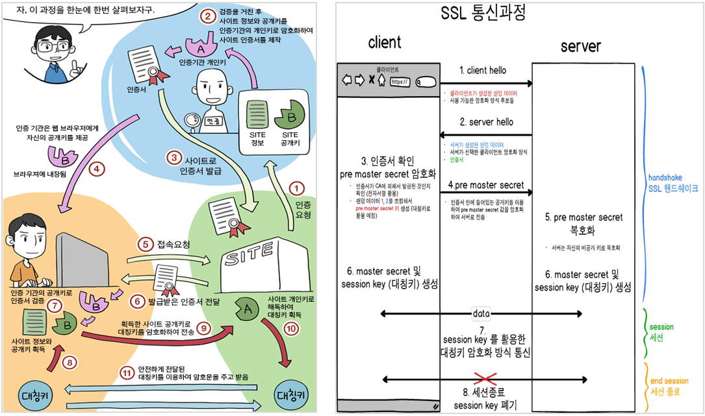
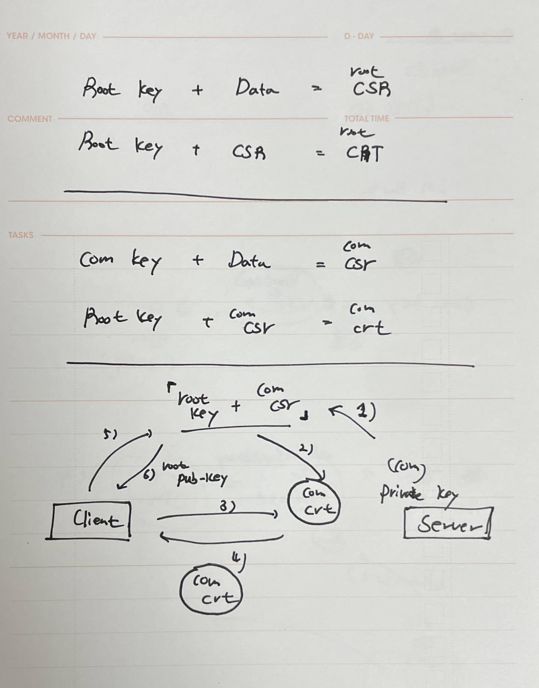

# Openssl

---
# 인증서 통신 과정

1. {Site 공개 키 + Site 정보}를 "인증 기관 개인 "키로 암호화하여 인증서 생성/발급, 그리고 인증 기관의 공개키가 브라우저에 저장되게 된다(1 ~ 4)
2. Client가 Server에게 hello Packet 전송 (5)
3. Server가 Client에게 hello Packet 전송, 이때 인증서를 전달 (6)
4. 인증서를 "인증 기관의 공개키"로 확인 (7)
5. 인증서에 들어있는 "Server 공개 키"를 이용하여 대칭 키를 암호화하여 전송 (8, 9)
6. Server는 받은 전달받은 값을 개인 키로 복호화하여 대칭 키 획득 (10)
7. 이후 Client와 Server 간의 통신은 대칭 키를 이용하여 통신하게 된다 (11)
> 대칭 키를 공개 키로 암호화하고, 실질적으로는 대칭 키를 이용해서 암호문을 주고받는다. 공개키는 대칭키를 효율적으로 보내기 위해 사용된다.

* 인증 기관 - 공개 키를 위해서는 인증기관이 필요하다(중앙집권)
    1) 최상위 인증기관: KISA 등
    2) 공인인증기관: 예스사인 등
    3) 등록대행기관: 은행 등

</br>
</br>


---
## Self Signed Certificate 생성

* Self Signed Certificate : 모든 인증서는 발급기관(CA)의 개인키를 통해 요청자 데이터와 공개키를 암호화한(전자서명한) 데이터이다. 하지만 최상위에 있는 인증기관(Root ca)는 서명해줄 상위 인증기관이 없으므로 Root ca의 개인키로 스스로의 인증서에 서명하여 최상위 인증기관 인증서를 만든다. 이렇게 만든 인증서를 SSC라고 한다.
* 인증서 생성 순서는 다음과 같다.
    0) SSL 설치
    1) Private/Public Key 생성
    2) 인증 요청서 생성
    3) 인증서 생성
</br>

### 0. Private/Public Key 생성
```
$  yum install –y openssl mod_ssl
```
* OpenSSL : 네트워크를 통한 데이터 통신에 쓰이는 Protocol인 TLS와 SSL의 Open Source, 각기 다른 다양한 암호화 알고리즘을 지원.
* mod_ssl : OpenSSL 라이브러리를 사용하여 HTTPS를 구현한 확장 모듈이다.
</br>

### 1. Private/Public Key 생성
* 개인키 생성
    ```
    #openssl genrsa -[messageDigest_value] -out [outputFile_name] 2048

    $ openssl genrsa -out ca.key 1024
    ```
* 공개키 생성
    ```
    # openssl rsa -in <PRIVATE_KEY> -pubout -out <PUBLIC_KEY>

    $ openssl rsa -in ca.key -pubout -out public.key
    ```

* 추가 작업 : 패스워드 제거
    ```
    $ cp server.key server.key.origin
    $ openssl rsa -in server.key -out server_pri.key
    ```
</br>


### 2. 인증 요청서 생성
```
$ openssl req -new -key ca.key -out ca.csr

$ openssl req -in ca.csr -pubkey
```
1) Country Name : 국가코드, KR
2) State or Province Name : 시/도 이름, Seoul
3) Locality Name : 구/군, Jong-ro
4) Organization Name : 회사명
5) Organizational Unit Name: 부서명
6) Common Name : 도메인명, www.cloud.com
7) Email Address : 이메일 주소, Administrator@cloud.com
> csr에 공개키가 포함되어 있다!!!!


### 3. 인증서 생성
```
$ openssl x509 -req -days 3650 -in ca.csr -signkey ca.key -out public.crt
```
* openssl x509 -req -days [유효기간] -in [인증 요청서] -signkey [개인키] -out [인증서 파일명]
</br>


## 암호화 알고리즘 확인
```
$ openssl ciphers -v
```
암호화 알고리즘 확인