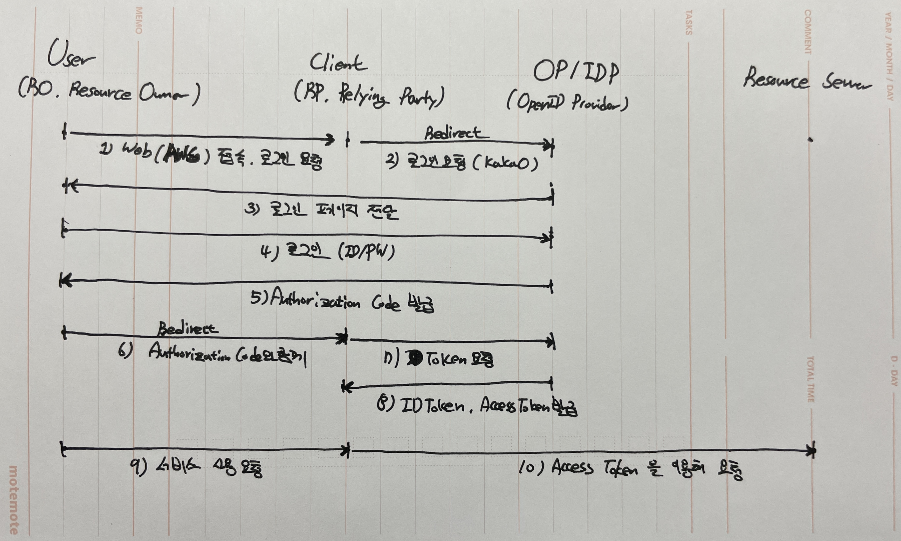

# OIDC & OAuth
서비스에 대한 접근 인증을 해당 서비스가 아닌 믿을 만한 다른 서비스(구글, 페이스북, 트위터 등)에 인증 절차를 위임하는 방식이다.
* 왜 이런 방식이 나왔을까?
    - 보안 침해 사례가 늘어남에 따라 사용자 데이터를 직접 관리하는 것은 큰 부담이 된다
    - 보통 각 서비스마다 인증 체계를 가지고 갔기 때문에 모든 서비스가 인증관련 정보를 모두 가지고 있어야 부담이 생겼다
* OpenID Connect : Authentication
* OAuth : Authorization
* OIDC Flow
    
    1) 서비스 사용을 위해 A 웹사이트를 접속한다. 사용자 인증을 카카오(OP)를 통해 받도록 Redirection 한다.
    2) A 웹사이트는 카카오에게 자신을 대신하여 인증을 해달라고 요청한다.
    3) 카카오는 로그인 페이지를 사용자에게 전달한다.
    4) 사용자는 카카오에 인증 정보를 전달해 처리한다.
    5) 카카오는 사용자에게 Authorization Code를 발급한다.
    6) 사용자는 Authorization Code를 A 웹사이트에 전달한다.
    7) A 웹사이트는 Authorization Code가 정상적인지 카카오에게 확인한다.
    8) Code를 확인하고, 토큰을 발급해준다.
    9) 이후 토큰을 사용하여 사용자는 서비스를 사용한다. 
 
 

## OpenID Provider(IDP)
OpenID Connect + OAuth 2.0 를 제공하는 업체
* Google, kakao, Naver 등이 해당

## OpenID Connect
OAuth 2.0을 기반으로 구축된 인증 표준으로, 타사 서비스가 대신하여 인증할 수 있도록 하는 위임 프레임워크(OAuth 2.0의 Authentication Layer)
* 응답 : ID Token - 암호화된 사용자 정보가 저장되어 있으며, 클라이언트에게 사용자 정보를 제공
* 형태 : JWT (JSON Web Token)
> 공식 : https://openid.net/developers/how-connect-works/

 
 

## OAuth 2.0
권한 부여 표준으로, 타사 서비스에게 접근 권한 위임을 받을 수 있는 프레임워크Connect는 이를 사용해서 인증 서비스를 제공한다.
* 응답 : Access Token - Lifecycle이 짧으며, 특정 리소스에 대하여 임시로 액세스할 수 있는 정보가 저장
 

---
### ID Token OpenID Connect 가 필요한 이유

 

### ID Token vs Access Token
* ID Token
    * ID Token은 사용자를 확인하는데에만 쓰여야 한다. 하지만 일부 이를 Access Token처럼 사용하는 경우가 있는데, 이런 경우 민감한 영역에 대하여 무단으로 접근할 수 있다. (취약점 발생)
* Access Token
    * Access Token에는 사용자와 상관없이 액세스할 수 있는 정보가 저장되어 있어, 탈취 시 공격자는 사용자 정보 없이 액세스할 수 있게 된다. (취약점 발생)
    * Access Token만 있으면 어디서나 접근이 가능하다보니 TTL이 짧다.

> 
