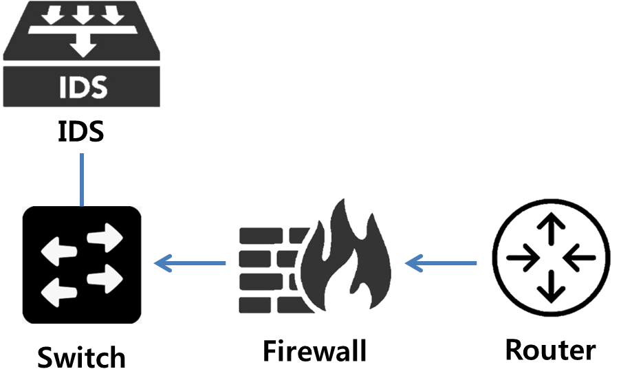

# 정보보호 시스템
* Computer Security System
* 정보보호 시스템을 통해 암호화, 인증, 감시, 탐지, 차단 등이 이뤄진다.

## 정보보호 시스템 종류 및 기능
## 방화벽 (FireWall)
* 침입 __차단__ 시스템
* <u>가장 기본적으로 사용되는 1차 방어선</u>
* <u>미리 정한 정책/규칙에 따라 트래픽 필터링</u>
* Hadware 또는 Software

## IDS (Intrusion Detection System)

* 침입 __탐지__ 시스템
* IPS는 차단 솔루션임에 반해 IDS는 수동적인 시스템으로 <u>트래픽을 모니터링 및 스캔하고 위협 및 공격에 대해서 보고<u>만 하는 침입 감지 시스템. 탐지도니 공격에 대해서 관리자에게 Notify하면 IDS의 역할은 끝난다.
* Firewall이 차단하지 못한 해킹, 악성코드의 활동 탐지
* 설치위치에 따라 __호스트기반(HIDS)__, 네트워크기반(NIDS)로 나뉜다.

## IPS (Intrusion Prevention System)

* 침입방지시스템
* 네트워크 자체에 대한 스캐닝을 수행하여 악성 공격을 감지하고 방어하는 역할을 수행. 모든 네트워크 트래픽을 스캐닝하여 차단(block)할지, 악성 트래픽을 교정(redediate) 할지를 결정.
* 방화벽의 Rule 차단은 공격에 대한 차단율이 낮다는 점을 보완하기 위해 만들어졌다.
* IPS vs Firewall
    | 비교 항목          | IPS                                                            | IDS                                                               |
    | ------------------ | -------------------------------------------------------------- | ----------------------------------------------------------------- |
    | 유형               | Active/Passive                                                 | Passive                                                           |
    | 탐지 방식          | Anomaly 탐지, 시그니처 탐지                                    | 시그니처 탐지                                                     |
    | 위치               | 데이터 통신 네트워크 내부                                      | 데이터 통신 네트워크 외부                                         |
    | 반응               | 악성 트래픽 경고 및 삭제                                       | 악성 트래픽 경보 및 알림                                          |
    | 네트워크 성능 영향 | 내부 네트워크 IPS 처리로 인한 지연으로 인해 네트워크 성능 저하 | 네트워크 성능 저하와 관계없음                                     |
    | 장점               | 탐지 및 방어가 자동으로 수행                                   | IPS에 의해 차단될 수 있는 합법적인 트래픽을 차단하지 않을 수 있음 |

* IPS vs Firewall
    |      | IPS                                              | Firewall                                                                                              |
    | ---- | ------------------------------------------------ | ----------------------------------------------------------------------------------------------------- |
    | 기능 | 트래픽 차단 및 필터링과 같은 작업을 수행         | 공격을 탐지하고 방지                                                                                  |
    | 대상 | 소스, 대상 IP 주소, 프로토콜 및 포트 번호에 의존 | 표준 길이가 아닌 IP 패킷, 버퍼 오버플로, DOS 및 DDOS 공격과 같은 공격과 같은 시나리오를 탐지하고 조치 |
    * 방화벽은 트래픽 차단 및 필터링과 같은 작업을 수행하고, IPS는 공격을 탐지하고 방지한다.
    * 방화벽

## VPN (Virtual Private Network)

## WAF (Web Application Firewall)

## Bastion Host

## DMZ

### Reference
* https://brunch.co.kr/@sangjinkang/49
* https://girrr.tistory.com/25

