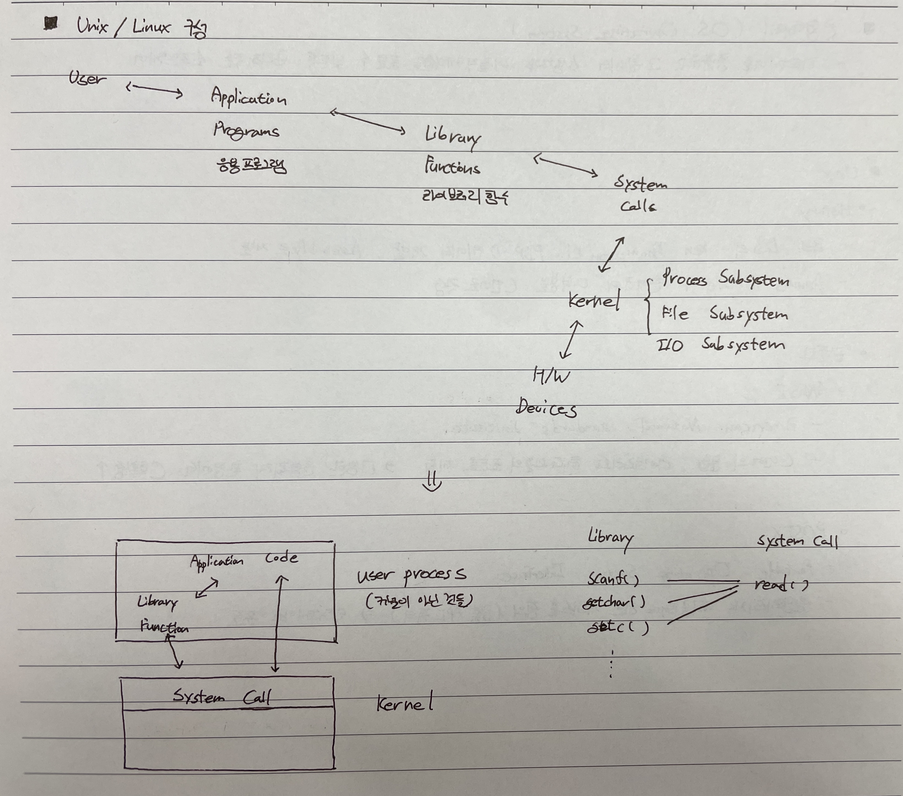
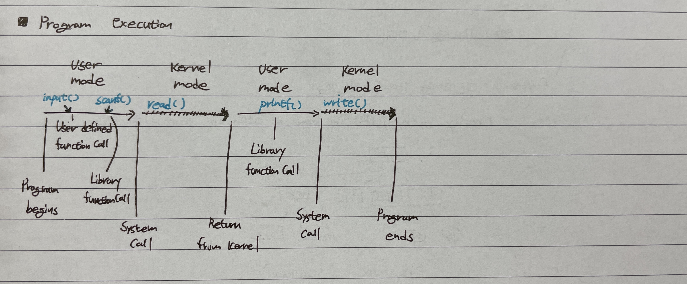

# Operating System
운영체제라고 하며, 하드웨어를 총괄하고 그 위에서 사용자가 Application을 돌릴 수 있도록 관리해주는 소프트웨어

---
# Linux

## History
### POSIX
* Portable operating system interface
* 서로 다른 기업, 학교 등에서 UNIX 계열 운영체제가 개발이 되었다. 그러다보니 운영체제 간의 호환성과 이식성에 어려움이 발생했다.8 이식성을 높이기 위해 POSIX 표준이 개발되었다.
* POSIX는 운영체제가 아니라 응용 프로그램과 운영체제 간의 인터페이스이다.
* POSIX 표준을 만족하는 파일 시스템 계열들로는 EXT 계열이 있다.
* https://medium.com/naver-cloud-platform/posix-%EC%95%8C%EC%95%84%EB%B3%B4%EA%B8%B0-1-linux-%EB%A6%AC%EB%88%85%EC%8A%A4-%ED%8C%8C%EC%9D%BC-%EC%8B%9C%EC%8A%A4%ED%85%9C%EC%9D%98-%EC%A2%85%EB%A5%98%EC%99%80-%ED%8A%B9%EC%A7%95-96a2e93e33b3
 

## Linux Architecture

* kernel : 하나의 프로그램으로 구성되어 컴퓨터를 구성하는 모든 하드웨어와 소프트웨어를 관리(System Resource)
* Device : 물리적인 부품 (CPU, Memory, HDD, Network Adaptor etc)
* Device Driver : 특정 디바이스를 조작하는 소프트웨어 (Device를 다루는 코드, 필요에 다라 커널에 적재할 수 있도록 디자인)
* System Call : 하드웨어를 조작하기 위해 커널에서 실행하는 Kernel API
> "/", "/boot"에 있는 "vmliuz" or "vmlinux", "vmlinuz-x.x.x" 파일이 Linux Kernel 본체
* Linux 구성요소
    * Library
    * File System
    * Process
    * Signal
    * Stream
    * Termail/Shell

 
 

## Procsess
실행 중인 프로그램, An executable file residing on disk
 

### Program Execution

* 과정은 다음과 같다.
    1. Program에서 작성된 코드 호출(라이브러리 호출)
    2. 코드는 Kernel API 호출(System Call)
* Kernel Mode
    * 모든 메모리에 접근 가능
    * 권한이 있는 모드
    * 직접적인 제어 가능
    * 주변장치 제어 가능
* User Mode
    * 일반 실행 모드
    * 권한이 없음
    * 직접적인 제어 불가능
 
 

