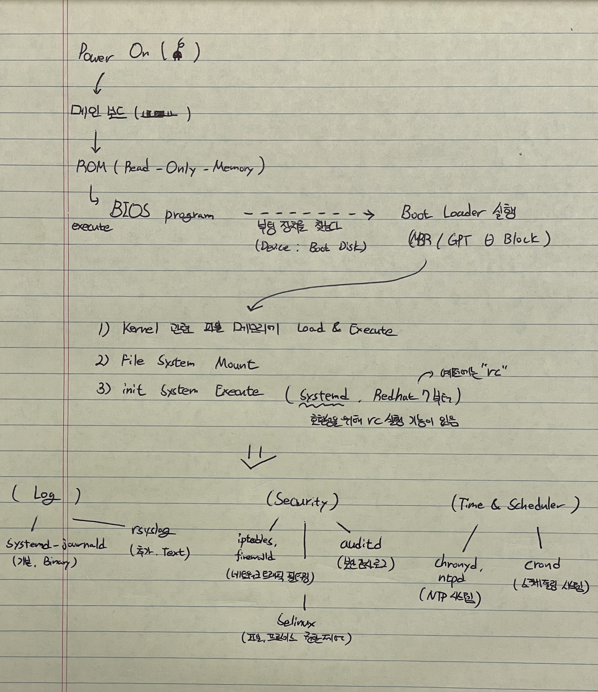

# Booting

 

## Linux Booting Sequence
* BIOS : Basic Input/Output System. 컴퓨터의 입출력을 처리하는 펌웨어 
* ROM : Read Only Memory
1. Power On
    * 메인보드에 전원 공급
    * 메인보드의 ROM을 통해 특정 번지에 있는 BIOS를 실행하도록 한다.
2. Execute BIOS Program
    * 자체 진단 기능 실행 (POST, Power On Self Test)
    * CMOS, CPU, Memory, 주변장치 등 각종 장치의 이상 유무를 검사
3. Boot Loader 실행 (Linux : GRUP)
    1) MBR(Master Boot Record) 또는 VBR(Volume Boot Record) 로드 후 grup 실행 (이때 bios_grup 파티션이 있다면 해당 파티션으로 접근한다)
    2) /boot/grup에 접근하여 커널(vmlinuz)관련 파일을 메모리에 로드한다
4. Loading Kernel
    1) 커널 파일 실행
    2) PCI Bus 및 하드웨어 점검 후, /var/log/dmesg 기록
    3) Process ID(PID) 0인 swapper 프로세스를 실행하여 각 장치 드라이버 초기화(ps 명령어에 안보임 Memory context switching)
    4) 초기화 완료 후, PID 1인 init 프로세스 실행(systemd)
5. File System Mount
    * /etc/fstab에 지정된대로 마운트 진행
    1) Root File System("/") 마운트
    2) 그 외 다른 파일 시스템 마운트
6. init 프로세스에 따라 순서대로 시스템 초기화 (/usr/lib/systemd/systemd)
    * /etc/rc.d/init.d 실행
    * systemd-journald 실행 (서비스 로그 저장)
    * 서비스 실행
> Ref : https://lilo.tistory.com/21 / https://yonlog.tistory.com/59

## init system
### Log
* systemd-journald 
    - systemd 기반의 로그 관리 데몬
    - 바이너리로 저장
    - 모든 시스템의 전반적인 로그를 수집 (세부적인 거는 X)
    - 세부 설정, 커스텀 등이 제한적이며, 원격 서버로의 로그 전송 불가능
* rsyslog
    - 텍스트 기반 로그를 /var/log 디렉토리에 저장하는 서비스
    - 텍스트로 저장
    - 특정 로그들 수집
    - 세부적인 설정이 가능하며, 원격 서버로의 로그 전송 가능

### Secure
* iptables / firewalld
    - 네트워크 트래픽을 제어하는 패킷 필터링 시스템 (데몬)
    - firewalld나 직접 iptables 명령을 통해 제어
    - firewalld: 방화벽을 관리하는 데몬으로, iptables를 간편하게 설정할 수 있는 인터페이스를 제공
* selinux
    - SELinux는 강화된 보안 모델을 제공
    - 파일과 프로세스 권한을 매우 세밀하게 제어할 수 있는 보안 기능
* auditd
    - 보안 감사 로그를 수집하는 데몬
    - 시스템 이벤트에 대한 감사 기록을 남깁니다.
 
### Time & Scheduler
* chronyd
    - NTP(Network Time Protocol)를 사용하여 시스템 시간을 동기화하는 데몬
    - 최신 시스템에서는 ntpd 대신 주로 사용됩니다.
* crond
    - 정기 작업을 예약하여 실행하는 크론 데몬
    - 시스템 관리 작업(백업, 로그 관리 등)을 주기으로 실행

### 프로세스 및 자원 관리
* systemd
    - 시스템 부팅 및 서비스 관리를 담당하는 핵심 데몬으로, 프로세스, 서비스, 자원(메모리, CPU) 관리 등을 수행
* cgroups
    - 컨트롤 그룹으로, 리소스를 제어하고 제한하여 특정 서비스나 프로세스의 자원 사용을 관리

### 장치 관리
* udevd: 하드웨어 장치의 변화를 감지하고 시스템에서 사용할 수 있도록 설정합니다. 새 장치가 연결되면 udev 규칙을 사용해 자동으로 설정을 적용합니다.
* mdadm: RAID 관리 도구로, 소프트웨어 RAID 설정과 관리를 담당합니다.

### Network
* NetworkManager: 네트워크 인터페이스를 관리하는 서비스. 대부분의 데스크탑 환경과 서버 환경에서 사용되며, 유선/무선 네트워크 연결을 자동으로 관리합니다.
* systemd-networkd: 네트워크 인터페이스와 연결을 관리하는 systemd 서비스로, 특히 서버 환경에서 자주 사용됩니다.
* network-scripts: 이전 버전의 네트워크 관리 도구. CentOS 7 이전에서는 이 스크립트가 주로 사용되었으며, 최신 배포판에서는 NetworkManager로 대체되었습니다.
* dhclient: DHCP 클라이언트로, 네트워크 인터페이스에 동적으로 IP 주소를 할당받는 데 사용됩니다.

### 파일 시스템 및 스토리지
* systemd-udevd: 하드웨어 장치의 변경을 감지하고 설정을 적용하는 데몬. 새로운 장치가 연결되거나 제거되었을 때 적절한 설정을 적용합니다.
* LVM (Logical Volume Manager): 디스크 파티션 관리를 위한 서비스로, 논리 볼륨을 사용하여 유연한 디스크 공간 할당을 가능하게 합니다.
* autofs: 자동 마운트 서비스로, 특정 파일 시스템이 필요할 때 자동으로 마운트되도록 설정할 수 있습니다.
* nfs-server: Network File System (NFS) 서버로, 네트워크를 통해 파일 시스템을 공유합니다.

