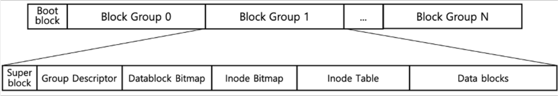
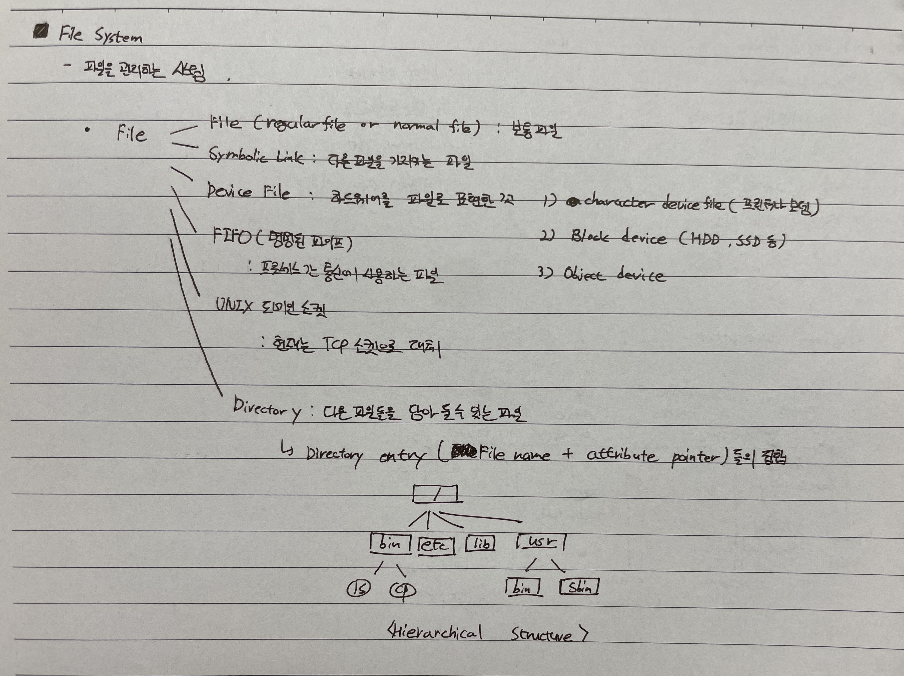

# File System
파일 관리 체계
* 컴퓨터 데이터는 0, 1로 이루어져 있다. 하지만 기본 단위인 Bit 단위(0,1)로 데이터를 쓰고 읽는 작업을 수행하기에는 오버헤드가 크다.
* 그래서 이를 Block 단위로 관리하여 오버헤드를 줄이는 방식을 사용하기로 했다. Block은 Block마다 고유 번호를 부여하여 관리가 되어진져다.
* 하지만 Block도 데이터가 많아질수록 고유 번호를 관리하기가 어려워, Block들을 하나의 논리적인 단위로 묶어 관리하게 되었는데 이를 파일이라고 한다.
    > 외부 단편화에 의해 관리가 어려워짐!!
* Reference
    * https://cpm0722.github.io/operating-system/file-system
    * https://medium.com/naver-cloud-platform/posix-%EC%95%8C%EC%95%84%EB%B3%B4%EA%B8%B0-1-linux-%EB%A6%AC%EB%88%85%EC%8A%A4-%ED%8C%8C%EC%9D%BC-%EC%8B%9C%EC%8A%A4%ED%85%9C%EC%9D%98-%EC%A2%85%EB%A5%98%EC%99%80-%ED%8A%B9%EC%A7%95-96a2e93e33b3
 
 

---
## File System 종류
* EXT
* XFS : EXT4 보다 큰 최대 16 EiB 파일시스템과 최대 8 EiB 파일을 지원
* Btrfs
* ZFS
 

---
## File System Architecture (EXT2 File System 기준)
파일 시스템을 구축하게되면 다수의 Block Group으로 나뉜다. 디스크/파티션 당 여러개의 Block Group으로 나뉜다.

* EXT2 Block Group 구성 요소는 다음과 같다.
    * Super block
    * Group Descriptor
    * Datablock Bitmap
    * inode Bitmap
    * inode Table
    * Data Blocks
1. Super block (Super block, Group Descriptor)
    * File System 당 하나만 존재하며, 파일 시스템 구성에 대한 모든 정보를 포함하고 있다. 마운트할 때 필수적으로 사용되며, Group Descriptor과 함께 모든 Block Group에 복사된다.
    * File System의 전체 inode와 block의 개수, free inode와 free block의 개수, block size, block group 당 inode 개수, filesystem mount 시간 등의 정보 저장
2. Allocation structure block (inode Bitmap, Data Bitmap)
    * inode Table과 Data Blocks 내의 빈 공간을 관리하기 위해 사용된다(사용 중인 경우 1, 빈 공간인 경우 0)
3. Key meta data block (inode Table)
    * File에 대한 메타 정보들을 저장하고 있는 inode 정보가 저장
    * 파일 종류, 권한, uid, gid, atime, ctime, mtime, dtime, links_count(링크 수), i_blocks(block 수), i_block
    * block 위치는 12개의 direct block과 3개의 indirect block(single indirect, double indirect block, triple indirect block)으로 구성
4. User data block (Data Blocks)
    * 실제 데이터가 저장되는 공간
 

### File Object

* File : 일반 파일
* Directory : 파일들을 담아둘 수 있는 파일
* Symbolic Link : 다른 파일을 가리키는 파일
* Device File : 하드웨어를 파일로 표현한 파일
* FIFO File : 프로세스 간 통신에 사용되는 파일
* UNIX 도메인 소켓 : 현재는 TCP 소켓으로 대체
 

### Directory Architecture
| Directory | Description |  |
|-----------|-------------|---|
| / | 루트 디렉터리 |  |
| /bin, ../bin | 실행파일(명령어). /bin에는 부팅할 때 필요한 시스템의 기본 실행 파일 저장. /usr/bin에는 그 외의 알반 사용자를 위한 실행 파일 저장 | 직접 설치하는 명령어는 /usr/local/bin 등에 보관하는것이 좋음 |
| /sbin, ../sbin | 관리자용 명령어들의 위치. /sbin에는 부팅할 때 필요한 관리자용 명령어들이 있다. /usr/sbin에는 평상시 사용하는 시스템 관리 명령어나 서버 프로그램이 배치 |  |
| /lib, ../lib, ../lib64 | 라이브러리(libxxx.so, libxxx.a) 저장. /bin, /usr/bin의 차이는 부팅할 때 필요한지 여부 | |
| /usr | User Services and Routines. 기본적으로 여러 컴퓨터에서 공유할 수 있는 파일을 보관 |  |
| /var | 자주 바뀌는 파일을 저장하기 위해 사용 | Log, Mail Box 등등이 저장 |
| /etc | 각 시스템의 설정 파일이 저장 | /etc/fstab, /etc/hosts 등 |
| /dev | 디파이스 파일 존재 |  |
| /proc | 프로세스 파일 시스템이 탑재. 프로세스를 파일 시스템으로 표현하여 저장 |  |
| /sys | 시스템에 존재하는 디바이스나 디바이스 드라이버의 정보를 얻을 수 있다 | CPU, Power 등. |
| /boot | 커널 프로그램이 보관 | 리눅스 커널은 vmlinuz, 유닉스는 vmunix |
| /root | root 홈 디렉터리 |  |
| /home | 일반 사용자의 홈 디렉터리 |  |
| /tmp, /var/tmp | 임시로 어딘가에 파일을 만들고 싶은 경우, 일시적으로 파일을 만들기 위한 디렉터리 | /tmp는 리부팅하면 삭제될 수 있으나, /var/tmp는 리부팅해도 삭제되지 않는다. |
 
 

---
## VFS(Virtual File System)
* https://medium.com/naver-cloud-platform/posix-%EC%95%8C%EC%95%84%EB%B3%B4%EA%B8%B0-1-linux-%EB%A6%AC%EB%88%85%EC%8A%A4-%ED%8C%8C%EC%9D%BC-%EC%8B%9C%EC%8A%A4%ED%85%9C%EC%9D%98-%EC%A2%85%EB%A5%98%EC%99%80-%ED%8A%B9%EC%A7%95-96a2e93e33b3

