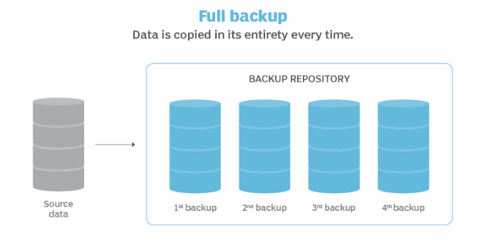
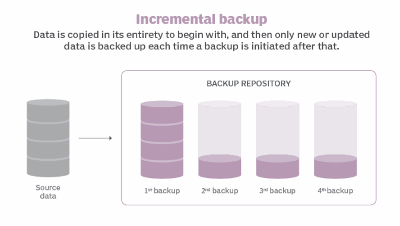
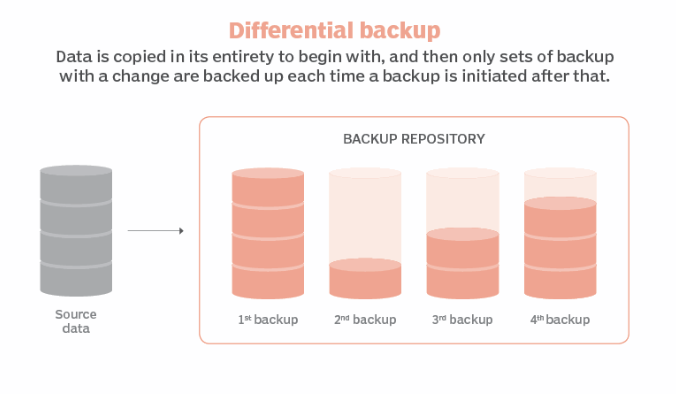

# Backup
* 자료를 보호하는 방법 중 하나로 복사본을 만들어 놓고, 장애 발생 시 대체
* 고려 사항
    1) 백업 대상 : 쉽게 설치 가능하거나, 자동으로 생성되는 데이터들은 백업이 불필요
    2) 백업 종류 : 전체 백업, 증분 백업, 차등 백업
    3) 백업 주기 : 얼마나 자주 할지 결정 (ex> 주중 증분 백업, 주말 전체 백업 등)
    4) 백업 매체 : 경제성, 효율성, 신뢰성, 처리 속도, 가용 성을 고려하여 매체 선택
    5) 백업 방법 : tar, dd, dump, cpio, rsync


## 백업 종류
* ref: https://www.techtarget.com/searchdatabackup/tip/Data-backup-types-explained-Full-incremental-differential-and-incremental-forever-backup

### Full Backup (전체 백업)

* 전체 데이터의 복사해 둔다.
* 장점
    1) 전체 데이터를 복사하기 때문에 최고의 보호 기능을 제공
* 단점
    1) 백업하는데 시간이 오래 걸린다.
    2) 많은 저장 공간이 필요하다.
    3) 비용이 많이 든다.
> 가장 좋은 방법이지만, 비용, 시간 등으로 인해 매일 같이 사용되지 않는다.
</br>


### Incremental Backup (증분 백업)

* 전체 데이터를 한 번 복사한 뒤, 변경된 데이터만 복사해 둔다.
* 장점
    1) 백업 속도가 빠르다.
    2) Full Backup보다 저장 공간이 많이 필요하지 않다.
* 단점 
    1) 많은 데이터 세트를 순차적으로 복원해야되기 때문에, 복원하는데 시간이 오래 걸린다.
    2) 증분 백업 데이터가 누락되거나 손상된 경우 불완전한 데이터 복구가 발생한다.
</br>


### Differential Backup (차등 백업)

* 전체 데이터를 한 번 복사한 뒤, 변경된 데이터만 복사해 둔다.
* 증분 백업과의 차이는 마지막 Full Backup 이후에 변경된 모든 데이터가 포함된다.
* 장점
    1) 증분 백업보다 복원 속도가 빠르다.
    2) 차등 백업 데이터는 백업 데이터 세트가 적다.
* 단점
    1) 차등 백업 데이터를 순차적으로 복원해야되기 때문에, 복원하는데 시간이 오래 걸린다.
    2) 증분 백업 데이터가 누락되거나 손상된 경우 불완전한 데이터 복구가 발생한다.
</br>
</br>


## 백업 주기
* Full Backup : 일주일 / 한달 - 1 회
* Incremental Backup or Differential Backup : 1일 - 1회
> 삭제도 생각해야 됨!!!

</br>
</br>


## 백업 매체
* 경제성, 효율성, 신뢰성, 편리성, 처리속도, 가용성 등을 고려
* HDD / SSD / USB / 
</br>
</br>


## 백업 방법
## cpio
* __copy input to output__ 전체 파일 시스템을 복사하는 방법
* Hard Link, FIFO 및 비표준 파일 기능 등을 보존한다.
* Full Backup에 사용된다.
* Option
    * o : 표준 입력으로 받은 파일 리스트를 출력 형태로 압축 생성
    * i : 표준 입력으로 받은 압축 파일을 압축 해제
    * p : 디렉토리의 데이터를 다른 디렉토리로 복사
    * d : 필요한 디렉토리를 자동으로 생성
    * m : 파일의 변경시간을 그대로 유지
    * v : 파일명 목록을 출력
    * a : 한번 access하기 때문에 access time을 재설정
</br>

### Example
```
# Create Archive
$ find . | cpio -ov > test.cpio


# Restore Archive
$ cpio -imv < test.cpio


# Copy
$ find . -depth -print | cpio -pdmv /data2
```
</br>
</br>


## tar
* __tape a archive__
* Incremental Backup, Full Backup 등에 모두 사용 가능
* 주로 소량의 파일을 백업하는데 사용한다.
* Option
    * c : 압축 생성
    * x : 압축 해제
    * z : gzip 압축 생성 및 해제
    * v : verbose. 압축 과정 출력
    * p : 권한 유지
    * f : 압축 파일 명 지정
    * g : 증분 백업 사용을 위한 증분 백업 내용 저장 파일 지정
    * C : 해당 Directory 변경후 명령 실행 
</br>

### Example
* Full Backup
    ```
    # Create Archive
    # tar -cvzfp [file_name] [target_path]
    $ tar -cvzfp test.tar.gz /data


    # Restore Archive
    # tar -xvzfp [file_name] -C [directory_name]
    $ tar -xvzfp test.tar.gz -C /data2
    ```

* Incremental Backup
    ```
    # Create Archive 1
    # tar -g [backup_name] -cvzfp [file_name] [target_path]
    $ tar -g test_ic_back -cvzfp test_0.tar.gz /data


    # Create Archive 2
    $ tar -g test_ic_back -cvzfp test_1.tar.gz /data


    # Restore Archive
    # tar -xvzfp [file_name] -C [directory_name]
    $ tar -xvzfp test_0.tar.gz -C /data2
    $ tar -xvzfp test_1.tar.gz -C /data2
    ```
</br>
</br>


## dump & restore
* 파일이 아닌 파일 시스템 전체를 백업할 때 사용 (파티션 단위 백업)
* Full Backup & Incremental Backup 지원
* 백업시, /etc/fstab 파일 참조
* dump Option
    * 0~9 : 0 == Full Backup / 1~9 == Incremental Backup
    * f : dump 파일명 지정
    * u : dump 작업에 대한 정보를 /etc/dumpdates에 기록
* restore option
    * 
    * 
    * 
    * 
</br>

### Example
* dump
    ```
    # Create Dump
    # dump [option] <backup_name> [target]
    $ dump -0u -f test.dump /dev/sda1

    $ dump -0u -f test.dump /home/sysadmin


    ```
* restore
    ```

    ```
</br>
</br>


## dd
* 
* 
* 
</br>

### Example
```
```
</br>
</br>


## rsync
* 
* 
* 
</br>

### Example
```
```
</br>
</br>


### Reference
* https://m.blog.naver.com/PostView.naver?isHttpsRedirect=true&blogId=p_rain&logNo=220703521025