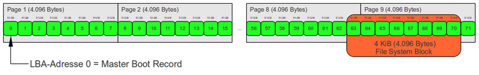
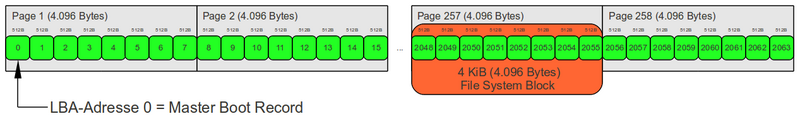

# Partition 하는 방법
* 크게 명령어는 ```fdisk```와 ```parted```가 있다.
* 기본적인 순서는 다음과 같다.
    1) 파티션 생성
        * MBR : O Sector는 MBR이므로 __1 Sector 부터 파티션 시작점으로 잡아야 한다.__
        * GPT : O ~ 33 Sector는 GPT이므로 __34 Sector 부터 파티션 시작점으로 잡아야 하며__, Backup을 위한 33 Sector가 필요하므로 __마지막 33 Sector는 남겨서 파티션을 잡아야 한다.__
    2) 파일 시스템 설정
    3) 마운트 지정
    4) LVM 생성
    5) PV 초기화
    6) VG 생성
    7) LV 생성

* 왜 파티션 시작은 2048Sector 부터인가?
	* 가장 큰 이유는 호환성 문제이다. File System Block 사이즈가 512 Byte에서 4096 Byte로 계산됨에 따라 
	* Disk 사이즈 단위 : sector / 512,2048 or 4096 byte per 1 Sector
	* Memory 사이즈 단위 : Page / 512 to 8192 per 1 page
	> 결국 디스크를 메모리에서 읽게 되는데 1, 34, 63 Sector에서 시작하게 되면 Block Size가 4096 byte인 경우, Page가 넘기게 된다. 그 외에도 RAID 구성 계산 등 호환을 위한 설정들을 계산하게 되면 2048 Sector(1MB)를 경계로 정렬하는 것을 권장하고 있다!!!

	
	
	> 과거 Windows에서 Partition의 시작은 63 Sector에서 시작한다. 결론적인거는 호환 이런거 생각안하면 생각할 필요가 없긴하지만, 기본적으로 MBR(0 Sec)과 Protective MBR(34 Sec) / Backup MBR(33 Sec)을 생각해야 된다.
* Reference
    * https://joungkyun.gitbook.io/annyung-3-user-guide/annyung3-white-paper/wp-partition-alignment
    * https://www.thomas-krenn.com/en/wiki/Partition_Alignment_detailed_explanation
    * https://doyaji-bw.tistory.com/33
</br>

## fdisk
0. 사용법
1. 기본 명령어
* https://yoonix.tistory.com/24
* https://docs.aws.amazon.com/ko_kr/AWSEC2/latest/UserGuide/ebs-using-volumes.html
</br>
</br>


## parted
* fdisk는 2TB 이상을 넘겨서 사용할 수 없다.
* 이를 해결하기 위해 새로운 명령어인 parted가 나왔다.
0.  사용법   
	* ```$ parted \[OPTION\] DEVICE```
        
	```
	$ lsblk
	NAME    MAJ:MIN RM  SIZE RO TYPE MOUNTPOINT
	xvda    202:0    0    8G  0 disk
	└─xvda1 202:1    0    8G  0 part /
	xvdf    202:80   0  100G  0 disk
        
	$ parted /dev/xvdf
	```
</br>

1.  기본 명령어
	```
	# print : Partition table 정보 출력
	$ print
	

	# unit UNIT : 용량 단위 변경
	## UNIT => s, B, MB, GB, TB, MiB, GiB 등
	$ unit s


	# mklabel LABEL-TYPE : Disk Label 설정
	## LABEL-TYPE => msdos, gpt, bsd, mac, sun 등 지원
	$ mklabel gpt


	# mkpart PART-TYPE [FS-TYPE] START END : Partition 나누기
	## PART-TYPE => primary, logical, extended
	$ mkpart primary 2048s 50%


	# align-chek TYPE NUMBER : 파티션 정렬 확인 
	## TYPE => min (minimal) / opt (optimal)
	(parted) align-check opt 1
	1 aligned				# 정상적인 경우 aligned
	(parted) align-check opt 2
	2 not aligned				# 비정상적인 경우 not aligned


	# rm NUMBER : 파티션 삭제
	$ rm 1

	```

</br>
</br>


## Mount
1. File System Format
	* ```mkfs.FS-TYPE DEVICE``` : 파일 시스템 포맷
	* FS-TYPE => ext3, ext4, fat32, hfs, linusx-swap(v1/v0), ntfs, xfx, apfs2 등
	```
	$ mkfs.ext4 /dev/xvdf1
	```
</br>

2. Mount
    * ```$ mount DEVICE MOUNT-DIR``` : Directory에 Device를 마운트
	```
	$ mount /dev/xvdf1 /test
	```
</br>

3. fstab
	* 시스템 재부팅 후에도 볼륨을 자동으로 탑재하기 위해서는 ```/etc/fstab``` 파일에 추가해야 한다.
	* fstab 설정 정보
		| Filed 이름 | 내용 | 비 고 |
		|------------|------|------|
		| Filesystem Device Name | 파일 시스템 장치 이름 / UUID |  |
		d| Mount Point | 연결할 디렉토리 지정 |  |
		| Filesystem Type | 파일 시스템 종류 | ext2, ext3, ext4, nfs 등 |
		| Mount Option | 파일 시스템 옵션을 지정 | 보통 default 설정 |
		| Dump | 덤프 여부 설정 | 0: 덤프 설정 X </br> 1: 덤프 설정 O |
		| File Sequence Check Option | 파일 점검 옵션 | 0 : fsck 실행 X </br> 1: 루트 파일 시스템 </br> 2: 루트 파일 시스템 이외의 파일 시스템 |
		* 장치 이름은 UUID를 사용하는 것을 권장. 장치 이름은 바뀔 수 있지만, UUID는 파티션 수명이 다할 때까지 유지되기 때문이다.
		* 파일 점검 옵션 순서대로 fsck의 순서가 결정된다.
		* Mount Option은 다음과 같다.
			1) defaults : rw, exec, nouser, auto, suid 속성을 모두 설정
			2) auto / noauto : 부팅 시 자동 마운트 여부
			3) exec / noexec : 파일 실행에 대한 허용 여부
			4) suid / nosuid : SetUID와 SetGID 적용에 대한 허용 여부
			5) ro / rw : 파일 읽기, 쓰기 권한 (읽기 전용 or 읽기, 쓰기)
			6) user / nouser : 마운트할 수 있도록 허용할 계정 (일반 계정 or root 계정)
			7) usrquota : 개별 계정 사용자별 Quota 설정 가능
			8) grpquota : 그룹별 Quota 설정 가능
	
	* fstab Example 
	```
	# blkid
	$ blkid

	# sudo lsblk -o +UUID,PARTLABEL,FSTYPE
	NAME    MAJ:MIN RM  SIZE RO TYPE MOUNTPOINT UUID                                 PARTLABEL FSTYPE
	xvda    202:0    0    8G  0 disk
	└─xvda1 202:1    0    8G  0 part /          e6c06bf4-70a3-4524-84fa-35484afc0d19 Linux     xfs
	xvdf    202:80   0  100G  0 disk
	├─xvdf1 202:81   0   50G  0 part            1c2161b7-f8e5-416f-afec-7d18a00a8fbb primary   ext4
	└─xvdf2 202:82   0   50G  0 part            df3103f2-b0e1-42fb-86ee-d63c5fd230cc primary   ext4
	

	# sudo vi /etc/fstab
	## Name : Mount_Point :	Filesystem_Type : Mount_Option : Dump : Fsck
	UUID=e6c06bf4-70a3-4524-84fa-35484afc0d19     /           xfs    defaults,noatime  1   1
	UUID=1c2161b7-f8e5-416f-afec-7d18a00a8fbb	/log	ext4	defaults,nofail  0  2
	/dev/xvdf1	/log	ext4	rw,noexec,nouser,auto,suid	0	0
	UUID=abcdef12345test	/data	ext4	defaults	0	0

	# 적용
	$ sudo mount -a
	```
	</br>

	* https://mpjamong.tistory.com/19#:~:text=fstab%20%EC%84%A4%EC%A0%95%EC%9D%80%20%EB%94%94%EC%8A%A4%ED%81%AC%20%EB%A7%88%EC%9A%B4%ED%8A%B8%20%28Mount%29%20%ED%9B%84%20%EC%84%9C%EB%B2%84%EB%A5%BC%20%EC%9E%AC%EC%8B%9C%EC%9E%91%ED%95%98%EB%8A%94,%7C%20fstab%20%EC%84%A4%EB%AA%85%EC%9D%84%20%EC%9C%84%ED%95%9C%20%ED%85%8C%EC%8A%A4%ED%8A%B8%20%EB%B3%BC%EB%A5%A8%20%EC%83%9D%EC%84%B1%EA%B3%BC%20%EB%A7%88%EC%9A%B4%ED%8A%B8


4. UMOUNT
	* ```$ umount MOUNT-DIR```: Mount 시킨 볼륨을 떼어낸다.
	```
	$ umount /data
	```