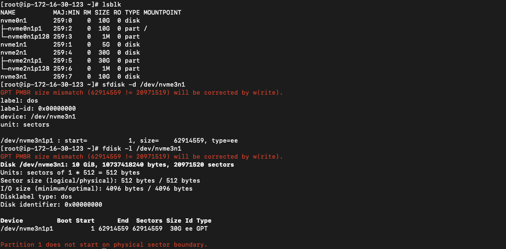
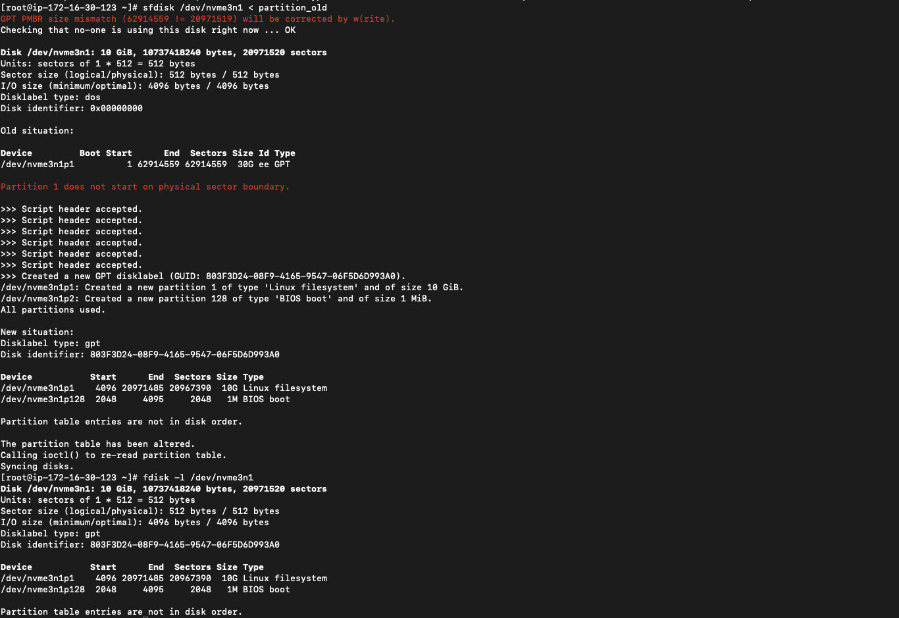

## Volume Backup


## XFS 볼륨 백업
XFS File System은 기본적으로 축소가 불가능하다(확장만을 생각하고 나온 시스템)
* /dev/nvme3n1(30GiB) ---> /dev/nvme1n1(10GiB) 변경 진행
1. Block 단위 백업 진행
    ```
    $ dd if=/dev/nvme2n1 of=/dev/nvme3n1 bs=512 count=4096
    ```
    * MBR(0~2047s/파티션 정보)과 BIOS boot(2048~4095s)를 복사한다.
        > 기존 BIOS boot 프로그램을 들고오기 위해서

2. 파티션닝 정보 저장
    
    ```
    $ sfdisk -d /dev/nvme2n1 > partition_old
    ```
    * /dev/nvme2n1와 동일한 파티션을 가주갈것이기 때문에 /dev/nvme2n1의 파티션 정보를 저장한다.
        > 이를 우리는 수정해야줘야 한다!!

    </br>

    
    ```
    $ lsblk
    $ sfdisk -d /dev/nvme3n1
    ```
    * lsblk에는 파티션 되어 있는 상태로 나오지 않는다. 이유는 Partition Size가 Disk Size를 넘어갔기 때문에 충돌이 나있기 때문이다!
    * 다른 파티션닝 명령어를 통해 확인하게 되면 설정이 되어있기 때문에, 파티션이 되어 있는 형태로 나오지만 에러 문구를 같이 출력하고 있다.

    </br>
    
3. 파티션닝 정보 수정
    
    ```
    $ fdisk -l /dev/nvme3n1     # 전체 섹터 크기 확인
    $ vi partition_old

    label: gpt
    label-id: 803F3D24-08F9-4165-9547-06F5D6D993A0
    device: /dev/nvme2n1
    unit: sectors
    first-lba: 34
    last-lba: 20971486

    /dev/nvme2n1p1 : start=        4096, size=    20967390, type=0FC63DAF-8483-4772-8E79-3D69D8477DE4, uuid=D341CB37-3CFE-4007-BD90-5B289510756F, name="Linux"
    /dev/nvme2n1p128 : start=        2048, size=        2048, type=21686148-6449-6E6F-744E-656564454649, uuid=27009441-4AF9-4E54-8EC3-E439E93D573F, name="BIOS Boot Partition"
    ```
    * partition_old 파일의 ```last-lba```와 ```size```값을 수정한다.
    * last-lba = 20971486 / 전체 섹터 크기(20971520) - first-lba(34)
    * szie = 20967390 / 전체 섹터 크기(20971520) - first-lba(34) - 파티셔닝 섹터 크기(2048) - MBR(2048)

    </br>

4. 파티션닝 정보 적용
    
    ```
    $ sfdisk /dev/nvme3n1 < partition_old
    ```
    * 파티션닝 결과를 적용시키면 정상적으로 파티션닝 결과가 출력되는 것을 확인할 수 있다.
    
    </br>

5. 파티션 UUID 변경
    
    ```
    $ mkfs.xfs /dev/nvme3n1p1
    $ blkid
    $ xfs_admin -U 51403082-041f-49d7-8308-d34b0185adda /dev/nvme3n1p1
    $ xfs_admin -L / /dev/nvme3n1p1
    ```
    * 파티션에 XFS 파일 시스템을 적용하고 나면 UUID를 확인할 수 있는데, /dev/nvme2n1p1 과 /dev/nvme1n1p1가 서로 다른 것을 확인할 수 있다.
    * 해당 UUID와 LABEL을 동일하게 해주면된다.
    * PTUUID, PTTYPE은 같다(같은 파티션닝 정보로 적용했기 때문에)

    </br>

6. XFS File System 백업 및 복원
    ```
    $ mkdir /mnt/data_new
    $ mount /dev/nvme2n1p1 /mnt/data_new

    $ xfsdump -L data -f ~/data.xfsdump /mnt/data_new

    $ umount /mnt/data_new
    $ mount /dev/nvme3n1p1 /mnt/data_new

    $ xfsrestore -f ~/data.xfsdump /mnt/data_new

    $ umount /mnt/data_new
    ```
    </br>

7. 볼륨을 dettach 후, 서버에 Attach
    * /dev/xvda attach

</br>


### Reference
* 
* https://access.redhat.com/documentation/en-us/red_hat_enterprise_linux/7/html/storage_administration_guide/xfsbackuprestore
* https://hiseon.me/linux/linux-disk-clone/