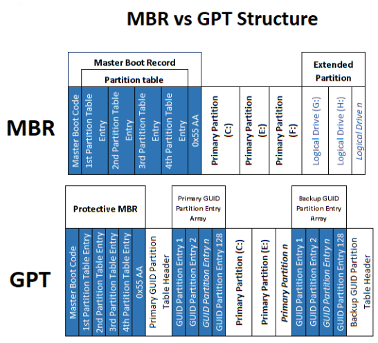
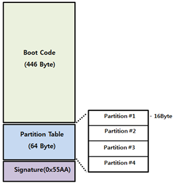
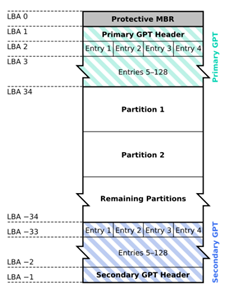

# MBR & GPT 구조

 

## MBR (Master Boot Record)
* MBR은 저장 장치의 부팅 정보, 파티션 정보 등을 저장한다.
* 저장 장치의 첫 번째 Sector(0 Sector)는 MBR이다.
    * Sector : 저장 장치는 데이터를 찾아가기 위해 Sector란 구조로 주소화되어 있으며, 크기는 512 Byte로 구성되어 있다.
    * __현재 최신 저장 장치 Sector는 물리적으로 4096 byte를 요청하고, 내장된 컨트롤러가 논리적으로는 512 byte로 처리한다.__
* BIOS를 사용하여 부팅하며, BIOS가 부팅 장치를 감지하면 해당 장치의 첫 번째 디스크 블록을 메모리로 읽어들인다.
* 파티션은 주 파티션 최대 4개 또는 주 파티션 최대 3개 + 확장 파티션 최대 1개로 총 4개의 파티션으로 분리할 수 있다.
 

### MBR 구조

1. __Boot Strap Code__ : 440 Byte로 구성. OS를 부팅하기 위해 부팅 파티션을 찾는 부분
2. __Partition Table__
    * 64 Byte로 구성
    * Partition Entry Size : 각 Entry는 16 Byte로 되어 있으며, 파티션의 정보가 저장되어 있다(각 파티션 정보는 16Byte로 구성). 16 Byte * 4 = 64 Byte 이므로 총 4개의 파티션을 구성할 수 있다.
    * Starting LBA Address : 4 Byte (=32 Bit). LBA의 시작주소로 실제 파티션의 시작 위치.
3. __Signature__ : 해당 Sector의 오류 유무를 확인하기 위한 값(기본 값: 0xAA55)
* 파티션의 주소는 32 Bit를 사용하므로, MBR이 인식할 수 있는 __각 파티션의 크기는 최대 2TB로 제한된다(2^32-1)__
* O Sector는 MBR이므로 __1 Sector 부터 파티션 시작점으로 잡아야 한다.__
 

### 장단점
* __장점__
    * 대부분의 시스템과 호환이 된다.
* __단점__
    * 4개의 파티션만 허용되며, 크기를 최대 2TB로 제한된다.
    * MBR은 0 Sector에만 저장되므로, 해당 Sector가 손상되면 전체 하드 디스크를 읽을 수 없게 된다.
 
 

## GPT (GUID Parition Table)
* GPT는 MBR과 마찬가지로 저장 장치의 부팅 정보, 파티션 정보 등을 저장한다.
* 저장 장치의 첫 번째 Sector(0 Sector)는 Protective MBR이 있다. 
* EFI 펌웨어를 사용하여 부팅한다.
* GPT는 주 파티션만 생성할 수 있고, 128개의 파티션을 가질 수 있다.
 

### GPT 구조

1. __Protective MBR__ : MBR과 구조는 같으며, MBR과 호환을 위해 구성되어 있다. 512 Byte로 0 Sector에 저장되어 있다.
2. __GPT Header__ : Signature, Header Size, Partition Table 최대 수, 각 Entry Size 정보 등을 가지고 있다. 1 Sector에 저장.
3. __GPT Partition Entry__ : 각 Entry는 128 Byte로 되어 있으며, Partition 위치 정보 등 각 Partition 정보 저장. 2~33 Sector에 저장 (16,384 Byte). 16,384 Byte = 128 Byte * 128 이므로 최대 128개의 파티션을 구성할 수 있다.
4. __Backup__ : 디스크의 마지막 Sector에 GPT Header와 GPT Partition Entry가 자동으로 백업된다.
* 파티션의 주소는 64 Bit를 사용하므로, GPT가 인식할 수 있는 __각 파티션의 크기는 최대 18EB로 제한된다(2^64-1, 이론상으로는 최대 8 ZB까지 지원)__
* O ~ 33 Sector는 GPT이므로 __34 Sector 부터 파티션 시작점으로 잡아야 하며__, Backup을 위한 33 Sector가 필요하므로 __마지막 33 Sector는 남겨서 파티션을 잡아야 한다.__
 

### 장단점
* __장점__
    * 2TiB보다 큰 하드 드라이브 지원
    * 백업을 통해 디스크의 데이터 보호가 잘 된다.
* __단점__
    * USB와 같은 외장 매체에서 인식이 불가.
 
 
