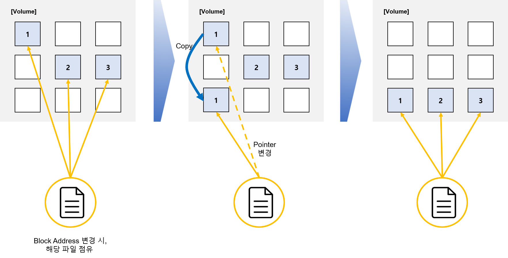

# Volume Resizing

## Resizing 과정

## Optimizing 과정

> File을 i-node를 가지고 있고, i-node 안에는 Data Block 위치 정보가 저장되어 있다.

1. File에 Write가 될 수 있으므로 해당 File을 점유
2. 1번 Data Block을 다른 Block으로 복사
3. File의 i-node에 저장되어 있는 1번 Data Block 위치 정보를 복사한 Block 위치 정보로 변경한다.
4. 1 ~ 3 까지 디스크가 최적화가 완료될 때까지 반복 진행
5. 최적화 완료
 

## 
