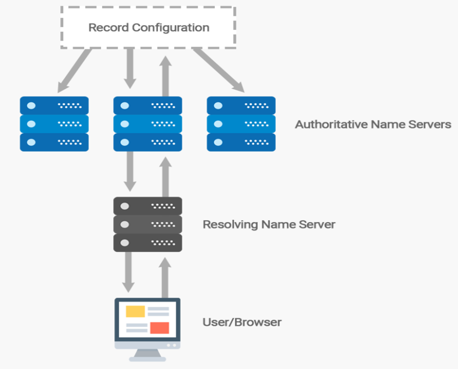
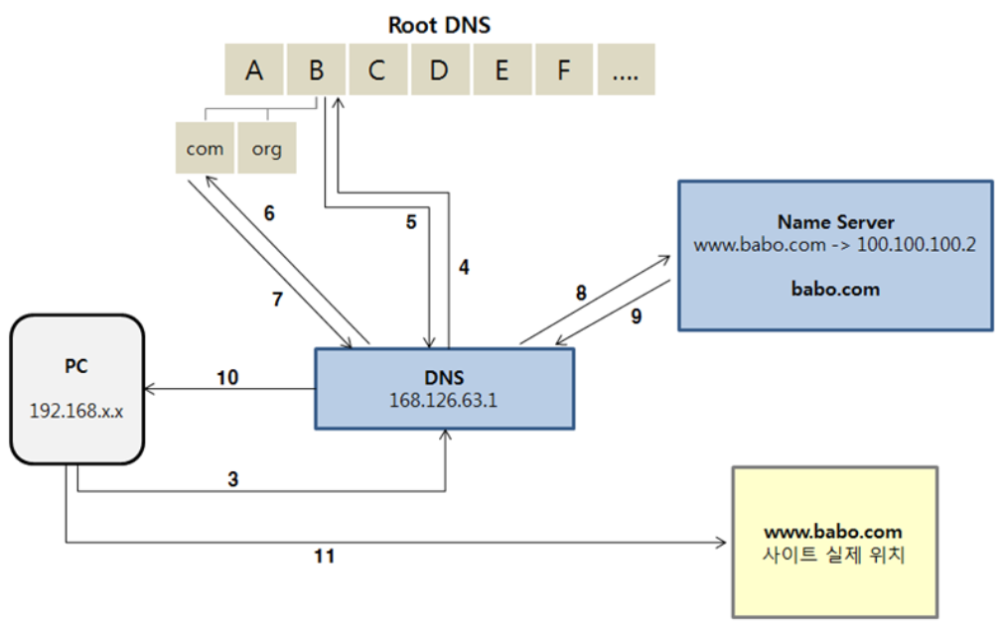

# DNS
Domain Name System 서비스

---
## Domain 등록 개념
* __Domain name__
    * 사용자가 웹 사이트 또는 웹 애플리케이션에 액세스하기 위해 웹 브라우저의 주소 표시줄에 입력하는 이름.
    * example.com과 같은 이름.
* __Domain registry__
    * 도메인 레지스트리.
    * 특정 최상위 도메인을 가지고 도메인을 판매할 권리를 소유한 회사로, 등록된 도메인의 데이터베이스를 유지 관리하는 기관.
    * 등록된 도메인이 인터넷 상에서 접속될 수 있도록 최상위 도메인(TLD)의 도메인 네임 서버(DNS)를 운용하고 있다.
* __Domain registrar__
    * 도메인 등록 대행자.
    * 국제 인터넷 주소 관리기구(ICANN)가 인증한 특정 최상위 도메인(TLD) 등록을 처리하는 회사로, 레지스트리(registry)의 데이터베이스에 등록 데이터를 등록한다.
    * 예를 들어 Amazon Registrar, Inc.는 .com, .net, .org 도메인의 등록 대행자이다. Amazon의 등록 대행 협력사인 Gandi는 .apartments, .boutique, .camera 등 수백 가지 TLD의 도메인 등록 대행자이다.
* __Domain reseller__
    * 도메인 대리점.
    * Registrar를 경유하여 도메인 등록 업무를 대행하는 업자로 Route 53이 해당한다.
    * 리셀러는 SRS(Shared Registry System)이라는 도메인 관리 시스템의 접속 권한이 없기 때문에 반드시 레지스트라를 경유하여 도메인을 관리하게 된다.
* __Domain TLD__
    * top-level domain
    * .com, .org 또는 .ninja 등 도메인 이름의 마지막 부분으로 최상위 도메인을 의미.
    * TLD 유형
        1) __일반적인 최상위 도메인__
            * 해당 TLD를 보면 해당 웹사이트가 어떤 사이트인지 알려준다.
            * 예를 들면 .bike라는 TLD를 가진 도메인은 모터사이클 또는 자전거 업체나 조직의 웹 사이트와 연관된 경우가 많다.
        2) __지리적 최상위 도메인__
            * 해당 TLD는 국가나 도시같은 지리적 영역과 연관된다.
* __Root Domain__
    * TLD와 하나의 Level만 붙은 도메인을 일컫는다. 예시로 test.com, abc.net 등등
* __Sub Domain__
    * Root Domain에 하나 이상의 Level이 붙어 있는 도메인을 일컫는다. 예시로 www.test.com, mail.abc.net 등등
* __NXDOMAIN__
    * 등록되어 있으나 IP주소가 지정되지 않은 도메인 이름 등 IP주소가 지정되어 있지 않은 모든 도메인 이름
</br>

### Domain 등록 과정
1. 도메인 이름을 선택하고, 사용 가능 여부 체크
2. Route53에 도메인 이름 등록 (도메인 소유자와 연락처 정보도 같이 제공)
    * 도메인 이름과 같은 hosted zone 생성
    * hosted zone에 4개의 name server 세트를 할당한다.
    * hosted zone에서 name server를 얻고, 도메인에 추가한다.
3. 해당 등록과정이 끝나면 AWS는 Domain Registrar에게 사용자의 정보를 전송한다(Domain registrar는 Amazon Registrar 또는 Gandi)
4. Domain Registrar는 사용자 정보를 Domain Registry으로 전송한다.
5. Domain Registry는 자체 데이터베이스에 사용자의 도메인에 관한 정보를 저장하고 일부 정보는 Public WHOIS 데이터베이스에도 저장한다.
</br>
</br>


---
## DNS 개념

* __alias record__
    * Record Type 중 하나. 자세한 내용은 DNS Record 작업 참조
* __authoritative name server & non-authoritative name server__
    1) authoritative name server는 원본 zone 파일을 가지고 있다. IP 주소를 저장, 수정, 삭제할 수 있으며, 적절한 매핑을 통해 재귀 서버에 응답한다.
    2) non-authoritative name server는 원본 zone 파일을 가지고 있지 않다. 이전에 수행한 DNS 조회로 인해 요청한 DNS Record의 캐시가 있을 수 있어, DNS 쿼리에 응답할 경우 신뢰할 수 없는 응답이 된다(cahe name server, resolver name server라고도 한다)
* __DNS query__
    * Domain name과 연결된 리소스의 IP를 확인하기 위해 DNS에 제출하는 요청.
* __DNS resolver__
    * 보통 인터넷 서비스 제공업체(ISP)가 관리하며, authoritative name server와 최종 사용자 사이의 중간 역할을 한다. 예를 들면 Google이 자체 public resolver name server를 제공하고 있다.
    * Web browser에 Domain name을 입력하면 쿼리는 먼저 resolver server로 전송된다. resolver server는 DNS record의 캐시를 가지고 있는 경우, authoritative name server까지 쿼리를 확인하지 않는다.
    * DNS record의 캐시가 없는 경우, DNS Tree를 재귀적으로 검색하여 Domain Record에 대한 authoritative name server를 찾는다.
    * recursive name server라고도 한다.
* __Domain Name System(DNS)__
    * DNS는 example.com 같은 Domain name을 컴퓨터가 인터넷에서 서로를 찾을 수 있도록 해주는 IP 주소라는 숫자로 변환한다.
* __hosted zone__
    * Zone 파일이라고도 한다.
    * Domain(ex> example.com)과 Sub Domain(ex> www.example.com, mail.example.com)의 트래픽을 라우팅하는 방법에 대한 정보를 포함하고 있는 레코드의 컨테이너이다.
    * __hosted zone__은 해당 Domain과 이름이 같아야 한다.
    * 예를 들어 example.com의 hosted zone에는 www.example.com의 트래픽은 192.168.0.40이라는 IP 주소로 라우팅하라는 레코드 정보가 저장되어 있다.
* __name servers__
    * Domain Name System을 제공하는 서버.
* __TLD Server__
    * Top Level Domain 서버로 .com, .kr 등을 관리하는 도메인 최상위 서버
* __Root Domain Server__
    * TLD 서버로 recursive resolver하는 최상위 네임 서버
* __Primary DNS__
    * 원본 zone 원파일을 가지고 있는 서버
* __Secondary DNS__
    * Primary DNS로부터 읽기 전용으로 원본 zone 파일을 복사하여 서비스를 공급하는 서버
    * 해당 서버는 authoritative name server 이다.
* __private DNS__
    * Domain과 Sub Domain의 트래픽을 하나 이상의 Amazon VPC 내의 Amazon EC2 인스턴스로 라우팅하도록 해주는 DNS의 로컬 버전.
* __reusable delegation set__
* __time to live (TTL)__
    * Resolver Server가 해당 레코드의 값을 캐싱할 시간.
</br>

### DNS 동작 과정

1. Domain name이 입력되면 먼저 Application(Browser, Apache 등)의 cache를 확인
    ```
    $ curl -v http://abc.2yj.com
    ```
2. ```/etc/hosts``` 파일에서 Domain 정보를 확인
3. 설정한 DNS Resolver Server에서 Domain 확인
4. 저장되어 있는 cache 정보가 없다면, Recusive Query를 통해 정보를 확인하게 된다. 먼저 Root name server에서 Domain 정보를 확인
5. Root name server는 TLD name server 정보를 전달
6. 전달 받은 TLD name server에서 Domain 정보 확인
7. TLD name server는 Sub domain name server(Route 53 name server) 정보를 전달
    ```
    ; .com TLD name server
    2yj IN  NS  ns1.test.com.
        IN  NS  ns2.test.net.
    ```
    ```
    $ORIGIN test.com.

    @   IN  NS  ns1.test.com.

    ns1 IN  A   10.0.0.2    (Public IP 가정)
    ```
8. 전달받은 Sub domain name server에서 Domain 정보 확인
    ```
    ; Sub domain name server (test.com)
    ; Zone File (y2j.com)
    $ORIGIN y2j.com.
    @   IN  NS  ns1.test.com.
        IN  NS  ns2.test.net.

    abc IN  A   10.0.0.85
    ``` 
9.  실제 서비스를 제공하는 Server 정보를 전달 
10. DNS Resolver Server는 서비스 Server의 정보를 다시 Application에 전달
11. Application은 전달받은 Domain 정보를 이용하여 서비스 Server에 접근
</br>
</br>

---
## DNS Record Type
| Type  | Type id. | Description                           | Function                                                                                                                                                               |
| ----- | -------- | ------------------------------------- | ---------------------------------------------------------------------------------------------------------------------------------------------------------------------- |
| A     | 1        | Address record                        | 호스트 이름과 IPv4 주소를 저장                                                                                                                                         |
| AAAA  | 28       | IPv6 record                           | 호스트 이름과 IPv6 주소를 저장                                                                                                                                         |
| CERT  | 37       | Certificate record                    | PKIX, SPKI, PGP 등의 암호화 인증서를 저장                                                                                                                              |
| CNAME | 5        | Canonical name record                  | 호스트 이름을 다른 호스트 이름으로 별칭하는데 사용                                                                                                                     |
| DNAME | 39       | Delegation name record                |                                                                                                                                                                        |
| HINFO | 13       | Host Information                      | 호스트에 대한 일반 정보를 얻는데 사용. 하지만 보안상의 이유로 공용 서버에서는 사용되지 않는다                                                                          |
| MX    | 15       | Mail Exchange record                  | 이메일을 수신할 이메일 서버를 지정 (SMTP 이메일 서버). MX record를 설정하려면 A record가 지정되어 있어야 하며, MX record 데이터에는 A record의 호스트를 입력하면 된다. |
| NS    | 2        | Name Server record                    | 주어진 호스트에 대한 authoritative name server를 알려준다. 즉, 해당 도메인의 IP 주소를 찾기 위해 가야할 곳을 알려준다                                                  |
| PTR   | 12       | Reverse-lookup Pointer record         | 순방향 DNS 확인(A or AAAA)과 달리 IP 주소를 기반으로 호스트 이름을 찾는데 사용 / Reverse DNS lookup                                                                    |
| SOA   | 6        | Start Of [a zone of] Authority record | DNS Zone 파일의 시작 부분에 나타내며 관리자의 연락처 세부 정보, 타이머 설정 등을 저장                                                                                  |
| SRF   | 이제 사용되지 않는다   | Sender Policy Framework               | TXT record 안에서 사용되며, 메일 스푸핑을 방지하는데 사용되는 레코드. 특정 사업체(네이버, 다음, 구글)                                                                  |
| SRV   |          |                | Voice over IP, 메시징 등의 특정 서비스에 대한 호스트 및 포트를 지정                                                                   |
| TXT   | 16       | Text record                           | 역할 등의 도메인 설명을 기입하는 용도 또는 SRF 역할로 사용되는 레코드                                                                                                  |
* Reference: http://dns-record-viewer.online-domain-tools.com/
</br>


## RFC 1034
* 같은 도메인에 대해 CNAME RR은 MX, TXT와 같이 쓰일 수 없다!
    * https://totaluptime.com/kb/cname-and-mx-for-the-same-host-name/
    * https://serverfault.com/questions/18000/dns-subdomains-that-require-both-an-mx-record-and-a-cname
* Root Domainm에 CNAME을 적용할 수 없다.
    * ex> ``````
</br>


### A Record
호스트 이름과 IPv4 주소를 저장
* 일반적으로 Sub Domainhq다 Root Domain을 매핑하는데 많이 사용된다. IP  변경시 변경된 정보가 전세계에 있는 모든 DNS 서버로 전파되는데는 시간이 오래걸릴 수 있기 때문이다. 그리고 클라우드 인프라를 사용할 경우 IP가 자주 바뀔 수 있기 때문이다.
* Example
    ```
    example.com.  IN  A     192.0.2.1    
    ```

### AAAA Record
호스트 이름과 IPv6 주소를 저장
* Example
    ```
    example.com.  IN  A     192.0.2.1             ; IPv4 address for example.com
                IN  AAAA  2001:db8:10::1        ; IPv6 address for example.com
    ns            IN  A     192.0.2.2             ; IPv4 address for ns.example.com
                IN  AAAA  2001:db8:10::2        ; IPv6 address for ns.example.com
    ```

### CERT Record
PKIX, SPKI, PGP 등의 암호화 인증서를 저장
* Example
    ```

    ```

### CNAME Record
호스트 이름을 다른 호스트 이름으로 별칭하는데 사용
* Root Domain은 CNAME으로 올수 없다.
* Example
    ```
    # example.com IN  CNAME test                  ; Can't do this
    www           IN  CNAME example.com.          ; www.example.com is an alias for example.com
    wwwtest       IN  CNAME www                   ; wwwtest.example.com is another alias for www.example.com
    ```

### MX Record
이메일을 수신할 이메일 서버를 지정 (SMTP 이메일 서버)
* MX record를 설정하려면 A record가 지정되어 있어야 하며, MX record 데이터에는 A record의 호스트를 입력하면 된다.
* Example
    ```
    @	    IN  MX  10  mail.example.com.
            IN  MX  20  mail.example.net. 
            IN  MX  30  mail2.example.com. 
    mail    IN  A   192.168.254.7
    mail2   IN  A   192.168.254.8
    ```


### NS Record
해당 도메인에 대한 권한을 어떤 네임 서버가 관리하고 있는지 알려주는 레코드
* 해당 도메인에 대한 IP 주소를 찾기 위해 가야할 곳을 알려준다
* Example
    ```
    example.com.  IN  NS    ns                    ; ns.example.com is a nameserver for example.com
    example.com.  IN  NS    ns.somewhere.example. ; ns.somewhere.example is a backup nameserver for example.
    ns            IN  A     192.0.2.2             ; IPv4 address for ns.example.com
                  IN  AAAA  2001:db8:10::2        ; IPv6 address for ns.example.com
    ```


### PTR Record
순방향 DNS 확인(A or AAAA)과 달리 IP 주소를 기반으로 호스트 이름을 찾는데 사용 / Reverse DNS lookup
* 보통 메일 수신 서버에서 발송 서버의 IP를 조회하여 도메인이 등록된 PTR 값과 일치하면 스팸으로 구분하지 않고 정상 메일로 판단할때 쓰인다.
* 확인용으로 쓰이기 때문에 PTR 레코드는 DNS가 아닌 ISP 업체에 요청해야 한다. (=> ISP 업체가 중간 Resover DNS를 관리하기 때문에)
* Example
    ```
    30.0.168.192.in-addr.arpa   IN  PTR test.example.com.
    ```
</br>

### SOA Record
관리자의 이메일 주소, 도메인이 마지막으로 업데이트된 시간, 새로 고침 사이에 서버가 대기해야 하는 시간 등 도메인 또는 영역에 대한 중요한 정보를 저장
* Zone에 대한 핵심 정보를 포함하고 있어, SOA 레코드가 없으면 동작하지 않는다.
* Example
```
@     IN     SOA    {primary-name-server}     {hostmaster-email} (
                    {serial-number}
                    {time-to-refresh}
                    {time-to-retry}
                    {time-to-expire}
                    {minimum-TTL} )

@	    IN	SOA	ns1.example.com.	hostmaster.example.com. (
		    	2023040900    ; serial                     
		    	21600      ; refresh after 6 hours
		    	3600       ; retry after 1 hour
		    	1209600     ; expire after 2 week
		    	86400 )    ; minimum TTL of 1 day
```
* https://help.dyn.com/how-to-format-a-zone-file/
* {primary-name-server} : 기본 네임 서버
* {hostmaster-email} : 관리자 메일, @ 대신 .을 써야한다.
* {serial-number} : SOA 레코드의 버전 번호. 변경되면 그에 따라 Secondary name server에게 업데이트 알림을 보낸다(notify). (일반적으로 YYYYMMDDnn, nn == 당일 수정 번호)
* {time-to-refresh} : Secondary가 SOA 레코드가 업데이트 되었는지 확인하기까지 대기 시간 (== 갱신 주기)
* {time-to-retry} : Primary가 응답하지 않을 시 Secondary가 업데이트를 다시 요청할 때까지 대기하는 시간
* {time-to-expire} : 만료 시간. Secondary가 계속해서 응답받지 못하면 해당 Zone에 대하여 오래되어 신뢰할 수 없다고 판단하고 쿼리를 중지해야 하는데, 이때까지 걸리는 시간
* {minimum-TTL} : TTL. Caching name server에서 설정되지 않은 도메인에 대해 에러 응답을 받았을 때 캐싱할 시간
</br>


### SRV Record
Voice over IP, 메시징 등의 특정 서비스에 대한 호스트 및 포트를 지정(wjdqh wjwkddyd)
* SIP(Session Initiation Protocol)과 XMPP(Extensible Messaging And Presence Protocol)등이 SRV레코드를 사용한다.
* Nginx HAProxy와 같은 Proxy에서 SRV를 사용한다.
* AWS Target Group처럼 우선순위 가중치를 통해 서버 트래픽 분배
* Example
    ```
    # _service._proto.name. <ttl> IN SRV <priority> <weight> <port> <target> 
    _xmpp._tcp.example.com. 86400 IN SRV 10 5 5223 server.example.com.
    ```
</br>


### SRF Record
SPF(Sender Policy Framework)는 일종의 메일 발송 서버 등록 제도
* TXT record 안에서 사용되며, 메일 스푸핑을 방지하는데 사용되는 레코드. 특정 사업체(네이버, 다음, 구글)
* SPF 레코드를 설정 하면 메일 수신자로 하여금 발신자의 DNS에 등록된 SPF 레코드를 확인하여 SPF 레코드에 등록되지 않은 IP 주소에서 보낸 메일을 스팸메일로 처리할 수 있다.
    ```
    이제 사용되지 않는다!!
    ```
</br>


### TXT Record
* 보통 SPF 레코드를 추가하는데 사용된다.
* Example
    ```
    "v=spf1 include:spf.gov-naverworks.com -all" 
    "v=spf1 ip4:192.168.101.0/24 include:spf.worksmobile.com -all"
    ```
    1) 공공기관용 네이버웍스에 대해서만 발신자 승인하며, 이외에는 메일 차단
    2) IP가 192.168.101.1~192.168.101.255인 서버이고 네이버웍스에 대해서만 발신자 승인하며, 이외에는 메일 차단
</br>

### 별칭 레코드
* 별칭 레코드로 다음과 같이 선택한 AWS 리소스로만 쿼리를 리디렉션할 수 있다.
* Amazon S3 Bucket
* CloudFront 배포
* 동일한 Route 53 호스팅 영역의 다른 레코드
</br>
</br>


---
## Zone File

### Zone File Example
```
$ORIGIN example.com.     ; designates the start of this zone file in the namespace
$TTL 3600                ; default expiration time (in seconds) of all RRs without their own TTL value
example.com.  IN  SOA   ns.example.com. username.example.com. ( 2020091025 7200 3600 1209600 3600 )
example.com.  IN  NS    ns                    ; ns.example.com is a nameserver for example.com
example.com.  IN  NS    ns.somewhere.example. ; ns.somewhere.example is a backup nameserver for example.com
example.com.  IN  MX    10 mail.example.com.  ; mail.example.com is the mailserver for example.com
@             IN  MX    20 mail2.example.com. ; equivalent to above line, "@" represents zone origin
@             IN  MX    50 mail3              ; equivalent to above line, but using a relative host name
example.com.  IN  A     192.0.2.1             ; IPv4 address for example.com
              IN  AAAA  2001:db8:10::1        ; IPv6 address for example.com
ns            IN  A     192.0.2.2             ; IPv4 address for ns.example.com
              IN  AAAA  2001:db8:10::2        ; IPv6 address for ns.example.com
www           IN  CNAME example.com.          ; www.example.com is an alias for example.com
wwwtest       IN  CNAME www                   ; wwwtest.example.com is another alias for www.example.com
mail          IN  A     192.0.2.3             ; IPv4 address for mail.example.com
mail2         IN  A     192.0.2.4             ; IPv4 address for mail2.example.com
mail3         IN  A     192.0.2.5             ; IPv4 address for mail3.example.com
```
> Zone 파일을 수정할때마다 SOA의 Serial을 변경해줘야 한다!! (동기화때문에)
</br>
</br>