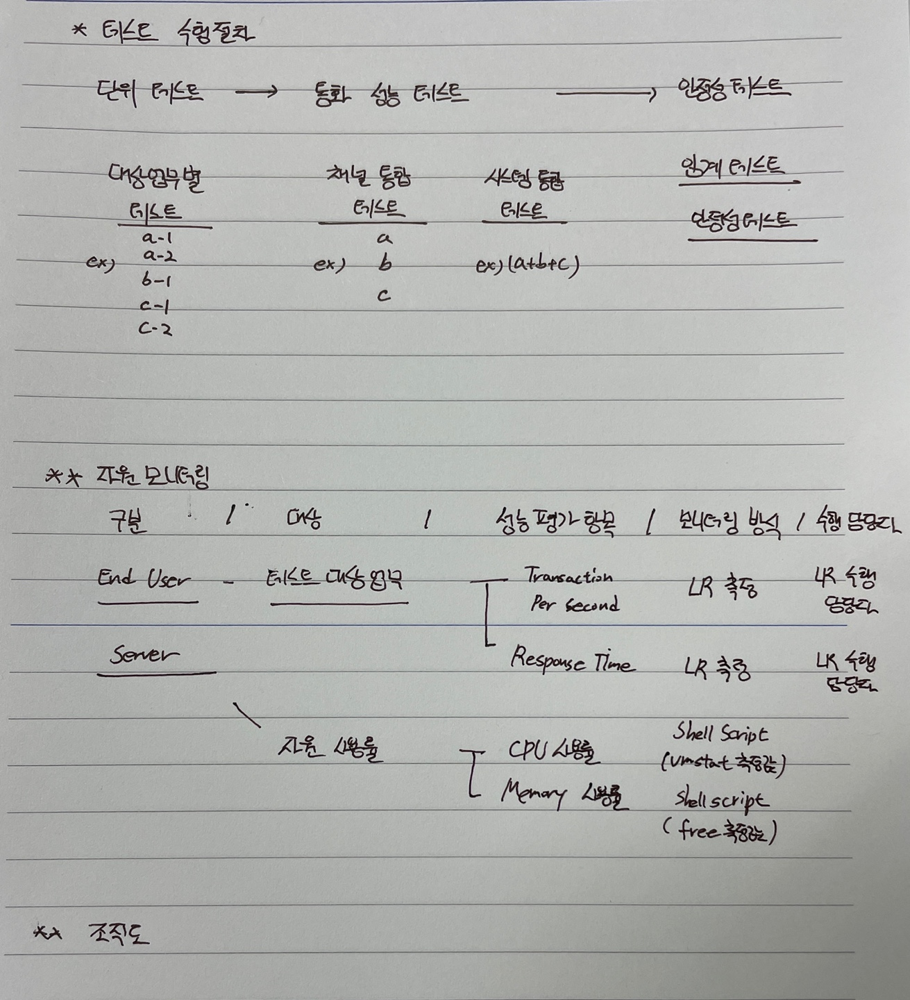
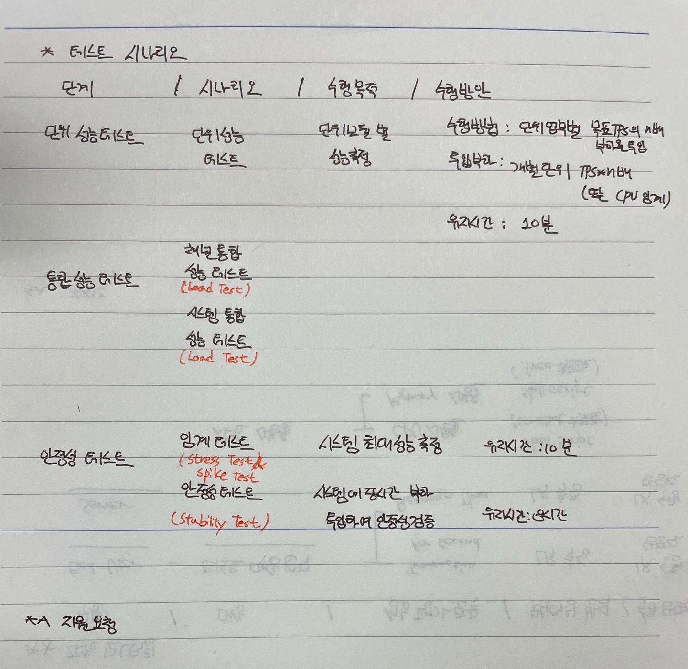
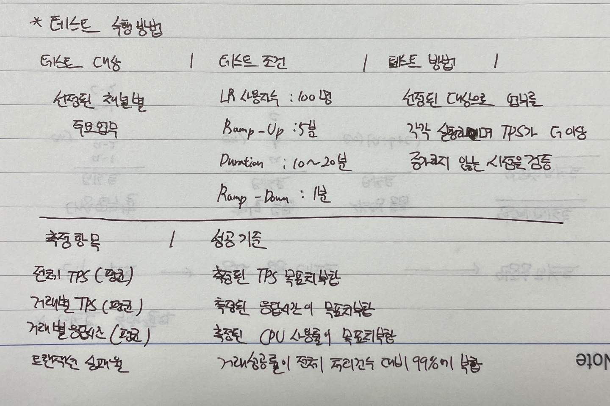
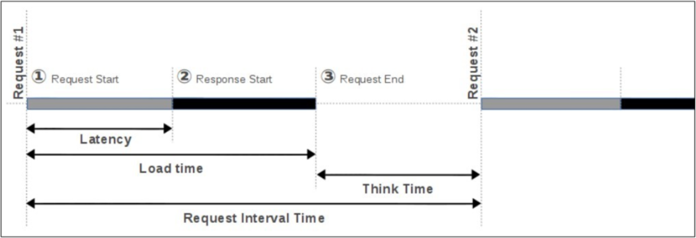

# Performance Test
* 구축 및 확장, 서비스 배포 등 후에 성능을 테스트해야 한다.
* 응답시간, 처리량, 병목 현상, 예외 상황 등을 확인할 수 있고, 성능 테스트를 통해 얻은 정보들을 통해서 문제점을 개선할 수 있기 대문이다.

## 성능 테스트 쓰임 종류
| Test                       | Description                                                                                                                                                                                                                                  |
| -------------------------- | -------------------------------------------------------------------------------------------------------------------------------------------------------------------------------------------------------------------------------------------- |
| Load Test                  | 부하(Load)를 순차적으로 증가시키면서, 응답시간이 급격히 증가하거나 더는 처리량이 증가하지 않거나, CPU와 Memory 등이 기준값 이상으로 증가하는 등 비정상 상태가 발생하는 임계점을 찾아내고 이를 바탕으로 성능 이슈에 대한 튜닝과 테스트를 반복 |
| Stress Test                | 임계값 이상의 요청이나 비정상적인 요청을 보내 비정상적인 상황의 처리 상태를 확인하고 시스템의 최고 성능 한계를 측정하기 위한 테스트                                                                                                          |
| Spike Test                 | 갑자기 사용자가 몰렸을 때 요청이 정상적으로 처리되는지 그리고 그 업무 부하가 줄어들 때 정상적으로 반응하는지를 확인하기 위한 테스트                                                                                                          |
| Stability Test / Soak Test | 긴 시간 동안 테스트를 진행하여 테스트 시간에 따른 시스템의 메모리 증가, 성능 정보의 변화 등을 확인하여 안정성을 확인하는 테스트                                                                                                              |

## 성능 테스트
* 성능 측정을 위해서는 아래와 같이 준비해야 한다.
1. 요구사항 분석 및 테스트 계획 (테스트 개요, 테스트 범위, 목표성능 지표)
2. 테스트 환경 구축
3. 테스트 설계 (테스트 수행절차, 수행일정, 테스트 시나리오, 지원 요청사항)
4. 테스트 수행 및 결과 수집
5. 테스트 분석
6. 문제점 수정 및 재테스트
7. 결과 리포트 작성

## 테스트 개요
* 여기서는 정확한 요구사항 분석을 통해 전반적인 내용을 결정한다.
* __성능 테스트 일정 및 장소__ : 언제, 어디서할 지 결정
    * ex> 일시: 2021년 8월 4일 ~ 2021년 11월 30일 / 장소: 상암 월드컵경기장
* __성능 테스트의 목적__ : 어떤 시스템의 어떤 성능을 테스트하는지 정확한 목적 결정. 정확한 목적 결정을 통해 중요도와 목적에 맞는 우선순위 등을 결정할 수 있다.
    * ex> 클라우드 확장 이후 부하 성능 테스트
* __성능 테스트 수행방안__ : 어떤 식으로 테스트 하는지 결정
    * 단위 성능 < 통합 성능 테스트 < 안정성 테스트
    * ex> 통합 성능 테스트 = 채널 통합 성능 + 시스템 통합 성능
    * ex> 안정성 테스트 = 임계 테스트 + 안정성 테스트
* __성능 테스트 환경__ : 성능을 테스트하기 위한 환경을 결정
    * 일반적인 성능 테스트 환경에 사용되는 Module은 다음 표와 같다. ex> (컨트롤러 / LoadRunner), (대상서버 / VM) 등

    | Module     | Description                                               |
    | ---------- | --------------------------------------------------------- |
    | 컨트롤러   | 부하발생기에 신호를 쏴주는 역할                           |
    | 부하발생기 | 부하를 발생시키는 역할                                    |
    | 모니터링   | 성능을 모니터하는 역할                                    |
    | 대상서버   | 해당 Server, 일반적으로 VM 등 가벼운 Server를 이용해 Test |

## 테스트 범위
* 테스트할 대상의 범위를 지정한다. 선정된 대상의 정보를 확인한다.
    * __대상 시스템__
    * __대상 업무__
    * __Architecture__
    * __H/W__
    * __S/W__
    * __구성정보 확인__

## 목표 성능 지표
* __업무 처리량__, __Peak Time__ 등을 기준으로 향후 부하량 증가분을 반영하여 수립
* 목표 성능을 정한다.
* ex>
    | 항목        | 목표 성능                              | 비고                                                                                          |
    | ----------- | -------------------------------------- | --------------------------------------------------------------------------------------------- |
    | 목표 TPS    | 109TPS                                 | 1트랜잭션/1초 = 화면 1건 처리/1 변환                                                          |
    | 자원 사용률 | CPU : <60%                             | 가용성 기준 3Node의 CPU 사용량                                                                |
    | 응답 시간   | 응답시간 비율 : > 99% / 응답시간 : 3초 | Client Time = N/W Time + Channel Server Time + Swing, Server Time (Browser Parsing Time 제외) |
    * __목표 TPS__ : 트랜잭션 값을 서비스에 대한 트랜잭션 값으로 매칭하여 기준을 잡는다. WAS 처리 TPS -> 화면 기준으로 환산. ex> 109 TPS = 109 Page view/1s = 1초당 109 Page를 렌더링할 수 있는 성능(TPS)초를 원한다
    * __자원 사용률__: CPU, Memory 등의 자원 사용률 기준을 잡는다. ex> VM 기준 H/W -> Hypervisor -> OS 순으로 올라가 있기 때문에, 100% -> 90% -> 60%로 기준을 잡는다.

## 테스트 수행 절차

* 일반적으로 __단위 테스트 -> 통합 성능 테스트 -> 안전성 테스트__ 같은 절차를 세운다.
* 다음으로 __대상, 성능 평가 항목, 모니터링 방식, 수행 담당자 등__ 절차에 대절 구체적인 사항을 결정한다. 
* 마지막으로 조직도, 역할을 구분한다.
    * 크게 조직은 5개로 구분된다.
    1) __PM (Project Manager)__
    2) __Infra 지원팀 (System Engineer Team)__
    3) __개발 지원팀 (Development Team)__
    4) __성능 테스트 지원팀 (Team Operator)__
    5) __고객사 Infra 담당자__

## 수행일정
* 테스트 수행에 대한 전체적인 일정과 자세한 일정 모두 세운다.

## 테스트 시나리오

* 테스트 수행 절차에 따른 테스트 시나리오를 작성한다.
* 각 테스트 단계에 필요한 지원이 있다면 리스트하여 요청하거나 필요한 데이터 셋을 준비한다.

## 테스트 수행방법

* 시나리오에 작성한 수행방법데 대한 세부 사항을 결정한다.

## 테스트 수행 및 결과 수집
* 결정한 수행 방법에 따라 테스트 수행
* 크게 두 부분으로 나누어진다.
1. __Pre-Test__: Main-Test 전에 Script 등이 제대로 작성되었는지 테스트 환경, 데이터 셋에 문제가 없는지를 확인한다.
2. __Main-Test__: 실제 테스트를 수행하는 단계로, 테스트 분석에 필요한 자료를 수집한다.

## 테스트 분석
* 테스트 결과 자료와 시스템 성능 자료를 모아서 테스트 결과를 분석한다. 분석된 자료를 통해서 성능에 영향을 미치는 문제점을 찾는다.

## 문제점 수정 및 재테스트
* 테스트 분석에서 발견된 문제점을 개발팀(Development Team)이나 시스템 운영팀(System Operation Team)에 전달하여 문제점을 수정하고 다시 한 번 테스트를 수행한다.

## 결과 리포트 작성
* 테스트 리포트는 목적에 따라 해당 목적을 가장 잘 표현할 수 있는 방식으로 작성한다. 요약 리포트와 상세 리포트를 분리해서 상세 경과를 필요로 하는 부서와 요약 결과만 필요로 하는 부서에 별도로 리포트를 제출하는 것도 좋은 방법이다.

## 주요 용어 및 개념
* __Active User__: 실제 서버에 연결된 상태로 요청을 처리 중인 사용자
* __InActive User__: 서버와의 세션 정보를 가지고 있지만 직접 접속하여 요청을 주고받는 상태가 아닌 사용자
* __Concurrent User__: Active User + InActive User, 동시접속 사용자수. 일반적으로 사용자 수의 많고 적음을 표현하는 값으로 성능 테스트에서 가상 사용자 수를 결정하는 기준이 된다. 일반적으로 Active와 InActive User 비율이 1:10 정도이다.
* __Virtual User__: 가상 사용자 수, JMeter에서는 Thread 수로 표현하기도 한다.
* __Ramp-Up Period__: Virtual User(Thread) 생성에 걸리는 시간을 의미.
* __Throughput__: 단위 시간당 대상 서버에서 처리되는 요청의 수. JMeter에서는 시간 단위를 보통 TPS로 표현한다.
* __Response Time/Load Time__: 응답 처리시간. 요청을 보낸 후 응답이 완료되어 사용자 화면에 출력될때까지의 시간.
* __Latency__: 요청을 보낸 후 데이터를 받기 시작할 때까지 시간.
* __Think Time__: 하나의 요청에 응답을 수신하고 다음 요청을 보낼 때까지 시간. 테스트에서 실제 사용자의 사용패턴과 유사한 패턴을 구현하기 위해서는 이 Think Time을 적절히 적용해야 한다.
* __Request Interval Time__: 요청을 보낸 후 다음 요청을 보낼 때까지 시간.
* __시간 관계도__
    
    * 항상 Response Time >= Latency 성립
    > A와 B 사이트에 동일한 크기(10MB 정도)의 파일을 올려놓고 다운로드 테스트를 행한다고 가정해본다. A 사이트와 B 사이트의 결과를 비교해 보니 B 사이트의 Load Time이 2배 이상 크게 나왔다. 하지만 Latency는 거의 비슷했다. 이렇게 차이가 나는 이유가 무엇일까? Load Time에서 Latency를 빼면 데이터를 전송받는데 걸리는 시간을 나타낸다. 즉, B 사이트가 A 사이트보다 데이터를 내려받는 속도가 다리다고 볼 수 있다. 따라서 B 사이트는 처리량을 늘리기 위해 웹서버를 튜닝하기보다는 네트워크의 대역폭(Bandwidth)을 늘리는 것을 고려해야 한다.

### Reference
* https://12bme.tistory.com/272