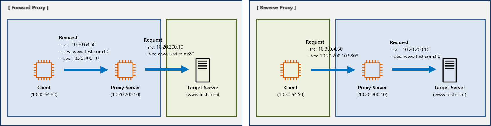

# Proxy Server
* Client가 다른 네트워크에 간접적으로 접속할 수 있게 해주는 서버.
 

## Forward vs Reverse

* Forward Proxy
    * Client에게 전달받은 Domain 정보가 등록되어 있으면, 해당 Domain으로 요청을 전달하는 방식
    * Private ---> Proxy ---> Public
* Reverse Proxy
    * Client가 Proxy Server에게 요청하면, Proxy Server에 설정되어 있는 Domain으로 요청을 전달하는 방식
    * Public ---> Proxy ---> Private
> Forward이든 Reverse이든 Public이 Private를 알지 못함!
 
 

## Proxy Open-source
1. HAProxy
    * Reverse Proxy & Load Balancer
    * 
2. Squid
    * Caching & Foward/Reverse Proxy
    * 
3. NGINX
    * Caching & Load Balancer & Reverse Proxy
    * 가볍기 때문에 실제 운영에서는 Proxy로 사용되는지 모르겠음?!
 
 

### Reference
* https://goodgid.github.io/HTTP-Keep-Alive/