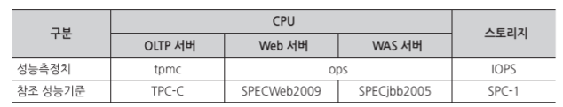

# Server
For Server

## Server 구축 시, 고민할 필요 요소.
1. CPU
2. Memory
3. Disk
4. Storage & I/O
5. Kernel & Driver
6. Network
7. Security
8. Application

## Server Resource 산정방법
* 한국정보통신기술협회 기준 (TTA)
* https://www.cisp.or.kr/wp-content/uploads/2013/11/%EC%A0%95%EB%B3%B4%EC%8B%9C%EC%8A%A4%ED%85%9C_%ED%95%98%EB%93%9C%EC%9B%A8%EC%96%B4_%EA%B7%9C%EB%AA%A8%EC%82%B0%EC%A0%95_%EC%A7%80%EC%B9%A8_TTAK.KO-10.0292_R1_2017.06.28.pdf
* https://www.tta.or.kr/data/androReport/ttaJnal/172-4.pdf

## 규모산정 개념
| 구분     | 정의                                                                                                                  | 관점         | 시간성 |
| -------- | --------------------------------------------------------------------------------------------------------------------- | ------------ | ------ |
| 용량관리 | 비즈니스 요구사항을 충족시키기 위한 현재와 미래의 용량 계획을 수립하고 비용(Cost)과 용량(Capacity)의 균형을 맞추는 것 | 조직         | 지속정 |
| 용량계획 | 개략적인 시스템 아키텍처와 응용 업무를 기반으로 시스템에 요구되는 성능 요구사항과 성능을 결정하기 위한 계획           | 조직, 시스템 | 지속성 |
| 규모산정 | 기본적인 용량과 성능 요구사항이 제시되었을 때, 그것을 시스템 요구사항으로 변환하는 것                                 | 시스템       | 일시적 |

* 용량관리: 시스템, 네트워크 등 조직 내의 하드웨어 자원만을 국한하는 것이 아니라 전사적인 자원을 관리 대상으로 하며, 일시적이 아닌 지속적인 관리에 중점을 둔다.
* 용량계획: 클라이언트 애플리케이션의 형태, 동작 특성, 이들에 접근하는 사용자의 수, 서버 시스템에 대응하는 오퍼레이션의 형태, 서버시스템에 접속하는 동시 접속자 수, 서버시스템에 의해서 수행되어야 하는 피크율, 피크타임 하에서의 여유율 등을 결정힌디.
* 규모산정: 서버의 CPU 형태나 수, 디스크 크기나 형태, 메모리 크기, 네트워크의 용량 등의 요소를 들 수 있다.

## 규모산정 방법
1. 어떻게 용량관리를 할지 결정한다.
	* 현재와 미래에 대한 비용과 용량 계획을 세운다.
	* 예산은 어떻게 되는지?
	* On-premise? Public? Hybird?
2. 적합한 용량 계획을 세운다.
	* 서비스 측면에서의 용량 계획과 리소스 측면에서의 용량 계획을 나누어 계획을 세운다.
	* 비즈니스의 확장성을 고려
	* Server, DB, Network, 보안, 응용프로그램 등과 같은 리소스 영역을 고려
	* 인증, 콘텐츠과 같은 논리 영역에 대한 검사도 병행해야 한다.
	* Application 형태, Application 동작 특성, 사이트 사용 대상자, 사이트 접속자 수, 사이트 동시 접속자수, 피크율, 피크 타임 하에서의 여유율 등 결정
	* 이들을 종합하며 아키텍처를 그린다.
3. 용략 계획을 기준으로 규모산정
	* 산정방식
		1) 수식계산법: 계산법이 있지만, 거의 맞지 않는다.
			* 그래서 각 HW에서 제공하는 tpmC를 기준으로 보정치를 확인해서 계산한다.
			* 기본적으로 Hypervisor를 사용하는 경우, OS Call 등으로 인해 100% HW 성능을 사용할 수 없다. 이러한 여러 이유 들로 인해 보정치가 필요하다.
			* 공식적인 업체에서 제공하는 TMPC 값은 공식적이지만, 보정치는 정해야되기 때문에 적절한 값이 필요한다 (근거 제시 미약일 수 있으니까 물어보자)
		2) 참조법: 업무량(사용자 수, DB 크기)에 따라, 기본 데이터를 토대로 대략적인 시스템 규모를 비교하여 비슷한 규모를 산정
			* 비교에 의한 것이므로 근거 제시 미약
		3) 시뮬레이션법: 대상업무에 대한 작업부하를 모델링하고 이를 시뮬레이션하여 규모를 산정
			* 테스트부터 하는 것은 실질적으로 힘들다.

## 규모 산정 대상
* CPU: 해당 업무를 처리하기 위한 CPU 규모를 계산
* Memory: CPU 규모산정에 따른 서버 구성방안에 의거하여, 서버별 시스템 S/W, 응용 프로그램 등의 메모리 사용량을 산정한다.
* Disk: CPU 규모산정에 따른 서버 구성방안에 의거하여, 서버별 OS, 시스템 S/W, DB의 데이터, DB의 Archive 및 백업 영역 등의 디스크 사용량을 산정한다.
* Storage: CPU를 기준으로 산정된 서버 규모에 따라 필요한 스토리지의 규모를 산정한다.

## 규모 산정 기준

### CPU
1. Used as a OLTP Server
    * TPC-C 기준을 참조하여 tmpC 값을 사용하거나 tpmC 계산
        * __TPC-C__: Transaction Processing Performance Council
        * __tpmC__: TPC-C 벤치마크 시나리오에 대한 1분당 최대처리 건수(분당 트랜잭션 수)를 나타내는 수치
    1) tpmC 성능자료를 볼 수 있는 Site
        * http://www.tpc.org/ -> Benchmarks/Results -> Transaction Processing -> TPC-C
    2) __CPU(tpmC) = 분당트랜잭션수(동시사용자수 * 사용자당 트랜잭션 처리수) * 기본 tpmC 보정 * Peak Time 부하 보정 * DB Size 보정 * Application 구조 보정 * Application 부하 보정 * Cluster 보정 * 시스템 여유율__
        * 정확한 수치는 TTA에서 확인할 수 있다.
        * __산정식에서 보정치 및 여유율은 100%를 추가한 후 소수점으로 변환하여 계산(30% = 1.3)__
		
    | 항 목                        | 값                                                                                                                                                                                                                                       |
    | ---------------------------- | ---------------------------------------------------------------------------------------------------------------------------------------------------------------------------------------------------------------------------------------- |
    | __동시사용자수__             | 총 사용자의 10~30% (일반값: 20% = 0.2)                                                                                                                                                                                                   |
    | __사용자당 트랜잭션 처리수__ | 업무처리건수 * 업무당 트랜잭션 수. 어무처리건수 일반값 2, 업무 유형 별 복잡도를 감안하여 업무당 트랜잭션 수 4~6 (일반 값 5)                                                                                                              |
    | __기본 tpmC 보정값__         | 실운영환경과 차이가 보이므로 보정이 필요. (20~30%, 일반값 1.3)                                                                                                                                                                           |
    | __피크타임 부하 보정__       | 업무가 과중한 시간대에 시스템이 원활하게 운영되어야 목적을 달성할 수 있으므로 보정 필요 (20~50%, 일반값 1.3)                                                                                                                             |
    | __DB Size 보정__             | DB 볼륨과 건수에 따라 속도가 다르므로 보정 필요 (1.5~2.0, 일반값 1.7)                                                                                                                                                                    |
    | __Application 구조 보정__    | 2계층, 3계층 등에 따라 응답시간이 달라지므로 보정 필요 (50~10%, 일반값 40%, 1.4)                                                                                                                                                         |
    | __Application 부하 보정__    | 온라인 작업을 수행하는 피크타임에 배치작업 등이 동시에 이루어지는 경우를 감안한 보정(1.3~2.2, 일반값 1.7 )                                                                                                                               |
    | __Cluster 보정__             | 시스템에 장애가 발생하면 남아있는 시스템이 장애가 발생된 시스템의 응용프로그램을 모두 수행하고, 사용자들을 받게 된다. 이 경우 시스템의 예비율이 없으면 업무가 가중되어 정상적인 운영이 어렵게 된다. 이를 위해 예비율이 필요하다 (30~50%) |
    | __시스템 여유율__            | 예기치 못한 업무의 증가 및 시스템의 안정된 운영을 위한 보정 (2-Node: 1.4, 3-Node: 1.3)                                                                                                                                                   |

2. Used as a Application Server
    * __CPU(OPS) = 동시사용자수 * 사용자당 오퍼레이션 수 * 기본 OPS 보정 값 * 인터페이스 부하 보정 * Peak Time 부하 보정 * Cluster 보정 * 시스템 여유율__
        * __산정식에서 보정치 및 여유율은 100%를 추가한 후 소수값으로 변환하여 계산(30% = 1.3)__

  | 항 목                      | 값                                                                                                                                                                                                                                                                                                                                                                                         |
  | -------------------------- | ------------------------------------------------------------------------------------------------------------------------------------------------------------------------------------------------------------------------------------------------------------------------------------------------------------------------------------------------------------------------------------------ |
  | __동시사용자수__           | 전체사용자 * (접속사용자수 예측 비율) * (5~10%).                                                                                                                                                                                                                                                                                                                                           |
  | __접속사용자 수__          | 대상 시스템에 등록된 전체사용자로서 일반적으로 접속할 수 있는 권한을 가진 사용자들을 나타내고, 불특정 다수를 포함할 수도 있어 추정이 필요. Ex> 전국민을 대상으로 하는 서비스 중 예상 가입자 수는 전체 인터넷 사용자 수를 감안하며 100만명을 가정하였다. 접속사용자 수는 전체였용자의 1%로 가정(10,000명)하고, 트랜잭션을 발생시키는 동시사용자 수는 접속사용자 수의 10%인 1,000명으로 산정 |
  | __사용자당 오퍼레이션 수__ | 사용자 한 사람이 초당 발생시키는 비즈니스 로직 오퍼레이션 수로서 업무 유형에 따라 복잡도를 감안하여 3~6                                                                                                                                                                                                                                                                                    |
  | __기본 OPS 보정값__        | 실운영환경과 차이가 보이므로 보정이 필요. (20~30%, 일반값 1.3)                                                                                                                                                                                                                                                                                                                             |
  | __인터페이스 부하 보정__   | 서버가 타 서버와 통신하게 될 때 인터페이스에서 발생하는 부하를 고려한 보정치 (1~10%, 일반 값 1.1, 1.임이되려면 대용량의 경우 cache 등 구성이 필요해 보임)                                                                                                                                                                                                                                  |
  | __피크타임 부하 보정__     | 업무가 과중한 시간대에 시스템이 원활하게 운영되어야 목적을 달성할 수 있으므로 보정 필요 (20~50%)                                                                                                                                                                                                                                                                                           |
  | __Cluster 보정__           | 시스템에 장애가 발생하면 남아있는 시스템이 장애가 발생된 시스템의 응용프로그램을 모두 수행하고, 사용자들을 받게 된다. 이 경우 시스템의 예비율이 없으면 업무가 가중되어 정상적인 운영이 어렵게 된다. 이를 위해 예비율이 필요하다 (30~50%, 2-Node: 1.4, 3-Node: 1.3)                                                                                                                         |
  | __시스템 여유율__          | 예기치 못한 업무의 증가 및 시스템의 안정된 운영을 위한 보정 (30%, 1.3)                                                                                                                                                                                                                                                                                                                     |

### Memory
* __Memory(MB) = {시스템 영역 + (사용자당 필요 메모리 * 동시사용자 수 + 미들웨어 버퍼 캐시 메모리)} * 버퍼캐쉬 보정 * 시스템 여유율__

| 항 목                        | 값                                                                                                                                                                                                                    |
| ---------------------------- | --------------------------------------------------------------------------------------------------------------------------------------------------------------------------------------------------------------------- |
| __시스템 영역__              | 시스템 운영시 구동되는 모든 SW(OS, Network Demon, DB Engine, Middleware Engine, Utility 등)의 소요공간으로 각각의 SW가 구동시 필요로 하는 영역을 계산하여 적용. 각각의 SW 제조사가 권하는 필요 메모리를 반영하여 산정 |
| __사용자당 필요 메모리__     | Application, Middleware, DBMS 등의 사용에 필요한 사용자당 메모리. 계산이 불가능한 경우 1 ~ 3MB 값을 임의로 적용할 수 있다. 일반 값 2MB                                                                                |
| __동시사용자 수__            | CPU의 동시사용자 수 추정치와 동일한 값을 적용                                                                                                                                                                         |
| __버퍼캐쉬 보정__            | 디스크 I/O 횟수를 줄이기 위한 버퍼캐쉬 크기는 시스템 운영자의 요구에 의해서 정해진다 (10~30%, 1.2)                                                                                                                    |
| __미들웨어 버퍼캐시 메모리__ | DBMS의 공유 메모리, WAS의 Heap Size 등 미들웨어에서 사용하는 캐시 영역을 말한다.       각 미들웨어의 요구에 의해서 결정                                                                                               |
| __시스템 여유율__            | 예기치 못한 업무의 증가 및 시스템의 안정된 운영을 위한 보정치로, 일반적으로 30%를 적용                                                                                                                                |

### Disk
* 디스크 규모산정 시 가장 중요한 고려요소는 데이터 백업 방안이다. 백업정책에 의해 디스크 요구량은 큰 차이를 가지기 때문에, 데이터의 중요도를 고려하여 상황에 적절한 백업 정책을 수립할 필요가 있다.
1. __System Disk__
	* __시스템 디스크__ = __(시스템 OS 영역 + 응용프로그램 영역 + SWAP 영역) * 파일시스템 오버헤드 * 시스템디스크 여유율__
2. __Data Disk__
	* __데이터 디스크__ = __(데이터 영역 + 백업 영역) * 파일시스템 오버헤드 * RAID 여유율 * 데이터디스크 여유율__

| 항 목                          | 값                                                                                                                                                                                                                                                                                                                                                                       |
| ------------------------------ | ------------------------------------------------------------------------------------------------------------------------------------------------------------------------------------------------------------------------------------------------------------------------------------------------------------------------------------------------------------------------ |
| __System OS 영역__             | 설치된 운영체제 뿐만 아니라 시스템 S/W와 수퍼유저(Super User)를 위한 영역까지 포괄한다. 설치될 운영체제나 시스템 SW의 크기는 SW Vendor                                                                                                                                                                                                                                   |
| __응용프로그램 영역__          | 어플리케이션 프로그램, 응용프로그램, DBMS 등의 설치에 따른 영역의 크기로, 모든 프로그램의 크기를 합하여 구한다. 특히, 데이터베이스 영역은 실 자료공간(건수 * 건수별 데이터 크기 * 보관기간), 예비용 데이터 공간, 인덱스 및 키용 실 데이터 공간 등 세부항목의 합계로 결정되며, 다만 인덱스의 크기는 시스템별 인덱스 정책에 따라 보정 범위가 가변적일 수 있다              |
| __SWAP 영역__                  | 시스템 장애 시의 덤프 역할 수행과 메모리 대용의 효율적인 Swapping을 수행하기 위한 작업공간. 일반적으로 메모리 요구량의 2배로 산정                                                                                                                                                                                                                                        |
| __파일시스템 오버헤드__        | 일반 사용자 관리영역을 위한 수퍼유저의 관리 공간과 I-node Overhead, 수퍼블럭, 실린더그룹 등 파일관리 공간이 필요함에 따라 오버헤드 공간을 고려하여야 한다. 일반적으로 이러한 파일시스템 오버헤드 공간은 시스템디스크의 경우 시스템OS 영역과 응용프로그램 영역, SWAP 영역을 합한 값의 10% 정도, 그리고 데이터디스크의 경우 데이터 영역과 백업 영역을 합한 값의 10%를 산정 |
| __시스템/데이터디스크 여유율__ | 안정성 있는 시스템 궁성을 위해 디스크 여유율을 가지는 것이 바람직하다. 업무분석의 실수로 디스크 요구량이 과소 산정되거나, 고려하지 못한 돌발적인 사태에 대비해서 일반적으로 전체 필요 디스크량의 20~50% 정도를 여유율로 산정. 기본 값은 30%                                                                                                                              |
| __데이터 영역__                | 실제 필요한 데이터량을 대상으로 하며, 계산시 매년 증가치를 반영하여 산정한다.                                                                                                                                                                                                                                                                                            |
| __백업 영역__                  | 백업 영역은 백업정책에 의해서 결정되는데, 일반적으로 데이터와 데이터의 변경내역 정보를 가지는 Archive 형태로 보관한다. Archive 파일은 실제 데이터와 Log, 보관기간에 의해 전체 사용영역이 결정되는데, 백업파일을 이중으로 관리하기 위해 Archive File 자체에 대한 백업을 수행할 수도 있다.                                                                                 |
| __RAID 여유율__                | RAID 여유율은 RAID 디스크가 도입될 경우 데이터 보호를 위한 패러티 영역으로 사용되는 공간을 가산 적용하며, RAID1의 경우 100%를 RAID5의 경우 30%로 산정한다.                                                                                                                                                                                                               |

### Storage
* SPC-1 기준을 참조하여 IOPS(초당 I/O 동작 처리건수)를 사용
* Storage Size는 서버 성능에 의존적이므로 서버 성능당 스토리지 성능 비율 즉, tpmC당 IOPS 비율로 설정한다. WEB/WAS 서버의 경우 OLTP&Batch 서버에 비해 I/O가 작으므로 tpmC 성능치 크기의 0.5%를 IOPS로 산정한다.

### I/O

### Kernel Driver

### Networking

### Security

### 용어정리
* Transaction(트랜잭션): 컴퓨터 과학분야에서는 "쪼개질 수 없는 업무처리의 단위"를 의미. 이러한 표현 때문에 원자성(Atomicity)을 보장해야 한다라고 얘기한다. DB에서는 하나의 작업을 수행하기 위해 필요한 DB 연산들을 모아놓은 것으로, 논리적인 작업의 단위를 의미.
* Service Response Time(응답 시간): 응답 시간은 "Client Time + Server Time". 예로 Server Time은 [Web Server 수행시간 + WAS Server 수행시간 + DB 수행시간 + 서버간 통신시간], Client Time은 [Data Network 전송시간 + Client 수행시간] 이다.
* IOPS: Input/Output operation per second
* ISP: Information Strategy Planning
* OLTP: On-Line Transaction Process
* ops: operations per second
* SPC: Storage Performance Council
* RAID: Redundant Array of Independent Disks
* TPM: Transaction Per Minute
* WAS: Web Application Server
* TPS: Transaction per Second, 초당 트랜잭션 개수

