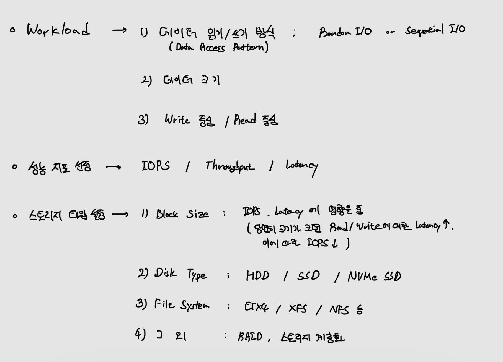

# Block Storage Performance and Optimization
## Performance
스토리지의 성능은 데이터를 읽고 쓰는데 걸리는 시간으로 결정되는데, Block Storage는 디스크 헤더를 움직여서 읽고, 쓸 위치로 옮기는 단계에서 결정된다.

그리고 디스크의 성능은 디스크 헤더의 위치이동 없이 얼마나 많은 데이터를 한 번에 기록하느냐에 따라 결정되기도 한다.

* 성능에 영향을 주는 요소
    

* IOPS & Throughput
    | 특성 | IOPS | Throughput |
    |-----|------|------------|
    | 측정 기준 | 초당 I/O 작업 수 | 초당 처리 데이터량 (MB/s, GB/s) |
    | 작업 크기	| 작은 크기(4KB~8KB) | 큰 크기(128KB~1MB 이상) |
    | 작업 유형	| 랜덤 I/O 작업에 최적화 | 순차 I/O 작업에 최적화 |
    | 적합한 워크로드 | 데이터베이스, 트랜잭션, VM | 백업, 스트리밍, 데이터 분석 |
    | 스토리지 유형	| SSD에서 더 높은 IOPS 제공	| HDD에서도 높은 Throughput 가능 |

    > IOPS가 높다고 Throughput이 높지 않을 수 있다. 네트워크 및 스토리지 성능이 충족한다는 가정하에 IOPS가 작더라도 IOPS를 만족하면서 사이즈가 큰 데이터를 처리를 하고 있고, 다른 한쪽은 IOPS는 큰데 사이즈가 작은데이터를 여러개 처리한다고하면 IOPS가 작더라도 처리량은 크게 나올 수 있다. 그래서 한쪽만 신경쓰는 것이 아니라 IOPS/Throughput/Latency 모두 확인해야 한다.

* Block vs Segment
    - Block : 물리적 또는 논리적 디스크에서 가장 작은 데이터 저장 단위. 일반적으로 파일 시스템에서 정해진 크기의 단위를 말하며, 이 단위로 데이터를 읽고 쓴다.
    - Segment : 연속된 블록들의 집합으로, 주로 성능 최적화를 위해 묶음 단위로 처리된다. 순차 접근(Sequential Access)처럼 큰 데이터를 다룰 때, 스토리지는 성능을 최적화하기 위해 여러 블록을 한꺼번에 읽는 프리페칭을 수행한다. 이 과정에서 연속된 블록을 그룹화한 세그먼트를 읽는 방식이 사용된다.
        - 예를 들어, RAID 0 설정에서는 여러 디스크에 걸쳐 있는 블록을 세그먼트 단위로 읽을 수 있습니다.

</br>


### HDD vs SSD
1. Solid State Drive (SSD)
    - 반도체 메모리 셀에 데이터를 저장하며, 이동 부품이 없음
    * Random I/O 매우 빠름 : 데이터 접근 속도는 전기적 신호로 이루어져 물리적 이동 시간이 없음
    * Seqential I/O 빠름 : 설계 특성상 Random I/O와 Sequential I/O 간의 성능 차이가 HDD만큼 크지 않음
2. Hard Disk Drive (HDD)
    - 디스크에 저장하며, 헤드의 위치를 이동하여 데이터를 읽고 씀
    * Random I/O 느림 : 디스크의 액세스 암을 움직이면서 헤드를 통해 데이터를 읽고 쓰기 때문에 느림
    * Sequential I/O 빠름 : 디스크의 헤드가 한 번만 위치를 잡고, 연속적인 데이터 블록을 읽고 씀으로 성능이 뛰어남
    
</br>

### Random I/O vs Sequential I/O
Random I/O, Sequential I/O 패턴은 워크로드가 어떻게 되냐에 따라 저장소 시스템이 결정한다.

* I/O 패턴 선택 방법
    1. 작업의 특성 : 워크로드 방식에 따라 읽기/쓰기 방식이 달라진다.
       - Random I/O: 데이터가 다양한 위치에 저장되었고, 임의로 접근 해야하는 경우
           - 데이터베이스에서 특정 레코드를 검색하거나 수정하는 경우 (파일 안에 랜덤하게 저장되어 있음)
           - 캐싱 사용
       - Sequential I/O: 데이터를 순차적으로 읽거나 써야하는 경우
           - 로그 파일 작성 (파일에 데이터를 한 번에 순차적으로 씀)
           - 백업 작업
           - 대용량 스트리밍 (대용량 파일을 순차적으로 보냄)
           - 데이터웨어하우스
    2. 저장소와 파일 시스템 설계 : 운영체제와 파일 시스템이 데이터를 물리적으로 배치하고 읽는 방식을 결정한다.
        - HDD: 파일이 조각화되면, Random I/O가 많아짐.
        - SSD: 데이터 배치와 상관없이 I/O 성능이 상대적으로 일정.
    3. Block Size 설정
        - 큰 Block Size : Sequential I/O
        - 작은 Block Size : Random I/O
</br>

### IOPS vs Throughput vs Latency
Throughput은 기본적인 모든 시스템, 장비의 처리 능력(성능)을 의미한다. 볼륨의 처리 능력은 IOPS이다. 하지만 시스템마다 장비마다 표시를 다르게 하다보니 혼동을 가지고 왔다.

* __IOPS(Input/Output Per Second)__: 시스템이 처음부터 끝까지 초당 읽기/쓰기 작업 수(또는 트랜잭션이라고도 한다)
* __Throughput(MB/s)__: 처리량. 시간 단위 내에 송수신되는 데이터의 양.
    ```
    # 계산 방법

    Throughput in MiB/s = (IOPS per GiB) × (I/O size in KiB)
    ```
    - (IOPS per GiB) : R = I/O 속도
    - (I/O size in KiB) : I = I/O 크기, Block 크기
* __Latency(ms)__ : 지연 시간. 네트워크에서 하나의 데이터 패킷이 다른 지점에 도착하는 데 소요되는 시간
    - 시스템 관점에서 Latency는 트랜잭션을 처리하는데 필요한 시간
    > 같은 처리능력이면 Block Size의 클 수록 -> 하나의 Block을 읽기/쓰기할 때 Latency가 증가할 것이고, IOPS가 떨어질 것이다!

    > IOPS는 시스템에 대한 내용이고, Throughput은 네트워크에 대한 내용이다! (Ref : https://performance.tistory.com/27)

</br>
</br>


---
## Optimization

