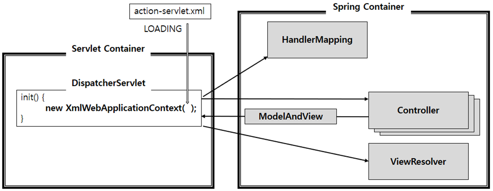

# Spring Prior Knowledge
* 스프링에 들어가기전 알아두면 좋은 내용에 대해 설명한다.

## Java File Compile 과정
```shell script
$ javac -cp lib\logback-classic.jar;lib\logback-core.jar;lib\slf4j-api.jar kr\co\fascamfus\Main.java
$ java -cp lib\logback-classic.jar;lib\logback-core.jar;lib\slf4j-api.jar;. kr.co.fascamfus.Main

$ jar -c -m manifest.txt -f fascamfus.jar kr\* logback.xml
$ java -jar fascamfus.jar // 실행 가능한 jar File
```
* javac - cp {Class File Path} {JAVA File} : JAVA File을 Class File로 변환
* java -cp {Class File Path} {Class FIle} : Class File 실행
* java -jar {JAR File} : JAR File을 이용하여 실행

## Context

* 필요한 정보를 포함하고 있는 설정 파일
* Global한 영역으로 시작부터 끝을 의미
* CS에서 사용되는 의미는 CPU의 Register 값을 의미한다. Scheduler에 의해 A Process에서 B Process로 실행이 변경되어야할 때, A의 CPU Register 값을 특정 위치에 저장하고
B Process Register  값을 복원한 후 B Code를 실행하게 된다. 이를 Context Switching이라고 한다. 이 외에도 Thread 등의 루틴이 실행될 때 사용되는 Call Stack, Memory 등의 상태를 의미한다.
    * https://kldp.org/node/51223
* Web에서는 Web Context 이라고 하며, 하나의 Web Application 안에는 여러 개의 context가 있을 수 있다.
    * Ex> 카카오톡 - 채팅 context, 쇼핑 context, 카카오페이 context
* Spring에서는 기본적으로 2개가 들어간다.
    1) Root WebApplicationContext
        * Web Application 최상단에 위치한 Context
        * 최상위에 위치해 있기 때문에 Servlet Context에 정의된 설정을 사용할 수 없다.
        * 그렇기 때문에 다른 Servlet Context에서 공용으로 사용되는 설정을 하게 된다 (@Service, @Repository, @Configuration, @Component, DataSource)
        * 보통 root-context.xml or applicationContext.xml으로 File naming
    2) Servlet WebApplicationContext
        * Servlet 단위로 생성되는 Context
        * @Controller, Interceptor, ViewResolver, MappingHandler 등 설정
        * Root WebApplicationContext를 부모 Context로 사용한다.
        * Bean객체를 찾을 때 Servlet Context -> Root Context 순으로 찾는다.
        * 그렇기 때문에 같은 id로 등록되어 있는 경우, Servlet Context에 정의된 내용
* transaction context
    * 동작 시작 부터 ~ 동작 끝까지(Query 동작, Query Rollback 등)의 범위, 영역

### Spring Container 종류
1. GenericXmlApplicationContext: XML 기반 일반적으로 사용할 수 있는 Container
2. XmlWebApplicationContext: XML 기반 Web에서 사용할 수 있는 Container
3. AnnotationConfigWebApplicationContext: Annotation 기반 Web Container, GenericXmlApplicationContext를 implement하고 있다.

## Servlet/JSP Listener Interface 종류
1. ServletContextListener
    * Servlet 기반 Web Application의 시작, 종료 Event에 대한 Listener
    * **public void contextInitialized(ServletContextEvent sce)** : 웹어플리케이션을 초기화할 때 호출
    * **public void contextDestroyed(ServletContextEvent sce)** : 웹 어플리케이션을 종료할 때 호출
2. HttpSessionListener
    * Http Session의 시작, 종료 Event에 대한 Listener
3. ServletRequestListener
    * Client로부터 Request를 받고, Servlet Request Listener

### ContextLoaderListener
* ServletContextListener Interface의 구현체
* Initialize the root web application context(Java Docs)
* 해당 Servlet의 Lifecycle에 맞추어 ApplicationContext를 추가, 삭제 하도록 한다.
* Servlet에 Spring 연동 Example
```xml
<web-app>
    <context-param>
        <param-name>contextClass</param-name>
        <param-value>org.springframework.web.context.support.AnnotationConfigWebApplicationContext</param-value>
    </context-param>

    <context-param>
        <param-name>contextConfigLocation</param-name>
        <param-value>/WEB-INF/root-context.xml</param-value>
    </context-param>

    <listener>
        <listener-class>org.springframework.web.context.ContextLoaderListener</listener-class>
    </listener>

    <servlet>
        <servlet-name>dispatcher</servlet-name>
        <servlet-class>org.springframework.web.servlet.DispatcherServlet</servlet-class>
        <init-param>
            <param-name>contextConfigLocation</param-name>
            <param-value>/WEB-INF/servlet-context.xml</param-value>
        </init-param>
        <load-on-startup>1</load-on-startup>
    </servlet>
    <servlet-mapping>
        <servlet-name>dispatcher</servlet-name>
        <url-pattern>/</url-pattern>
    </servlet-mapping>
</web-app>
```
* ContextLoadListener는 Web application context를 생성할 때, "contextClass" 와 "contextConfigLocation" Servlet context-param을 기준으로 Web Appplication context를 생성한다.
    * ```contextClass``` : Context Class Type
    * ```contextConfigLocation``` : Context File Location


## Web Application 설정 및 동작
* **Spring Framework**는 **Servlet 기반의 Web Application을 쉽게 만들 수 있도록 
도와주는 Framework**이다.
* **Spring Framework**를 사용한다는 의미는 아래와 같다.
    * IoC Container 사용
    * Spring MVC 사용
* Servlet을 사용하기 위해서 Maven에 등록
    * **javax.servlet-api** 등록(pom.xml)
* Spring(IoC Container, MVC)을 사용하기 위해서 Maven 등록
    * **spring-context** 등록(pom.xml)

### 전반적인 설명

1. Tomcat이 web.xml을 기준으로 Servlet Container 생성
2. DispatchServlet 생성 후, Spring Container 생성


### Web application 동작 과정

1. Servlet Container 초기화(web.xml 기준으로 초기화, 보통 webapp/WEB-INF에 저장)
    * Servlet 생성 및 삭제, Request를 처리
2. ContextLoaderListener 생성
    * Servlet Container의 Listner로써 Servlet의 생명주기를 관리
    * Servlet을 시작/종료 시점에 Servlet Context에 ApplicationContext 등록/삭제
3. ContextLoader가 root-context.xml Loading 및 Spring Container 생성
    * **context-parm의 contextConfigLocation**에 설정한 xml 파일 Loading
    * 파일 : **root-context.xml (applicationContext.xml or business-*.xml)**
    * Servlet는 Servlet, Filter, Listener만 띄울수 있다. 그렇기 때문에 Spring Container를 생성하는 이유는 일반 Java Class(POJO)를 사용하기 위해서 이다.
4. Root Spring Container 실행
    * **servlet-context.xml (presentation-*.xml)** 에는 주로 Service, DAO 등이 설정
5. Client로 부터 Request
6. Dispatcher Servlet 생성
    * FrontController 역할 수행 (**Front Controller Pattern** 이용)
7. servlet-context(presentation-layer.xml) Loading
    * **servlet-context(presentation-layer.xml)** 에는 controller, ViewResolver, Interceptor 등이 설정
8. Dispatcher Servlet에 해당하는 Spring Container 실행(controller, ViewResolver, Interceptor 등)

## Spring MVC 흐름

*https://owin2828.github.io/devlog/2019/12/30/spring-10.html*
1) **DispatcherServlet**이 모든 Request과 Response를 관리하게 된다.
    * **DispatcherServlet** 또한 Servlet Container가 관리
    * **FrontController Pattern** 역할을 하게된다(URL Mapping을 web.xml 또는 @Annotation을 이용하는 것이 아닌
    해당 FrontController Servlet이 관리)
2) Request가 들어오면 **DispatcherServlet**은 **HandlerMapping Bean** 객체에게 Controller 검색을 요청
    * **HandlerMapping**은 **Controller Bean** 객체를 **DispatcherServlet**에게 전달
3) **DispatcherServlet**는 전달받은 **Controller Bean** 객체를 **HandlerAdapter Bean**에게 요청 처리를 위임
4) **HandlerAdapter Bean**은 **Controller**의 Business Logic을 실행
5) **Controller**는 결과를 **ModelAndView** 객체로 **DispatcherServlet**에게 전달.
6) **DispatcherServlet**은 결과를 보여줄 View를 찾기 위해 **ViewResolver Bean**객채를 이용한다.
7) **ViewResolver**에게 받은 **View** 객체을 이용해 Response 결과를 생성해 Client에게 전달


## MVC Layer Architecture

* Presentation Layer
    * MVC Pattern을 위한 Layer
* Business Layer
    * 실질적인 Logic들을 다루는 Layer
    * Controller를 통해서만 접근할 수 있다.
    
### Reference
* https://12bme.tistory.com/555
* https://galid1.tistory.com/524
* https://javannspring.tistory.com/231