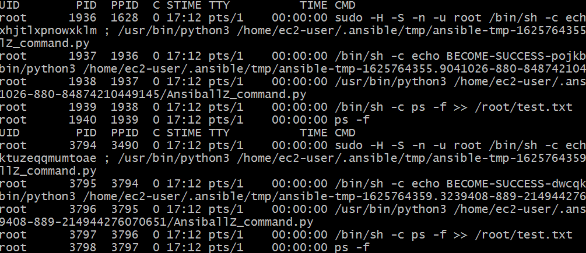

# Ansible Start

## Install
* 공식문서 : https://docs.ansible.com/ansible-core/devel/installation_guide/intro_installation.html#control-node-requirements
* 설치시, 필요한 ```ansible```, ```ansible-core```와 ```Python``` version을 체크해야 한다.
* Ansible은 community package ```ansible```과 ```ansible-core```을 포함하고 있다(2.10 version에서는 ```ansible-base```로 사용된다)

1. Install Ansible
   * Python ```pip```를 이용하여 설치
   * 명령어: ```$ python -m pip install --user ansible```

2. Install paramiko module
    * connection plugin or module들에서 사용되어진다.
    * 명령어: ```$ python -m pip install --user paramiko```


## Basic
* Anible의 기본 언어는 YAML 언어이다.
* Ansible은 크게 2개의 Component를 가진다.
*  Controller Node: Ansible 설치된 모든 시스템. Windows machine은 Control Node가 될 수 없다.
* Managed Node: Ansible로 관리되는 장치. "hosts"라고도 한다.
* Inventory: Managed node들의 IP address 목록을 정의하는 파일, "hostfile"이라고 말한다. Managed node들의 IP address나 그룹화 등의 정보가 저장된다.
* Role: Ansible을 모듈화시키는가 저장된다. 핵심 구성 요소로 Service와 Playbook의 전반적인 코드를 충분히 재사용하도록 할 수 있다.
* Playbook: Anisble 구성, 배포 및 오케스트레이션이 포함된 파일. 해당 파일을 작성함으로 OS 구성에서 응용 프로그램 배포와 모니터링까지 시스템의 상태를 순차적으로 정의할 수 있다.
* Module: Ansible에서 정의해둔 실행 단위로 실행할 수 있는 라이브러리를 의미.
* Ansible Config: Ansible 환경변수 정의 파일.


## Ansible Task 처리 과정

* Ansible은 Task 실행 시, 하나의 Module을 처리할 때마다 독립된 Process를 실행시켜 처리한다.
* 동일한 command를 처리해도 PID가 다른 것을 볼 수 있다.
* 그렇기 때문에, 하나의 Terminal에서 처리해야 되는 경우 주의해야 한다.


## Anisble 그 외 명령외
* ```ansible-doc <command>```: <command> 모듈에 대한 문서를 확인할 수 있다.


## Use Ansible
## Ansible Config 파일 설정
* https://docs.ansible.com/ansible/latest/reference_appendices/config.html#default-roles-path
* Ansible 기본 설정 정의 파일. 우선순위는 다음과 같다.
    * ```ANSIBLE_CONFIG``` (environment varable if set)
    * ```ansible.cfg``` (in the current direcotry)
    * ```~/.ansible.cfg``` (in the home directory)
    * ```/etc/ansible/ansible.cfg```
* Example
    ```
    # /etc/ansible/ansible.cfg
    [defaults]
    remote_user = ec2-user
    become = True
    become_method = sudo
    become_user = root

    # ./ansible.cfg
    [defaults]
    roles_path = ./roles

    ```


## 1. user 생성 및 sudo 권한 부여
* 기본적으로 root로 권한으로 모든걸 수행하는 것은 바람직하지 않다.
* Conrol Node의 User name이 Managed Node에도 동일하게 존재해야 한다.
* 그리고 기본적을 ssh 접속을 하기 때문에, key도 공유해야 한다. 
* Example
    ```
    # Control, Managed node 모두 동일한 유저가 이써야 한다.
    $ useradd -c AnsibleUser -u 5000 -U -s /bin/bash -p 0000000!! ansible
    $ echo "ansible ALL(ALL) NOPASSWD: ALL" >> /etc/sudoers
    ```


## 2. Role 만들기
* 역할 스크립트는 https://galaxy.ansible.com/과 같은 커뮤티니 사이트에서 지원을 받을 수 있다.
* ```ansible-galaxy``` 명령어를 사용해 커뮤니티에서 지원하는 역할을 임포트할 수 있다.
* task는 각 프로세스가 생성되어 실행된다. 그렇기 때문에 ```source``` 명령어가 필요한 경우, 하나의 프로세스에서 실행시켜야 한다.
* Role 사용 방법 
    ```
    # Role Initialization
    # ansible-galaxy init [option] <role_name>
    $ ansible-galaxy init nodejs

    # Role Structure
    .
    ├── defaults
    │   └── main.yml
    ├── files
    ├── handlers
    │   └── main.yml
    ├── meta
    │   └── main.yml
    ├── README.md
    ├── tasks
    │   └── main.yml
    ├── templates
    ├── tests
    │   ├── inventory
    │   └── test.yml
    └── vars
        └── main.yml


    $ cd nodejs

    # 전달할 파일을 files dir에 저장
    $ wget ... -O files/

    # task 작성
    $ vi task/main.yml

    - name: Copying the application file
      copy:
        src: helloworld.js
        dest: /home/ec2-user/
        owner: ec2-user
        group: ec2-user
        mode: 0644
      notify: restart helloworld


    # task에 작성한 notify에 대한 정의 작성
    $ vi handler/main.yml

    - name: restart helloworld
      service:
        name: helloworld
        state: restarted


    # Role의 종속석 등 메타데이저 작성
    $ vi meta/main.yml

    dependencies:
      - nodejs
    ```
    * defaults: Role의 기본 변수를 포함. 우선순위가 가장 낮다.
    * template: 해당 Role의 수정을 지원하는 file template을 포함한다.
    * vars: 해당 Role의 전역 변수 정의. defaults 디렉토리의 변수보다 우선순위가 높다.
    * files: 원격 호스트에 복사할 파일들이 저장되어 있다.
    * task: 해당 Role의 역할 정의. Ansible이 Playbook을 실행할 때 tasks/main.yml에 있는 코드를 실행한다.
    * handlers: "notify" 지시문에 의해 호출될 수 있고, 서비스와 연관된 Handler를 포함
    * meta: 저자, 지원 플랫폼, 종속성과 같은 Role의 메타 데이터를 포함
        * meta/main.yml은 두 가지 영역이 있다.
        1. galaxy_info: 빌드할 역할에 대한 정보
        2. dependencies: 종속정 정보 작성


## 3. Inventory 파일 생성
* 어떤 Managed Node를 관리할지 Inventory 파일에 작성한다.
* 기본적으로 ```/etc/ansible/hosts``` 파일에 정의한다.
* https://docs.ansible.com/ansible/latest/user_guide/intro_inventory.html
* Example
    ```
    # Inventory Structure
    .
    ├── group_vars
    │   └── all
    ├── hosts
    └── host_vars
      └── test

    # hosts file
    [all]
    test

    # group_vars/all
    ---
    ansible_connection: local
    absible_become: True
    ansible_become_method: sudo
    ansible_python_interpreter: /usr/bin/python3
    ansible_user: ec2-user

    # host_vars/test
    ---
    ansible_host: 12.12.12.12
    ```
    * 기본적으로 all은 모든 그룹을 의미한다.
    * host_vars: host variables, 하나의 host에 대한 변수. 해당 Dir의 File들은 host 명으로 naming 한다.
    * group_vars: group variables, group에 대한 변수. 해당 Dir의 첫 File 또는 Dir는 group 명으로 naming을 한다. 


## 4. Playbook 작성
* 실행할 명령 등이 포함된 Role과 Host 정보가 들어있는 Inventory를 이용하여 Playbook을 작성한다.
* Example
    ```
    ---
    - hosts: all
      become: yes
      roles:
        - helloworld
    ```
    * Playbook Keyword는 다음과 같다.
    1. hosts: Target hosts List
    2. become: (sudo와 같이)상승된 권한 사용 여부. 값은 ```yes``` or ```no```
    3. roles: 실행된 Role List
    4. port: 연결에 사용될 기본 port
    5. timeout: task가 실해될 제한 시간
    6. vars: Dictionary/Map variables


## 5. Playbook 실행
* 명령어: ```ansible-playbook <playbook.yml> -i <inventory> --private-key <key>``
    * --check: 실행 시 어떤 것이 변경되는지 확인할 수 있다. 처음에는 해당 옵션을 통해 확인 후 적용하는 것이 좋다(dry-run mode라고 한다)


### Reference
* Dir 구조: https://youngmind.tistory.com/entry/Ansible-%EA%B5%AC%EC%A1%B0%EC%9D%98-%EC%9D%B4%ED%95%B4


