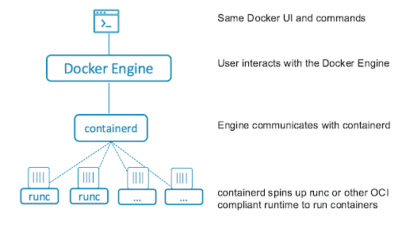

# Docker
기존 Hypervisor(Virtual Machine 라고도 한다)는 Hardware를 분리시키기 위한 Software인데, Container는 프로세스의 실행 환경을 격리하기 위한 Software 이다.

Hypervisor(Hosted Type)가 다양한 플랫폼(OS)에서 동작하도록 만들어진 것처럼 Container도 다양한 플랫폼(OS)에서 동작하는 것을 목표로 한다.

Container는 Linux에서 지원하는 다양한 커널 기능을 사용해 구성되어 진다. 예시로 Linux Namespace를 통해 별도의 환경(File System, Network 등)을 준비하고, Linux cgroups를 통해 자원을 제어한다.

---
## Docker Workflow

1) User들은 CLI/UI 등을 통해 명령을 Docker Engine에게 전달한다.
2) Docker Engine은 Containerd(Container Runtime)에게 컨테이너 라이프 사이클 관리 요청한다.
3) Containerd는 컨테이너를 생성/삭제/중지 등을 수행한다.


---
## Install
설치 방법은 다음과 같다.

```sh
# Install package
$ yum install docker-ce docker-ce-cli containerd.io docker-buildx-plugin docker-compose-plugin

# CHeck version
$ docker -v 
```
* Package 종류
    - docker-ce : Docker engine (Community Edition). 컨테이너 작업 및 관리를 위한 프로그램으로 dockerfile을 읽고, 컨테이너 런타임이 지시를 한다.
    - docker-ce-cli : Dcoekr command line interface, Docker Client.
    - containerd.io : Container runtime. 컨테이너를 생명주기를 관리한다. 컨테이너 생성/삭제/중지 및 네트워킹 활성, 스토리지 탑재 등을 한다.
    - docker-buildx-plugin : 멀티 플랫폼에서 Docker 이미지를 빌드하기 위한 도구 (ARM64, AMD64 등의 플랫폿 호환용)
    - docker-compose-plugin : Docker 구성을 더 편리하게 할 수 있는 도구


---

## Docker File Structure
```sh
$ ls -al /var/lib/docker/
buildkit/   containers/ image/      network/    overlay2/   plugins/    runtimes/   swarm/      tmp/        trust/      volumes/
```
- buildkit : 
- containers : 
- image : 
- network : 
- overlay2 : 
- volumes : 
- plugins : 
- runtimes : 
- swarm : 
- tmp : 
- trust :       


```
# Docker File
FROM centos:7

ARG APP_NAME
ENV H_NAME $APP_NAME

ENTRYPOINT ["/bin/bash", "-c", "echo hello $H_NAME"]
```

```
$ docker build --build-arg APP_NAME="Test" --tag test .

$ docker inspect test

$ docker run -it --name test
```


## 명령어
```
# Docker Image Remove
$ docker rmi <image>


# Container Process Check
$ docker ps -a


# Container Remove
$ docker rm <container>

```


## Build 


## Run
| 옵 션 | 설 명 | 비 고 |
|------|------|------|
| -i / --interactive | 컨테이너 표준 입력(stdin) 활성화 (-it 같이 사용) |  |
| -t / --tty | tty 할당 (-it 같이 사용) |  |
| --name | 컨테이너 이름 지정 | --name abc02 |
| -d / --detach | Background에서 실행 |  |
| -p / --publish | Host와 컨테이너 포트 연결 (Port Forwading)) | -p <host_port>:<container_port> |
| -v / --volume | Host와 컨테이너 디렉터리 연결 (Volume Mount) | -v <host_abs_path>:<container_abs_path> |
| -e | ENV 환경 변수 설정 | -e PI=3.14 |
| --env-file | ENV 환경 변수 파일 설정 | --env-file <path> |
| --rm | 컨테이너 종료 시, 컨테이너 삭제 옵션 |  |
| --restart | 컨테이너 종료 시, 재시작 정책 설정 (--rm과 함께 쓰일 수 없다) | --restart="always" (항상 재시작) / "on-failure" (종료 status가 0이 아닌 경우 재시작) |
| --privileged | 컨테이너 안에서 Host의 리눅스 커널 기능 사용 |  |