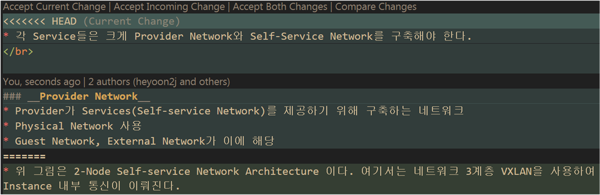

# Git Repository Update

## Pull Error
* Error Message
    ```
    error: Your local changes to the following files would be overwritten by merge
    ```
    * Remote Repo와 Local File이 다른 경우 발생.

### 해결 방법
1. Local Repository에 Commit
    ```
    ```
2. Modify File

* Accept Current Change : Head 부분을 적용
* Accept Incoming Chnage : 변경된 부분을 적용
* Accept Both Changes : Head, 변경된 부분 모두 적용
* Compare Changes : 더 자세하게 비교


